# Application Layer

[[toc]]

If we couldn't conceive of any useful applications, there wouldn't be any need for networking infrastructure and protocols to support them. Since the Internet's inception, numerous useful and entertaining applications have indeed been created. These applications have been the driving force behind the Internet's success, motivating people in homes, school, governments, and businesses to make the Internet an integral part of their daily activities.

## Principles of Network Applications
When developing your new applications, the software could be written, for example, in C, Java, or Python. You do not need to (and cannot) write software that runs on network-core devices, such as routers or link-layer switches. As we learned in chapter 1, network-core do not function at the application layer but lower layers (the network layer and below). This confines **application software** to the **end systems**.

### Network Application Architectures
#### Client-server architecture
A **server** is always-on and services requests from many other hosts, called **client**. In such architecture, clients do not directly communicate with each other; for example, in Web application, two browsers do not directly communicate. 

Another characteristic of the client-server architecture is that the server has a **fixed**, well-known address, called an IP address. Since it's always-on clients can always contact the server by sending a packet to the server's IP address. Some of the better-known applications with such architecture include the Web, FTP, Telnet and e-mail.

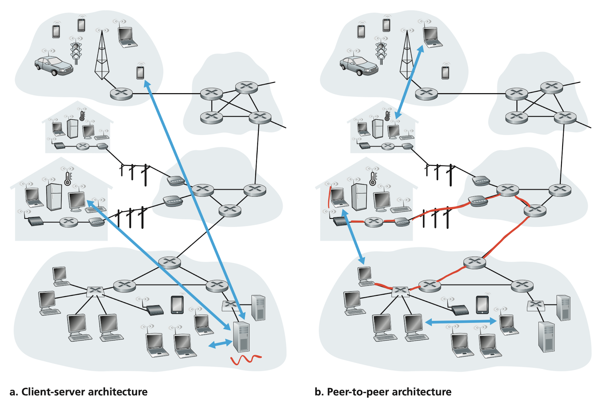

> Image credit to Computer Networking: A Top-down Approach, 7th Edition

##### Data center
The most popular Internet services–such as 

- Search engines
    - Google
    - Bing
- Internet commerce
    - Amazon
    - eBay
- Web-based email
    - Gmail
    - Yahoo Mail
- Social networking
    - Facebook
    - Instagram
    - Twitter
    - YouTube

If each of them has only one server handling all of its requests, it can quickly become overwhelmed. For this reason, these services employ one or more **data center**. A data center can have hundreds of thousands of servers, which must be powered, maintained, and **cooled down**. In fact, the cost to cool down all these servers, i.e., computers, is way higher than the electricity bills. Companies like Microsoft actually seals their data centers and drop them into the oceans to cool them down at a low cost.

#### P2P architecture
Instead of the reliance on dedicated servers in data center, the application exploits direct communication between pairs of intermittently connected hosts, called **peers**, which mostly reside in homes, universities, and offices. Because the peers communicate without passing through a dedicated server, the architecture is called peer-to-peer. Many of today’s most popular and traffic-intensive applications are based on P2P architectures. These applications include

- File sharing – BitTorrent
- Peer-assisted download acceleration – Xunlei
- Internet telephony and video conference
    - Skype
    - Zoom (hybrid)

Because of COVID-19, Zoom has earned a considerable fame. It's partly because of its support of both cloud-based and P2P architectures. Besides Zoom, many instant messaging applications also employ the hybrid architecture, with servers are used to track the IP addresses of users, but user-to-user messages are sent directly between user hosts. Without passing through intermediate servers, they provide a better security guarantee. Sadly, one of the biggest messaging application, **LINE** is not one of them, thus LINE has full control over the messages between users.

One of the most compelling features of P2P architectures is their **self-scalability**. For example, in a P2P file-sharing application, although each peer generates workload by requesting files, each peer also adds service capacity to the system by distributing files to other peers. P2P architectures are also cost effective, since they normally don’t require significant server infrastructure and server bandwidth (in contrast with clients-server designs with data centers). However, P2P applications face challenges of security, performance, reliability, and of course, copyright issue due to their highly decentralized structure.

### Processes Communicating

It's not actually your programs but **processes** that communicate. When processes are running on the same device, they can communicate with each other with interprocess communications, using rules that are governed by the operating system (usually through the kernel). With the same analogy, processes on two different end systems communicate by the Internet bridge between two kernels.

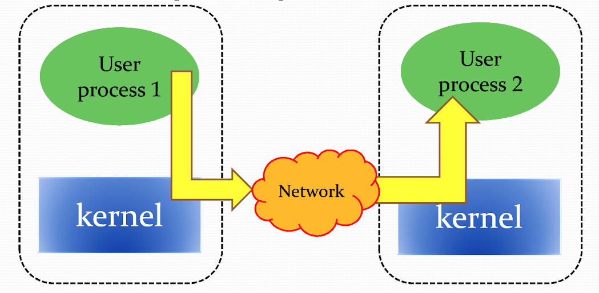

> Image credit to Prof. Y.C. Wang

#### Client and Server Processes
For each pair of communicating processes, we typically label one of them as the **client** and the other process as the **server**.

| Application      | Client                      | Server                    |
|------------------|-----------------------------|---------------------------|
| Web              | Browser                     | Web server                |
| P2P file-sharing | Peer that downloading files | Peer that uploading files |

You may find that in some applications, such as in P2P file sharing, a process can be bith a client and a server. Indeed, a process in a P2P file-sharing system can both upload and download files. Nevertheless, we can still label the processes as the client and the server.
##### Definition

> In the context of a communication session between a pair of processes, the process that initiates the communication (that is, initially contacts the other process at the beginning of the session) is labeled as the client. The process that waits to be contacted to begin the session is the server.
##### Client

- Communicate with server
- May be intermittently connected
- May have dynamic IP address
- Do not communicate directly with each other

##### Server

- Always-on host
- Permanent IP address
- Data center for scaling

#### The interface between the process and the computer network
A process sends messages into, and receives message from, the network through a software interface called a **socket**

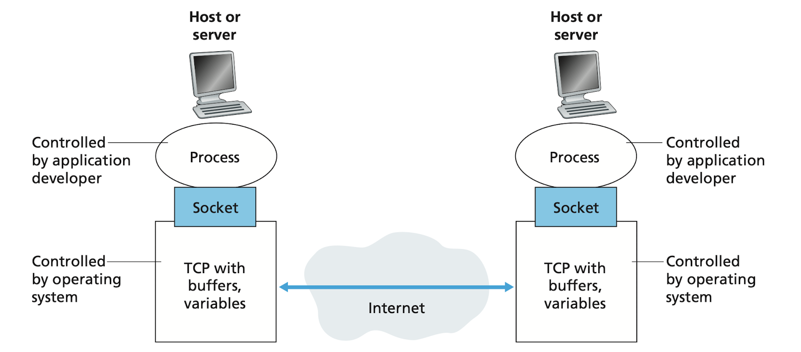

> Image credit to Computer Networking: A Top-down Approach, 7th Edition

As shown in the figure, a socket is the interface between the application layer and the transport layer within a host. It's also referred to as the **Application Programming Interface (API)** between the application and the network. The application developer has control of everything on the application-layer side of the socket but has little control of the transport-layer side of the socket.

> Just like in ML frameworks, such as Pytorch, you have control over the network structure, training procedures, etc. But you don't have to bother with how the gradients are computed.

The only control that the application developer has on the transport-layer side is 

1. The choice of transport protocol (TCP/UDP)
1. The ability to fix a few transport-layer parameters such as maximum buffer and maximum segment sizes

#### Addressing processes
To identify the receiving process, two pieces of information need to be specified

1. The address of the host (IP address)
1. An identifier that specifies the receiving process in the destination host (port number)

The **IP address** is where your computer located in the Internet. However, in general a computer could be running many network applications. A destination **port number** serves this purpose. Popular applications have been assigned specific port numbers

| Service name          | Port     |
|-----------------------|----------|
| FTP                   | 20, 21   |
| SSH                   | 22       |
| Telnet                | 23       |
| SMTP                  | 25       |
| DNS                   | 53       |
| HTTP                  | 80       |
| HTTPS (HTTP with SSL) | 443      |
| FTP over SSL/TLS      | 989, 990 |

### Transport Services Available to Applications
What are the services that a transport-layer protocol can offer to applications invoking it? We can broadly classify the possible services along four dimensions

1. Reliable data transfer (data integrity)
1. Throughput (bandwidth)
1. Timing (latency, delay)
1. Security

#### Reliable data transfer
If a protocol provides such a guaranteed data delivery service, it is said to provide **reliable data transfer**. When a transfer protocol provides this service, the sending process can just pass its data into the socket and know with complete confidence that the data will arrive without errors at the receiving process.

In contrast, when a transport-layer protocol doesn't provide reliable data transfer, some of the data sent by the sending process may never arrive at the receiving process. This may be acceptable for **loss-tolerant applications**, such as multimedia streaming, lost data might result in a small glitch in the audio/video–not a crucial impairment.

#### Throughput
Because many sessions share the bandwidth along the network path, the available throughput can fluctuate with time. This leads to a natural service that a transport-layer protocol could provide, namely, guaranteed available throughput at some specified rate. With such a service, the application could request a guaranteed throughput of $r$ bits/sec, and then the transport protocol would then ensure that the available throughput is always at least $r$ bits/sec.

Such a guaranteed throughput service would greatly appeal to many applications. For example, Internet audio/video telephony application encodes data at a fixed rate. It needs to send data into the network and have data delivered to the receiving application at this rate. Since in a call, data is generated every second. If the network can not keep up with that rate, the telephony service would be of no use.

Some application, like YouTube, use adaptive coding techniques to encode digitized video at a rate that matches the currently available throughput. So if an instant throughput can only support the quality of 360p, YouTube will set it to 360p to guarantee a steady playback.

While bandwidth-sensitive applications have specific throughput requirements, **elastic applications** can make use of as much, or as little, throughput as happens to be available. The most pervasive example is nothing but downloading files. Of course, the more throughput, the faster download rate.

#### Timing
An example guarantee might be that every bit that the sender pumps into the socket arrives at the receiver’s socket no more than 100 msec later. Such a service would be appealing to interactive real-time applications, such as Internet telephony and multiplayer games. Like in the popular game, League of Legends, the ping value indicated the time it takes for data to travel between your computer and the game server. If the latency is too high, you might encounter a unpleasant gameplay experience as every skill you cask would take affect after 1 second.

#### Security
A transport protocol can encrypt all data transmitted by the sending process; and in the receiving host, the transport-layer protocol can decrypt the data before delivering the data to the reviving process. Such a service would provide confidentiality between the two processes, even if the data is somehow observed between sending and receiving processes.

### Transport Services Provided by the Internet
#### TCP services
##### Connection-oriented service
TCP has the client and server exchange transport-layer control information with each other **before** the application-level messages begin to flow. This so-called handshaking procedure alerts the client and server, allowing them to prepare for an onslaught of packets. After the handshaking phase, a **TCP connection** is said to exist between the sockets of the two processes. The connection is a full-duplex connection in that the two processes can send messages to each other over the connection at the same time. When the application finishes sending messages, it must tear down the connection.

##### Reliable data transfer service
The communicating processes can rely on TCP to
deliver all data sent without error and in the proper order. When one side of the application passes a stream of bytes into a socket, it can count on TCP to deliver the same stream of bytes to the receiving socket, with no missing or duplicate bytes.

| Application            | Data Loss     | Throughput         | Time-Sensitive      |
|------------------------|---------------|--------------------|---------------------|
| File transfer/download | No loss       | Elastic            | No                  |
| E-mail                 | No loss       | Elastic            | No                  |
| Web document           | No loss       | Elastic (few kbps) | No                  |
| Internet telephony     | Loss-tolerant | few kbps-1Mbps     | 100ms               |
| Video conferencing     | Loss-tolerant | 10kbps-5Mbps       | 100ms               |
| Streaming audio/video  | Loss-tolerant | same as above      | few seconds         |
| Interactive games      | Loss-tolerant | few kbps-10kbps    | 50ms                |
| Smartphone messaging   | No loss       | Elastic            | No more than 10 min |

TCP also includes a congestion-control mechanism, which throttles a sending process when the network is **congested** between sender and receiver to prevent packet loss. It also attempts to limit each TCP connection to its fair share of network bandwidth.

##### Secure sockets layer (SSL)
SSL is not another Internet transport protocol but instead is an enhancement of TCP, with the enhancements being implemented in the application layer. In particular, if an application wants to use the services of SSL, it needs to include SSL libraries in both the client and server sides of the application. When an application uses SSL

1. The sending process passes the encrypted data to the TCP socket. 
1. The encrypted data travels over the Internet to the TCP socket in the receiving process.
1. The receiving socket passes the encrypted data to SSL, which decrypts the data.
1. SSL passes the clear text data through its SSL socket to the receiving process.

#### UDP services
UDP is connectionless, so there is no handshaking before the two processes start to communicate. UDP provides an unreliable data transfer service–that is, UDP provides no guarantee that the message will ever reach the receiving process. Furthermore, messages may arrive out of order. UDP also does not include a congestion-control mechanism, so the sending side of UDP can pump data into the layer below at any rate it please.

#### Services not provided by Internet transport protocols
Let's recap four services motioned above

1. Reliable data transfer
1. Throughput
1. Timing
1. Security

We have already noted that TCP provides reliable end-to-end data transfer and security services through SSL. How about the other two services? Throughput and timing. Today's Internet can often provide satisfactory service to time-sensitive applications, but it cannot provide nay timing or throughput guarantees.

Typically, e-mail, SSH, the Web, and file transfer all use TCP. These application have chosen it basically because TCP provides reliable data transfer, guaranteeing that all data will eventually get to its destination. On the other hand, Internet telephony application (such as Skype) can often tolerate some loss but require a minimal rate to be effective. Developers of which prefer to run their applications over UDP. However, because many firewalls are configured to block UDP traffic, Internet telephony applications often are designed to use TCP as a backup if UDP communication fails.

<!--

### Application-Layer Protocols
### Network Applications Covered in This Book

-->

## The Web and HTTP
### Overview of HTTP
The **HyperText** Transfer Protocol (HTTP), the Web's application-layer protocol, is at the heart of the Web. It's implemented in two programs: a client program and a server program. HTTP defines the structure of these messages and how the client and server exchange the messages.

A Web page consists of objects. An object is simply a file, typically **HTML** file, a JPEG image or a JavaScript. Each object is addressable by a **URL**, e.g.
```
http://www.hsnl.cse.nsysu.edu.tw/wklai/index.html
|__|   |_______________________||_______________|
 └──> protocol └──> host name       └──> path name
```
The host name can be resolved into an IP address for a server, while the path name typically reflects the actually file structure on that server. The file name `index.html` is for a special file which can be addressed by the directory containing it. For example, `http://www.hsnl.cse.nsysu.edu.tw/wklai/` directs to the same page as above.

#### HTTP client and server

**Client**

HTTP clients typically are browsers that request, receive, and display Web object (rendering HTML DOM). When you enter an URL on a browser

1. It tries to make a connection with the host (referring to the host name above). 
1. When a connection is established, it makes a HTTP request (typically GET) to get the file (referring to the path name above). 
1. If it is an HTML file, then the browser render out the HTML DOM (as everything you've on this webpage)


We can also **not** use a browser to request a webpage. Try this

```sh
echo -n "GET /wklai/index.html HTTP/1.0\r\n\r\n" | nc www.hsnl.cse.nsysu.edu.tw 80 | less
```

However, no one help us render the HTML file, so we'll see raw HTML texts. The command above makes a connection with Lai's website using `nc`, then send a request to get the object.

**Server**

Web server host Web objects which typically are 

1. HTML files
1. CSS style sheets
1. JavaScript (This can generate an entire web application nowadays. Vue.js, React)
1. PHP files (server-side render)
1. Multimedia

A server need to handle concurrency since it should serve multiple clients concurrently. Three software are mainly used in the Web servers.

1. Nginx
1. Apache
1. Microsoft IIS

These software aim to deal with large amount of connections, memory usage reduction, speed and so on. Another important job for them is serving as **reverse proxies**, which basically provide a single server entry for the clients but distribute different jobs to servers/computer inside the company networks hidden from the clients.

**An application server** is also frequently used in the modern websites. It can be written in 

1. PHP/Laravel
1. Java/Spring
1. Node.js/Express
1. Python/Django

This kind of servers provide business logics, Database interactions, UI independent tasks for the dynamic web contents. For example, a forum website hosts lots of issues from the users. These issues are presented in the same UI structure but the contents are different. Therefore, a HTML template can be used across the forum and an application server is responsible for providing the content **dynamically**.

The application servers can also handle concurrency but the **Web server** typically has done it by properly distributing the requests to them.

### Non-Persistent and Persistent Connections
HTTP is said to be a **stateless protocol**, by which it doesn't memorize anything happened in the past. If you've logged in on a website, closed it, and reopen it, you may find you still logged in. That's the Web server caching/maintaining the state of your activities, but has nothing to do with the HTTP.

Since the HTTP is stateless, it cannot recover the data if it's lost or arrives out-of-order during transmission. Consequently, it uses TCP (not UDP) as its underlying protocol to handle the recovery for it. HTTP also rely on the TCP connection, on which it can be classified into two types, non-persistent connections and persistent connections.

#### HTTP with non-persistent connections
In non-persistent connection, each request/response pair is sent over a **separate** TCP connection. That's to said, after the client received the requested objects, the connection is terminated.

When we enter the URL `http://www.hsnl.cse.nsysu.edu.tw/wklai/index.html` into the browser, here is what happens:

1. The HTTP client initiates a TCP connection to the server `http://www.hsnl.cse.nsysu.edu.tw/wklai/index.html` on port number 80 (default port for HTTP).
1. The client sends an HTTP request message `GET /wklai/index.html` to the server.
1. The server retrieves the requested object from its storage, encapsulates the object in an HTTP response message.
1. The server tells TCP to close the connection. (But TCP doesn't actually terminate the connection until it knows that the client has received the response message intact.)
1. The client receives the response message (guaranteed by TCP), extracts the HTML file and finds references to the other objects.
1. The first four steps are then repeated for each of the images, CSS style sheets, etc. referenced in the HTML file.
1. Finally ,the browser renders out the HTML DOM then apply the CSS style sheet.

In the steps described above, we intentionally vague about how the client obtains the images and style sheets from separated connections.

Let's estimate the amount of time it need to request an HTML file and its assets. We defined **round-trip time (RTT)** as the time it takes for a small packet to travel form client to server and then back to the client. The RTT includes processing, queuing, transmission and propagation delay discussed in [chapter 1](./chapter-1.html#types-of-delay). Since TCP enforces [Three-way handshaking](/courses/cse491-network-application-programming/chapter-2.md#connection-management), it requires **2 RTT** for a client to get the HTML file (3 transmission for connection, 1 for data transmission) for non-persistent connection *(the request message is included in the third transmission in 3-way handshaking)*. And **2 RTT** for every other objects following due to the separate connections.

#### HTTP with persistent connections

To overcome the waste of time on the connection establishment. HTTP 1.1 presents the persistent connections. In which the server leaves the TCP connection open after sending a response. Subsequent requests and responses between the same client and server can be sent over the same connection. In particular, an entire Web page (in the example above, the base HTML file and the assets) can be sent over a single persistent TCP connection. Only the first request to the object takes **2 RTT** to establish connection and transmit data, rest of the requests take **1 RTT** with the persistent connection.

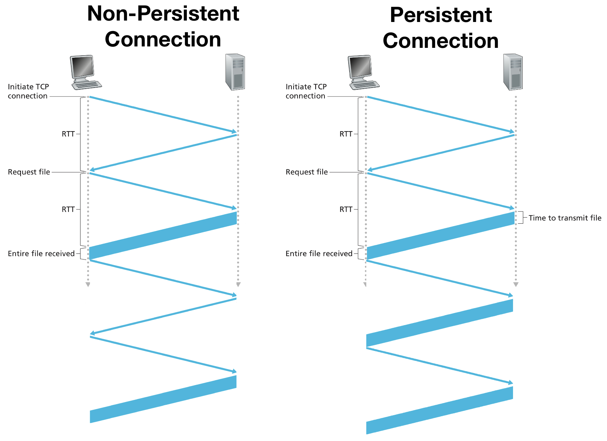

> Image credit to Computer Networking: A Top-down Approach, 7th Edition

### HTTP Message Format
#### HTTP request message

We've seen the `GET` method above, let's look at a more complete example of an HTTP request message. Run

```sh
nc -l 1234
```
This start a server on your computer listening on port 1234. Then go to your browser and enter the URL `localhost:1234` to make an HTTP request. On your terminal, you should see the server received the request.

```{1}
GET / HTTP/1.1
Host: localhost:1234
Upgrade-Insecure-Requests: 1
Accept: text/html,application/xhtml+xml,application/xml;q=0.9,*/*;q=0.8
User-Agent: Mozilla/5.0 (Macintosh; Intel Mac OS X 10_15_7) AppleWebKit/605.1.15 (KHTML, like Gecko) Version/14.1 Safari/605.1.15
Accept-Language: en-us
Accept-Encoding: gzip, deflate
Connection: keep-alive
```
The first line of an HTTP request message is called the **request line**; the subsequent lines are called the **header lines**

The **request line** have three fields:

1. The method field - `GET`, `POST`, `HEAD`, `PUT`, `DELETE`
1. The URL field - requested object
1. The HTTP version field - `HTTP/1.0`, `HTTP/1.1`

For the **header lines**

1. `Host:`
    - specifying the host on which the object resides. You might think that this is unnecessary, as there is already a TCP connection to the host. But, the information is required by Web proxy caches as we'll see later.
1. `User-agent:`
    - specifying the browser sending request, it is useful because the server can send different versions of the same object depending on the user-agent.
1. `Accept-language:`
    - This is how HTTP deliver the default version of language based on your language settings.
1. `Connection:`
    - `close` tells the server that it doesn't want to bother with persistent connections; it wants the server to close the connection after sending the requested object.
    - `keep-alive` tells the server that it wants a persistent connections

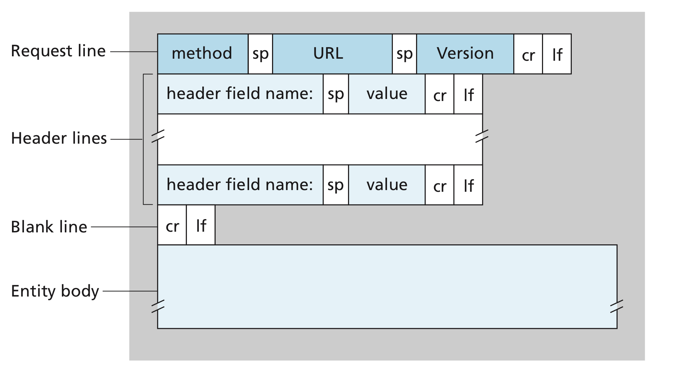
**General format of an HTTP request message**

> Image credit to Computer Networking: A Top-down Approach, 7th Edition

`GET` **method**

- Used by the browser to request objects
- The entity body is empty
- Can embed the inputted data in the URL when submitting forms
    - For example, `www.somesite.com/animalsearch?monkeys&bananas` submits the form with two inputs.

`POST` **method**

- Used when the user fills out a form
    - For example, when a user provides search words to a search engine.
- The entity body contains the user inputs

`HEAD` **method**

- Used by developer for debugging
- Just like `GET` but server responds with an HTTP message without the requested object

`PUT` **method**

- Used by the application that need to upload objects to Web servers.

`DELETE` **method**

- Allowing a user or an application to delete an object on a Web server

#### HTTP response message
```sh
echo -n "GET /wklai/index.html HTTP/1.0\r\n\r\n" | nc www.hsnl.cse.nsysu.edu.tw 80 | less
```
Look at the first few lines
```
HTTP/1.1 200 OK
Date: Sat, 01 May 2021 03:09:59 GMT
Server: Apache/2.2.23 (Unix)
Last-Modified: Tue, 26 Jan 2021 12:30:52 GMT
ETag: "4a00cd-d7ba-5b9ccd33cd700"
Accept-Ranges: bytes
Content-Length: 55226
Vary: Accept-Encoding
Connection: close
Content-Type: text/html

(data data data data data ...)
```
Let’s take a careful look at this response message. It has three sections: 

1. An initial **status line**
1. Nine **header lines**
1. The **entity body**

The entity body is the meat of the message—it contains the requested object itself (represented by data data data data data ...).

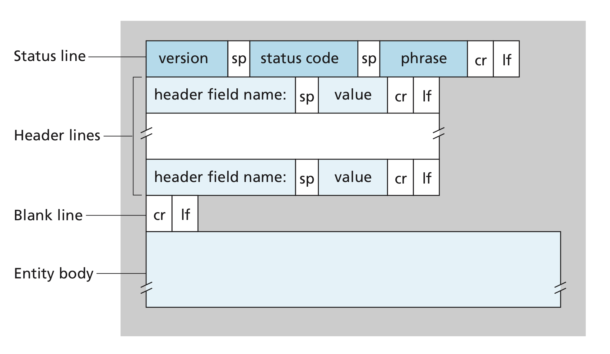
**General format of an HTTP response message**

> Image credit to Computer Networking: A Top-down Approach, 7th Edition

**Status line**

Some common status codes and associated phrases include:

- 200 OK
    - Request succeeded and the information is returned in the response.
- 301 Moved Permanently
    - Requested object has been permanently moved; the new URL is specified in Location header of the response message. The client software will automatically retrieve the new URL.
- 400 Bad Request
    - This is a generic error code indicating that the request
could not be understood by the server.
- 404 Not Found
    - The requested document does not exist on this server.
- 505 HTTP Version Not Supported
    - The requested HTTP protocol version is not supported by the server.

**Header lines**

- `Date:`
    - the time and date when the HTTP response was created, i.e., the time when the server retrieved the object from the file system.
- `Server:`
    - Analogous to the **User-agent** in the request message header.
- `Last-Modified:`
    - the time ad date when the object was created or last modified. It's critical for object caching as we'll see in the **proxy server** later
- `Content-Type:`
    - The object type is officially indicated by the Content-Type instead of the file extension.


### User-Server Interaction: Cookies
We've said that HTTP is stateless, but sometimes, we want to identify users on a website. The server wishes to restrict user access or serve content as a function of the user identity. For these purposes, HTTP uses **cookies**. We use a example of visiting `www.amazon.com` to show how cookies work.

When Susan use a browser to visit Amazon's website for the firs time

1. When the request comes into the Amazon Web server, the server creates a unique identification number and creates an entry in its **back-end database** that is indexed by the identification number.
1. The Amazon Web server then responds to Susan’s browser, including in the HTTP response a `Set-cookie:` header, which contains the identification number. 
    - For example, the header line might be `Set-cookie: 1678`.
1. When Susan’s browser receives the HTTP response message, it sees the `Set-cookie:` header. The browser then appends a line to the special cookie file that it manages.
    - Even if there is already cookie for another host, say `www.ebay.com`, they don't interfere with each other
1. As Susan continues to browse the Amazon site, each time she requests a Web page, her browser consults her cookie file, extracts her identification number for this site, and puts a cookie header line that includes the identification number in the HTTP request.

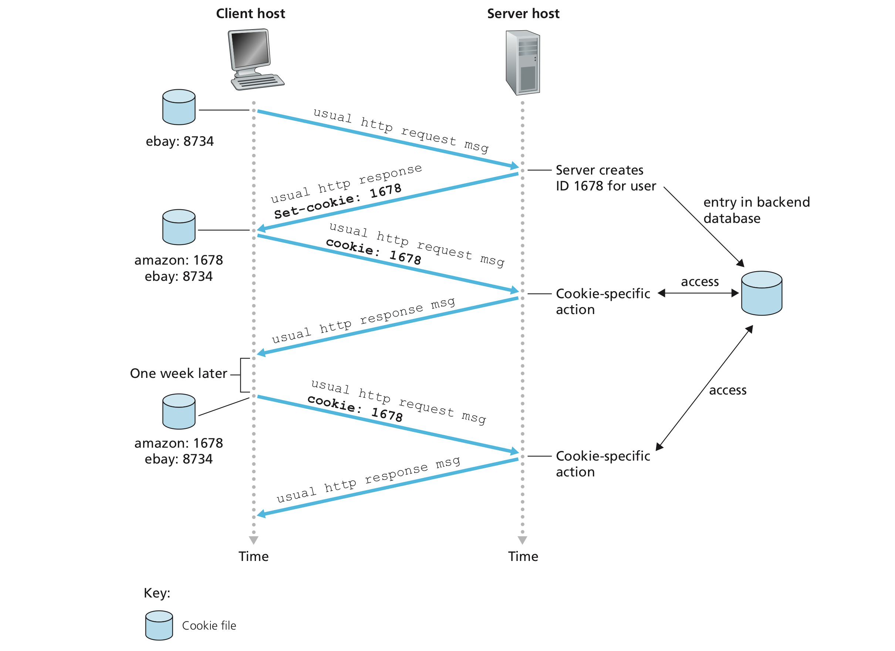

> Image credit to Computer Networking: A Top-down Approach, 7th Edition

In this manner, the Amazon server can track Susan's activities at the Amazon site, remember what's left in the shopping cart last time. It can also remember the Susan's name, credit card number, etc. if she's made some purchase, and next time, she doesn't need to enter those information again.

### Web Caching
A Web cache, also called a **proxy server**, is a network entity that satisfies HTTP requests on the behalf of an origin Web server, i.e., a mock server. The Web cache has its own disk storage and keeps copies of recently requested objects in this storage. If a browser is configured to use a proxy server, when sending requests

1. The browser establishes a TCP connection to the Web cache and sends an HTTP request for the object to the Web cache.
1.  The Web cache checks to see if it has a copy of the object stored locally. If it does, the Web cache returns the object within an HTTP response message to the client browser.
1. If the Web cache does not have the object, the Web cache opens a TCP connection to the origin server,then sends an HTTP request for the object into the cache-to-server TCP connection. After receiving this request, the origin server sends the object within an HTTP response to the Web cache.
    - If it have the object, the Web cache perform a [conditional `GET`](#the-conditional-get) and response to the browser if the object it has is up to date.
1.  When the Web cache receives the object, it stores a copy in its local storage and sends a copy, within an HTTP response message, to the client browser (over the connection between the client browser and the Web cache).

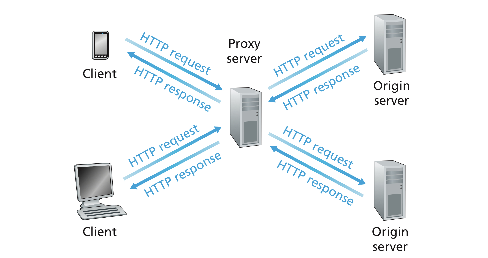 

> Image credit to Computer Networking: A Top-down Approach, 7th Edition

#### Advantage

1. The transmission rate doesn't have to be limited by the bottleneck on the link toward the public Internet
1. Reduce the congestion in the Public Internet

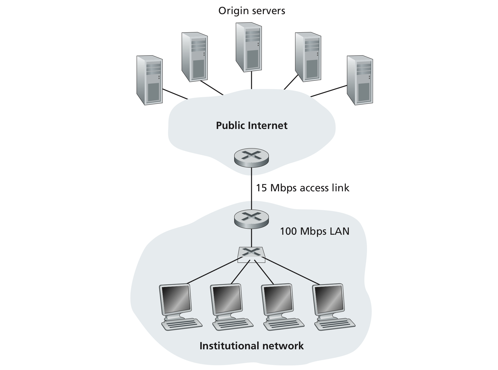 

> Image credit to Computer Networking: A Top-down Approach, 7th Edition

However, if the object wasn't cached in the proxy server, the time it takes to receive the requested data would be even longer than directly requesting to the origin server. Consequently, the use of proxy server increase the overall transmission rate but producing high **variance**.

|          | Cached | Non-cached |
|----------|--------|------------|
| Speed    | Fast   | Slow       |
| Variance | High   | Low        |

#### The conditional `GET`
Remember we've said the `Last-Modified:` header is important to the proxy server. The conditional `GET` sent by the proxy server guarantees it always responses with the up-to-date objects. When the proxy server received a request, it forward the request with `If-modified-since:` header added. For example

```
GET /fruit/kiwi.gif HTTP/1.1
Host: www.exotiquecuisine.com
If-modified-since: Wed, 9 Sep 2015 09:23:24
```
The value of the `If-modified-since:` header line is exactly equal to the value of the `Last-Modified:` header line of the request to get the cached object in the past.

This conditional `GET` is telling the server to send the object only if the object has been modified since the specified date. Suppose the object has not been modified since 9 Sep 2015 09:23:24. Then the Web server sends a response message to the proxy server
```
HTTP/1.1 304 Not Modified
Date: Sat, 10 Oct 2015 15:39:29
Server: Apache/1.3.0 (Unix) 
(empty entity body)
```
- If the resource has not changed, the server sends back a `304 Not Modified response`. This makes the cache fresh again, and the client uses the cached resource. Although there is a response/request round-trip that consumes some resources, this is more efficient than to transmit the whole resource over the wire again.
- If the resource has changed, the server just sends back a `200 OK response`, with the new version of the resource, like if the request wasn't conditional and the client uses this new resource (and caches it).

See more details on [MDN](https://developer.mozilla.org/en-US/docs/Web/HTTP/Conditional_requests)


## Electronic Mail in the Internet
### SMTP
SMTP is an ancient protocol, it restricts the body (not just the headers) of all mail messages to simple **7-bit ASCII**. The basic operation of SMTP is presented as following

1. Alice invokes her user agent for e-mail, provides Bob’s e-mail address, composes a message, and instructs the user agent to send the message.
1.  Alice’s user agent sends the message to her mail server, where it is placed in a **message queue**.
1.  The client side of SMTP, running on Alice’s mail server, sees the message in the message queue. It opens a TCP connection to an SMTP server, running on Bob’s mail server.
1.  After some initial SMTP handshaking, the SMTP client sends Alice’s message into the TCP connection.
1.  At Bob’s mail server, the server side of SMTP receives the message. Bob’s mail server then places the message in Bob’s mailbox.
1.  Bob invokes his user agent to read the message at his convenience.

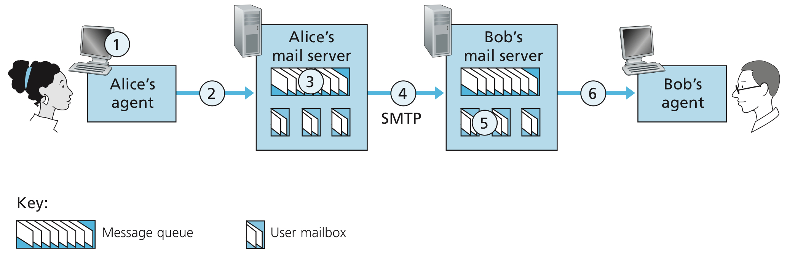

> Image credit to Computer Networking: A Top-down Approach, 7th Edition

::: tip Direct Connection
It is important to observe that SMTP does not normally use intermediate mail servers for sending mail. Even if Bob’s mail server is down, the message remains in Alice’s mail server and waits for a new attempt. The message does not get placed in some intermediate mail server.
:::

#### Run your own mail server

The marked lines are entered by ourselves, while the other lines are generated by the remote server.
```sh{1,3,5,7,9,11,12,13,15}
% nc student.nsysu.edu.tw 25
220 stu02.nsysu.edu.tw ESMTP Postfix
HELO NotAHost
250 stu02.nsysu.edu.tw
MAIL FROM: <nobody@blah.blahblah>
250 2.1.0 Ok
RCPT TO: <b073040018@student.nsysu.edu.tw>
250 2.1.5 Ok
DATA
354 End data with <CR><LF>.<CR><LF>
Who I am?
Do I exist?
.
250 2.0.0 Ok: queued as 1935812156C
QUIT
221 2.0.0 Bye
```

- `HELO hostname`
    - Say hello to the receiving server, i.e., make a TCP connection. Note that the hostname represent the sending host and it need not be registered in the DNS, it can be anything.
- `MAIL FROM: <address>`
    - Sender's address, anything follows the [email address format](https://en.wikipedia.org/wiki/Email_address). The domain need not be the same as the hostname in `HELO`.
- `RCPT TO: <address>`
    - A registered email address in the receiving mail server (`student.nsysu.edu.tw` here).
- `DATA`
    - The contents of the email. Terminated by `<CR><LF>.<CR><LF>`
- `QUIT`
    - Close the TCP connection.

**Received email**


::: danger Anyone Can Use Your Email Address
Since the sender's address can be any valid email address, it is possible that someone who has your email address fakes your identity and sends emails from your address to an SMTP server.
:::

### Comparison with HTTP
| HTTP                                                                            | SMTP                                                          |
|---------------------------------------------------------------------------------|---------------------------------------------------------------|
| Non-persistent or persistent                                                    | Persistent                                                    |
| A pull protocol where the receiver initiates the TCP connection                 | A push protocol where the sender initiates the TCP connection |
| No restriction                                                                  | 7-bit ASCII encoding                                          |
| Treat multimedia (binaries) as objects and encapsulate them in the HTTP message | Encode multimedia (binaries) into ASCII                       |

### Mail Access Protocols
The final missing piece to the puzzle, **user agents**! How can we retrieve the emails from the mail server? There are currently a number of popular mail access protocols

1. Post Office Protocol Version 3 (POP3)
1. Internet Mail Access Protocol (IMAP)
1. HTTP

#### POP3
POP3 is an extremely simple mail access protocol. Because it's so simple, its functionality is rather limited. POP3 begins when the user agent (the client) opens a TCP connection to the mail server (the server) on port **110**. With the TCP connection established, POP3 progresses through three phases: 

1. Authorization
    - Enter the username and the password
1. Transaction
    - `list`, `retr`, and `dele`
    - Server response `+OK` if the command is valid, otherwise `-ERR`
1. Update
    - Occur after the `quit` command, ending the POP3 session and deletes the messages that were marked for deletion by the `dele` command.

```sh{1,3,5,7,12,27}
% nc student.nsysu.edu.tw 110
+OK POP3 ready
user b073040018
+OK
pass ****
+OK server ready
list
+OK 2 messages
1 534
2 560
.
retr 1
+OK message follows
Return-Path: <nobody@blah.blahblah>
Received: from stu02.nsysu.edu.tw (LHLO stu02.nsysu.edu.tw) (10.10.20.85) by
 stu05.nsysu.edu.tw with LMTP; Sat, 1 May 2021 18:12:04 +0800 (CST)
Received: from NotAHost (220-142-21-58.dynamic-ip.hinet.net [220.142.21.58])
	by stu02.nsysu.edu.tw (Postfix) with SMTP id 1935812156C
	for <b073040018@student.nsysu.edu.tw>; Sat,  1 May 2021 18:11:32 +0800 (CST)
Message-Id: <20210501101146.1935812156C@stu02.nsysu.edu.tw>
Date: Sat,  1 May 2021 18:11:32 +0800 (CST)
From: nobody@blah.blahblah

Who I am?
Do I exist?
.
quit
+OK stu05.nsysu.edu.tw Zimbra POP3 server closing connection
```

#### IMAP
An IMAP server will associate each message with a folder; when a message first arrives at the server, it is associated with the recipient’s INBOX folder. The recipient can then move the message into a new, user-created folder, read the message, delete the message, and so on. IMAP also provides commands that allow users to search remote folders for messages matching specific criteria.

Another important feature of IMAP is that it has commands that permit a user agent to obtain components of messages. For example, a user agent can obtain just the message header of a message or just one part of a multipart MIME message. This feature is useful when there is a low-bandwidth connection or a long message that might contain, for example, an audio or video clip.


#### Web-based e-mail
More and more users today are sending and accessing their e-mail through their Web browsers. Hotmail introduced Web-based access in the mid 1990s. Now Web-based e-mail is also provided by Google, Yahoo!, as well as just about every major university and corporation. With this service, the user agent is an ordinary Web browser, and the user communicates with its remote mailbox via HTTP. When a recipient, such as Bob, wants to access a message in his mailbox, the e-mail message is sent from Bob’s mail server to Bob’s browser using the HTTP protocol rather than the POP3 or IMAP protocol.

## DNS–The Internet's Directory Service
### Services Provided by DNS

We have just seen that there are two ways to identify a host—by a hostname and by an IP address. The Internet's **domain name system (DNS)** is a directory service that translates hostnames to IP addresses. The DNS protocol runs over UDP and uses **port 53**. DNS provides a few other important services in addition to translating hostnames to IP addresses:

- Host aliasing
    - A host with complicated host name can have one or more alias names. The complicated one is usually a **canonical hostname**. The other names are aliases and they tend to be more mnemonic for people to memorize them.
- Mail server aliasing
    - Same as above, take our school for example, the canonical name for the student mail server is `stu02.nsysu.edu.tw` and the alias name is `student.nsysu.edu.tw`
- Load distribution
    - Busy sites are typically replicated over multiple servers, with each server running on a different end system and each having a different IP address. A set of IP addresses is thus associated with one canonical hostname. The DNS database contains this set of IP addresses. It tries to give the client one of these IP address evenly in order to distribute the loading on each server.

### Overview of How DNS Works
A simple design for DNS would have one DNS server that contains all the mappings. In this centralized design, clients simply direct all queries to the single DNS server, and the DNS server responds directly to the querying clients. Despite of the simplicity, the problems with a centralized design include

- A single point of failure
    - If the DNS server crashes, so does the entire Internet!
- Traffic volume
    - A single DNS server would have heavy loadings
- Distant centralized database
    - A single DNS server cannot be close to all the querying clients
- Maintenance
    - It have to be updated frequently to account for every new host

#### A distributed, hierarchical database 

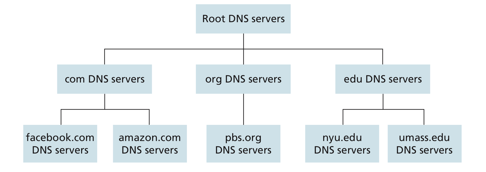

> Image credit to Computer Networking: A Top-down Approach, 7th Edition

- Root DNS servers
    - There are over 400 root name servers scattered all over the world.
    - Root name servers provide the IP addresses of the TLD servers.
- Top-level domain (TLD) servers
    - For the top-level domains such as com, org, net, edu, and gov
    - For the country top-level domain such as uk, fr, ca, jp, and tw
    - TLD servers provide the IP addresses for authoritative DNS servers.
- Authoritative DNS servers
    - Every organization with publicly accessible hosts on the Internet must provide publicly accessible DNS records that map the names of those hosts to IP addresses. An organization’s authoritative DNS server houses these DNS records. An organization can implement its own authoritative DNS server to hold these records
    - Most universities and large companies implement and maintain their own primary and secondary (backup)
authoritative DNS server.
    - Take our school for example, `dns.nsysu.edu.tw` a.k.a `140.117.11.1` is an authoritative DNS server
    - `dns2.nsysu.edu.tw` a.k.a `140.117.11.11` is a backup authoritative DNS server

**Example**

Suppose a host on `cse.nyu.edu` wants the IP address for `gaia.cs.umass.edu`. The local DNS server and the authoritative DNS server for them are `dns.nyu.edu.` and `dns.umass.edu` respectively.

1. The host send a DNS query messages to its local DNS server, `dns.nyu.edu`.
1. The local DNS server forwards the query message to a root DNS server.
1. The root DNS server takes note of the `edu` suffix and returns a list of IP addresses for TLD servers responsible for `edu`.
1. The local DNS server then resends the query message to on of these TLD servers.
1. The TLD server takes note of the `umass.edu` suffix and responds with the IP address of the authoritative DNS server for the University of Massachusetts, `dns.unass.edu`.
1. Finally, the local DNS server resends the query message directly to `dns.umass.edu`
1. The authoritative server responds with the IP address of `gaia.cs.umass.edu`.
1. The local DNS server then gives the IP address back to the host.

The left hand side of the figure illustrate the procedures above. However, a fully recursive approach, as the rhs of the figure shows, also works. In practice, the queries typically follow the pattern in the lhs: The query from the requesting host to the local DNS server is recursive, and the remaining queries are iterative.


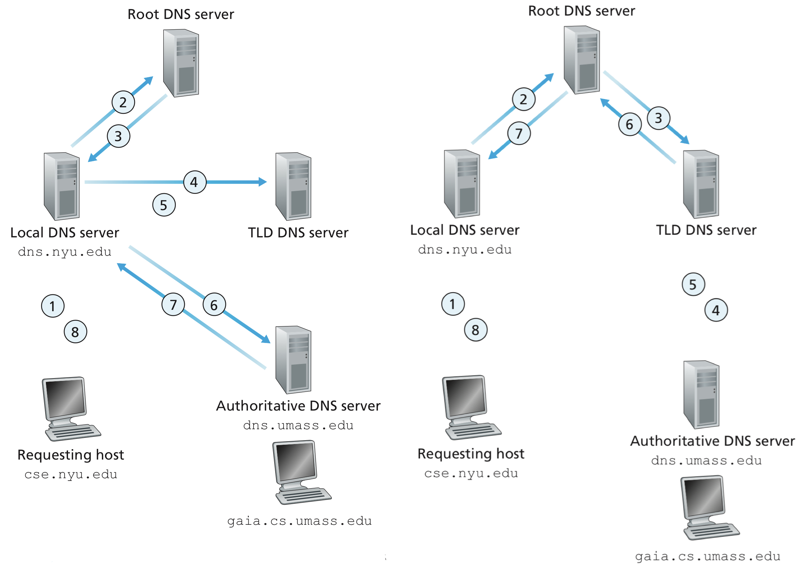

> Image credit to Computer Networking: A Top-down Approach, 7th Edition

Note that in this example, in order to obtain the mapping for one hostname, eight DNS messages were sent: four query messages and four reply messages! We’ll soon see how DNS caching reduces this query traffic.

#### DNS caching
The idea behind DNS caching is very simple. In a query chain, when a DNS server receives a DNS reply (containing, for example, a mapping from a hostname to an IP address), it can cache the mapping in its local memory. In the example above, the local DNS server `dns.nyu.edu` has acquired the IP addresses for 

1. The TLD servers
1. The authoritative DNS server for UMass
1. `gaia.cs.umass.edu`

Another host in NYU can thus use the cache in the local DNS server to directly get the IP address for `gai.cs.umass` or the TLD servers. In fact, because of caching, root servers are bypassed for all but a very small fraction of DNS queries.

### DNS Records and Messages
The DNS servers that together implement the DNS distributed database store **resource records (RRs)**, including RRs that provide hostname-to-IP address mappings. A RR is a four-tuple taht contains the following fields
```
(Name, Value, Type, TTL)
```
`TTL` is the time to live of the resource record; it determines when a resource should be removed from a **cache**. In the example records given below, we ignore the `TTL` field.

- `Type=A`
    - Address
    - The `Name` is a hostname
    - The `Value` is the IP address for the hostname
    - For example, `(www.nsysu.edu.tw, 140.117.13.241, A)`
- `Type=NS`
    - Name server
    - The `Name` is a domain
    - The `Value` is the hostname of an authoritative DNS server that knows how to obtain the IP addresses for hosts in the domain
    - For example, `(nsysu.edu.tw, dns.nsysu.edu.tw, NS)`
- `Type=CNAME`
    - Canonical name
    - The `Name` is an alias hostname
    - The `Value` is a canonical hostname for the alias hostname `Name`
    - For example, `(www.apple.com, www.apple.com.edgekey.net, CNAME)`
- `Type=MX`
    - Mail exchange
    - The `Name` is an alias hostname
    - The `Value` is a canonical hostname for the alias hostname `Name`
    - For example, `(student.nsysu.edu.tw, spamgw.nsysu.edu.tw, MX)`

::: tip Same Aliased Name for Mail and Web Server
By using the `MX` record, a company can have the same aliased name for its mail server and for one of its other servers (such as its Web server).

- To obtain the canonical name for the other server, the DNS client would query for an `CNAME` record.
- To obtain the canonical name for the mail server, a DNS client would query for an `MX` record
:::

- If a DNS server is authoritative for a particular hostname, then the DNS server will contain a **Type `A` record** for the hostname. (Even if the DNS server is not authoritative, it may contain a Type A record in its cache.)
- If a server is not authoritative for a hostname, it contains
    - A **Type `NS` record** for the domain that includes the hostname
    - A **Type `A` record** that provides the IP address of the DNS server in the Value field of the NS record.
    - For example a TLD server may contain
        - `(nsysu.edu.tw, dns.nsysu.edu.tw, NS)`
        - `(dns.nsysu.edu.tw, 140.117.11.1, A)`

#### DNS messages
There are only two kinds of DNS messages, DNS **query** and **reply** messages. They share the same header as following

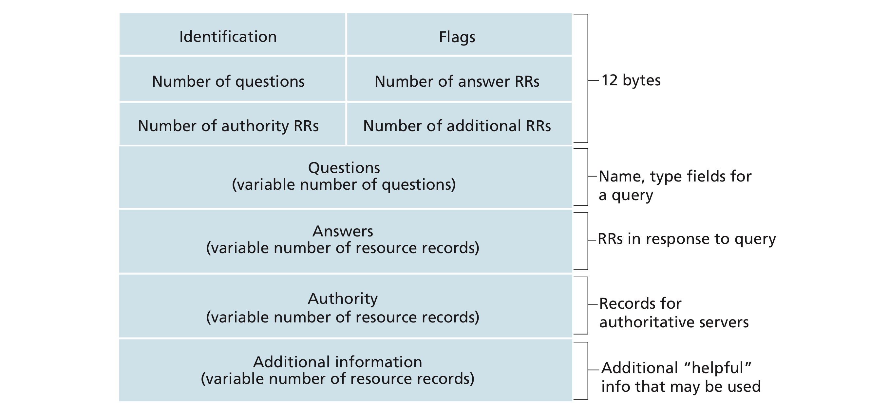

> Image credit to Computer Networking: A Top-down Approach, 7th Edition

- Flags
    - A 1-bit query/reply flag
        - Whether the message is a query (0) or a reply (1).
    - A 1-bit authoritative flag
        - Set in a reply message when a DNS server is an authoritative server for a queried name.
    - A 1-bit recursion-desired flag
    - A 1-bit recursion-available flag
- Number of ...
    - The number of occurrences of four types of data sections that follow the header
- Questions
    - Information about the query that is being made.
    - A name field that contains the name that is being queried
    - A type field that indicates the type of question being asked about the name, for example
        - The host address associated with a name (Type `A`)
        - The mail server for a name (Type `MX`)
- Answers
    - RRs for the name that was originally queried in a reply from a DNS server.
    - A reply can return multiple RRs in the answer, since a hostname can have multiple IP addresses. Recall [load distribution](#services-provided-by-dns)
- Authority
    - RRs of **other** authoritative servers.
- Additionally information
    - Other helpful RRs, for example, the answer field in a reply to an `MX` query contains 
        - A resource record providing the canonical hostname of a mail server. 
        - **The additional section** contains a Type `A` record providing the IP address for the canonical hostname of the mail server

#### Inserting records into DNS
Let's say, you have a startup named Network Utopia. You would like to build the network infrastructure for your company. How to make others find you by a new domain name?

1. Register the name `networkutopia.com` at **DNS registrar**, e.g., [Network Solutions](https://www.networksolutions.com)
    - Provide hostnames, IP addresses of authoritative name server (primary and secondary)
    - The registrar insert two RRs into `.com` TLD server
        - `(networkutopia.com, dns.networkutopia.com, NS)`
        - `(dns.networkutopia.com, 212.212.212.1, A)`
1. In your authoritative, insert
    - Type `A` record for `www.networkutopia.com` (Web server)
    - Type `MX` record for `networkutopia.com` (Mail server)

#### DNS vulnerabilities

- DDoS bandwidth-flooding
    - To DNS root servers
        - Happened before on Oct. 21, 2002, where 13 DNS root server were attacked
        - DNS root servers are typically protected by packet filers
        - Most local DNS servers cache the IP addresses of TLD servers, allowing the query process to bypass the DNS root servers.
    - To TLD servers
        - Harder to filter DNS queries directed o DNS server
        - Not easily bypassed as the root server
        - Severity is mitigated by caching in local DNS servers
- Man-in-the-middle-attack
    - Intercept queries from hosts and returns bogus replies
    - Difficult to implement

## Peer-to-Peer File Distribution
### Scalability of P2P architectures
To compare client-server architectures with peer-to-peer architectures, and illustrate the inherent self-scalability of P2P, we now consider a simple quantitative model for distributing a file to a fixed set of peers for both architecture types.

| Notation  | Meaning                                                 |
|-----------|---------------------------------------------------------|
| $u_s$     | Upload rate of the server's access link                 |
| $u_i$     | Upload rate of the $i$th peer's access link             |
| $d_i$     | Download rate of the $i$th peer's access link           |
| $d_{min}$ | Download rate of the peer with the lowest download rate |
| $F$       | Size of the file to be distributed (in bits)            |
| $N$       | Number of peers                                         |
| $D_{cs}$  | Distribution time for the client-server architecture    |
| $D_{p2p}$ | Distribution time for the peer-to-peer architecture     |

The **distribution time** is the time it takes to get a copy of the file to all $N$ peers

**Client-server architectures**

- The server must transmit one copy of the file to each of the $N$ peers. Thus the server must transmit $NF$ bits
    - $D_{cs}$ must be at least $NF/u_s$
- The peer with the lowest download rate cannot obtain all $F$ bits in less than $F/d_{min}$
- Putting these two observations together, we obtain

$$D_{cs} = \max \Bigg\{ {NF \over {u_s}} , {F \over {d_{min}}} \Bigg\}$$

For $N$ large enough, $D_{cs}$ is given by $NF/u_s$. This the distribution time increases **linearly** with the number of peers $N$

**Peer-to-peer architectures**

In a system that not only server but also peers can contribute to the upload capacity

- To get this file into the community of peers, the server must send the file at least once into its access link.
    - $D_{p2p}$ is at least $F/u_s$
- The peer with the lowest download rate cannot obtain all $F$ bits in less than $F/d_{min}$
- The total upload capacity of the system $u_{total} = u_s + u_1 + \cdots + u_N$. And the system must deliver $F$ bits to each of the $N$ peers
    - $D_{p2p}$ is at least $NF/u_{total}$
- Putting them together, we get

$$D_{p2p} = \max \Bigg\{ {F\over u_s}, {F\over d_{min}}, {NF \over {u_s + \sum_{i=1}^N u_i}} \Bigg\} $$

Thus, applications with the P2P architecture can be self-scaling. This scalability is a direct consequence of peers being redistributors as well as consumers of bits.

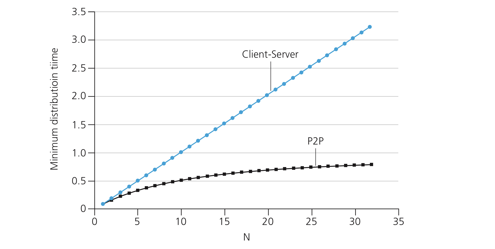

> Image credit to Computer Networking: A Top-down Approach, 7th Edition


### BitTorrent
BitTorrent is a popular P2P protocol for file distribution. In BitTorrent lingo, the collection of all peers participating in the distribution of a particular file is called a **torrent**. Peers in a torrent download equal-size chunks of the file from one another, with a typical chunk size of 256 kbytes. 

When a peer first joins a torrent, it has no chunks. Over time it accumulates more and more chunks. While it downloads chunks it also uploads chunks to other peers. Once a peer has acquired the entire file, it may (selfishly, most of us) leave the torrent, or (altruistically) remain in the torrent and continue to upload chunks to other peers. Also, any peer may leave the torrent at any time with only a subset of chunks, and later rejoin the torrent.

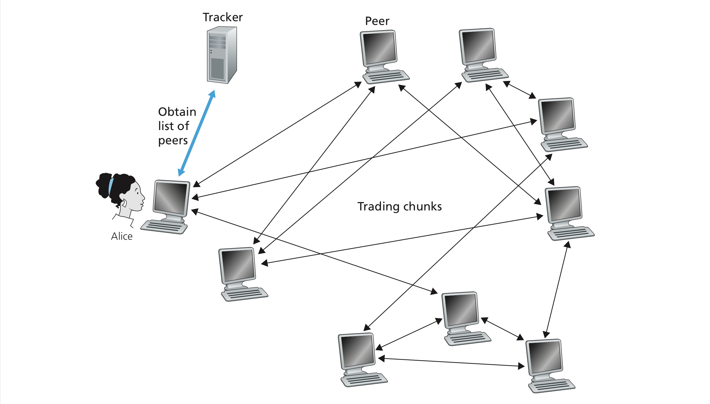

> Image credit to Computer Networking: A Top-down Approach, 7th Edition

Each torrent has an infrastructure node called a **tracker**. A tracker is essentially a server keeping track of all peers but doesn't provide the upload capacity of any data chunk. When a peer joins a torrent, it registers itself to the tracker and periodically informs the tracker that it is till in the torrent.

For example, when a new peer, Alice, joins the torrent

1. The tracker randomly select a subset of peers from the set of participating peers. Let's say, 50 peers in this example. 
1. Alice attempts to established 50 concurrent TCP connections with these peers (neighboring peers).
1. As time evolves, some of these peers may leave and other peers (outside the initial 50) may attempt to establish TCP connections with Alice. So a peer’s neighboring peers will fluctuate over time.

In BitTorrent, each user has two important decisions to make

1. Which chunks should I request first
    - Rarest first
1. Which of my neighbors should I send chunks to
    - tit-for-tat

#### Rarest first
The idea is to determine, from among the chunks she does not have, the chunks that are the rarest among her neighbors (that is, the chunks that have the fewest repeated copies among her neighbors) and then request those rarest chunks first. 

In this manner, the rarest chunks get more quickly redistributed, aiming to (roughly) **equalize** the numbers of copies of each chunk in the torrent.


#### Tit-for-tat
An incentive mechanism **tit-for-tat** is necessary to prevent the majority of the users from being **freeriders**, that is, users who only want to download the files but provides little upload capacity.

For each of the neighbors, a peer continually measures the rate at which it receives bits and determines the **four peers** that are feeding her bits at the **highest rate**. It then **only** sends chunks to these 4 peers, which are said to be **unchoked** . Every 10 seconds, the peer recalculate the rates and possibly modifies the set of 4 peers.

However, every 30 seconds, the peer also randomly picks one additional neighbor and sends it chunks. The randomly chosen peer is called **optimistically unchoked** and it has the chance to become one of the **unchoked** peer if it's rate is high enough.

Consequently, if the two peers are satisfied with the trading, they will put each other in their top four list and continue trading with each other. It's somehow similar to [Homogamy](https://www.youtube.com/watch?v=llKW1sGAADE) in Sociology. If you don't offer some chunks, then no one would like to give you either.

<!--

## Video Streaming and Content Distribution Networks
### Internet Video
### HTTP Streaming and DASH
### Content Distribution Networks
### Case Studies: Netflix, YouTube, and Kankan

## Socket Programming: Creating Network Applications
### Socket Programming with UDP
### Socket Programming with TCP

## Summary

-->
