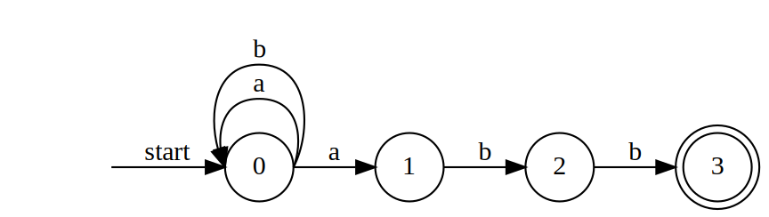
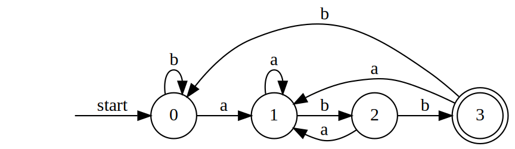
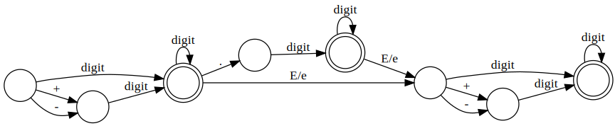

# Finite Automata
## Nondeterministic Finite Automata
Nondeterministic finite automata (NFA) have no restrictions on the labels of their edges. A symbol can label several edges out of the same state, and $\epsilon$, the empty string, is a possible label.

[[toc]]

#### Example
The transition graph for an NFA recognizing the language of regular expression `(a|b)*abb`. It is similar to regular expressions that describe languages of real interest.

For more details on the regular expression, check out the [note on the Unix programming class](/courses/cse365-unix-system-programming/lecture-5.md#regular-expression-regex-symbols).

### Transition tables
We can also represent an NFA by a transition table, whose rows correspond to states, and whose columns correspond to the input symbols and $\epsilon$. The entry is the transition state corresponding to the current state and the input. If the state-input pair doesn't exist, we put $\emptyset$ in the entry.

#### Example
The transition table for the NFA graph above.
| State | $a$         | $b$         | $\epsilon$  |
|-------|-------------|-------------|-------------|
| $0$   | $\{ 0,1 \}$ | $\{ 0 \}$   | $\emptyset$ |
| $1$   | $\emptyset$ | $\{ 2 \}$   | $\emptyset$ |
| $2$   | $\emptyset$ | $\{ 3 \}$   | $\emptyset$ |
| $3$   | $\emptyset$ | $\emptyset$ | $\emptyset$ |

## Deterministic Finite Automata
A deterministic finite automaton (DFA) is a special case of an NFA where:

1. There are no moves on input $\epsilon$.
1. For each state $s$ and input symbol $a$, there is exactly **one** edge out of $s$ labeled $a$.

#### Example
The transition graph for an DFA recognizing the language of regular expression `(a|b)*abb`.

The transition graph for **floating point**

Define **digit** as `[0-9]` in the regular expression

