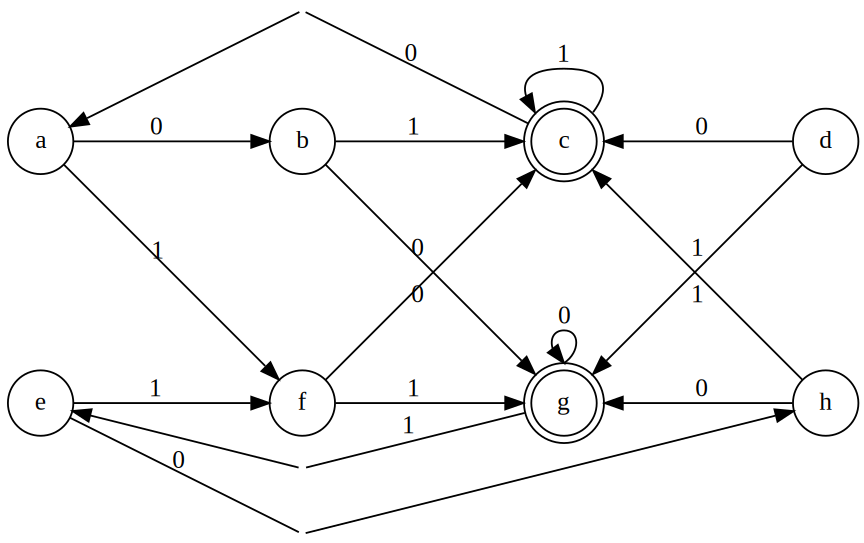
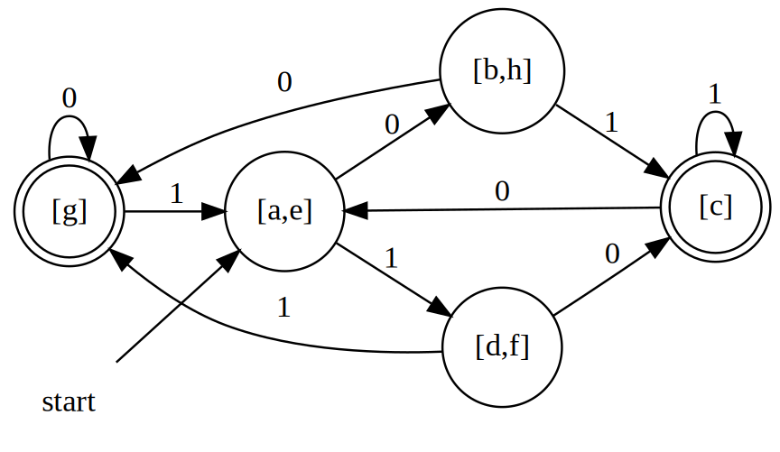
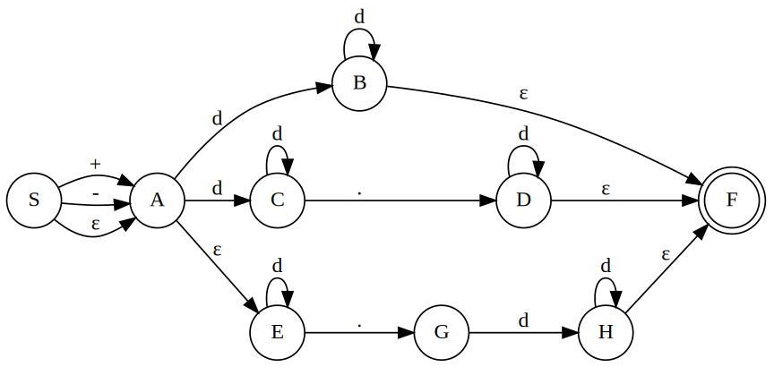
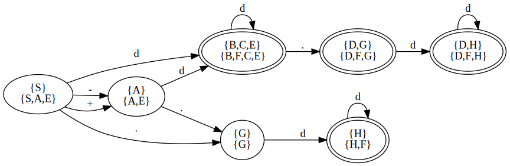
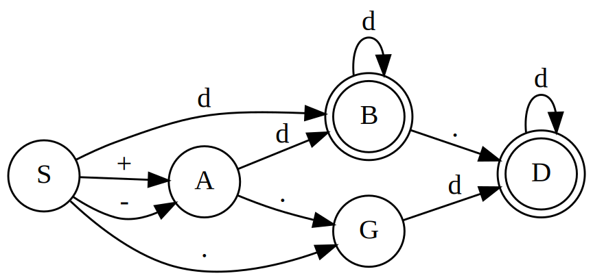
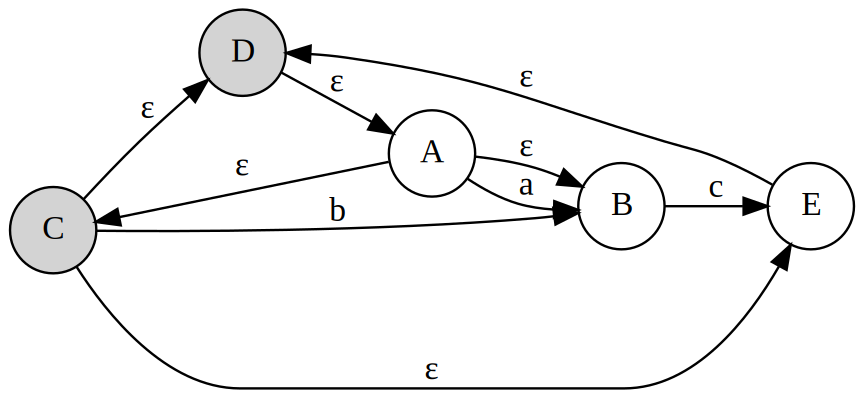
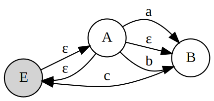
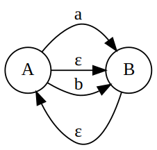

# Optimization of DFA-Based Pattern Matchers

## Minimizing the Number of State of a DFA
There can be many DFA's that recognize the same language. Not only do these automata have states with different names, but they don't even have the same number of states. If we implement a lexical analyzer as a DFA, we would generally prefer a DFA with as few states as possible.

**Rules for minimization**

For states $s$ and $t$ in a finite automata, they can be merged if and only if for all input symbol $a$, states $s$ and $t$ both have transitions on $a$ to

1. non-final states
1. the same final state or merged final state

### Example
Minimize the following DFA transition graph

In the following table, each entry shows whether two sets can be merged, while the upper-right triangle is redundant.

|   | a  | b  | c | d  | e | f | g |
|---|----|----|---|----|---|---|---|
| b |    | —  | — | —  | — | — | — |
| c |    |    | — | —  | — | — | — |
| d |    |    |   | —  | — | — | — |
| e | ✅ |    |   |    | — | — | — |
| f |    |    |   | ✅ |   | — | — |
| g |    |    |   |    |   |   | — |
| h |    | ✅ |   |    |   |   |   |

Consequently, we get these new state

## More NFA-to-DFA Conversion
Consider the regular expression, NFA transition graph and the corresponding transition table

`(+|-)?(d+|d+.d*|d*.d+)`

|                                                                                | + | - | . | d    | ε |
|--------------------------------------------------------------------------------|---|---|---|------|---|
| S                                                                              | A | A |   |      | A |
| A                                                                              |   |   |   | B, C | E |
| B                                                                              |   |   |   | B    | &nbsp;F&nbsp; |
| C                                                                              |   |   | D | C    |   |
| D                                                                              |   |   |   | D    | &nbsp;F&nbsp; |
| E                                                                              |   |   | G | E    |   |
| &nbsp;F&nbsp; |   |   |   |      |   |
| G                                                                              |   |   |   | H    |   |
| H                                                                              |   |   |   | H    | &nbsp;F&nbsp; |

### Using subset construction

$$\begin{matrix}
                    &                       & \{ \overline{S} \}    & = & \{ S,A,E \} \\
\{ \overline{S} \}  & \xrightarrow{+/-}     & \{ \overline{A} \}    & = & \{ A,E \} \\
\{ \overline{A} \}  & \xrightarrow{.}       & \{ \overline{G} \}    & = & \{ G \} \\
\{ \overline{G} \}  & \xrightarrow{d}       & \{ \overline{H} \}    & = & \{ H,F \} \\
\{ \overline{H} \}  & \xrightarrow{d}       & \{ \overline{H} \}    & = & \{ H,F \} \\
\{ \overline{A} \}  & \xrightarrow{d}       & \{ \overline{B,C,E} \}& = & \{ B,F,C,E \} \\
\{ \overline{B,C,E} \}  & \xrightarrow{.}       & \{ \overline{D,G} \}  & = & \{ D,F,G \} \\
\{ \overline{D,G} \}    & \xrightarrow{d}       & \{ \overline{D,H} \}  & = & \{ D,F,H \} \\
\{ \overline{D,H} \}    & \xrightarrow{d}       & \{ \overline{D,H} \}  & = & \{ D,F,H \} \\
\{ \overline{B,C,E} \}  & \xrightarrow{d}       & \{ \overline{B,C,E} \}& = & \{ B,F,C,E \} \\
\{ \overline{S} \}  & \xrightarrow{.}       & \{ \overline{G} \}    & = & \{ G \} \\
\{ \overline{S} \}      & \xrightarrow{d}       & \{ \overline{B,C,E} \}& = & \{ B,F,C,E \} \\

\end{matrix}$$

|                                                                                      | +   | -   | .     | d       |
|--------------------------------------------------------------------------------------|-----|-----|-------|---------|
| S,A,E                                                                                | A,E | A,E | G     | &nbsp;B,F,C,E&nbsp; |
| A,E                                                                                  |     |     | G     | &nbsp;B,F,C,E&nbsp; |
| G                                                                                    |     |     |       | &nbsp;H,F&nbsp;     |
| &nbsp;H,F&nbsp;     |     |     |       | &nbsp;H,F&nbsp;     |
| &nbsp;B,F,C,E&nbsp; |     |     | &nbsp;D,F,G&nbsp;| &nbsp;B,F,C,E&nbsp; |
| &nbsp;D,F,G&nbsp;   |     |     |       | &nbsp;D,F,G&nbsp;   |
| &nbsp;D,F,H&nbsp;   |     |     |       | &nbsp;D,F,G&nbsp;   |

### Minimize DFA using the technique above

Since $\{ D,F,G \} \xrightarrow{d}\{ D,F,G \}$ and $\{ D,F,H \} \xrightarrow{d}\{ D,F,G \}$, we can merge $\{ D,F,G \}$ and $\{ D,F,H \}$ into $\{ D,F,G,H \}$, which producing

|                                                                                      | +   | -   | .     | d       |
|--------------------------------------------------------------------------------------|-----|-----|-------|---------|
| S,A,E                                                                                | A,E | A,E | G     | &nbsp;B,F,C,E&nbsp; |
| A,E                                                                                  |     |     | G     | &nbsp;B,F,C,E&nbsp; |
| G                                                                                    |     |     |       | &nbsp;H,F&nbsp;     |
| &nbsp;H,F&nbsp;     |     |     |       | &nbsp;H,F&nbsp;     |
| &nbsp;B,F,C,E&nbsp; |     |     | &nbsp;D,F,G,H&nbsp;| &nbsp;B,F,C,E&nbsp; |
| &nbsp;D,F,G,H&nbsp;   |     |     |       | &nbsp;D,F,G,H&nbsp;   |

::: tip

Now, the next minimization is tricky. For $\{ H,F \}$ and $\{ D,F,G,H \}$, we can merge them if and only if they're merged. 

In DFA minimization, when **the effect is the cause**, we shall always assume that the minimization stands, i.e., $\{ H,F \}$ and $\{ D,F,G,H \}$ can be merged!
:::

After they're merged, we get.

|                                                                                      | +   | -   | .     | d       |
|--------------------------------------------------------------------------------------|-----|-----|-------|---------|
| S,A,E                                                                                | A,E | A,E | G     | &nbsp;B,F,C,E&nbsp; |
| A,E                                                                                  |     |     | G     | &nbsp;B,F,C,E&nbsp; |
| G                                                                                    |     |     |       | &nbsp;D,F,G,H&nbsp;     |
| &nbsp;B,F,C,E&nbsp; |     |     | &nbsp;D,F,G,H&nbsp;| &nbsp;B,F,C,E&nbsp; |
| &nbsp;D,F,G,H&nbsp;   |     |     |       | &nbsp;D,F,G,H&nbsp;   |

Tidy it up by renaming the merged state with the leading state

|                                                                                      | +   | -   | .     | d       |
|--------------------------------------------------------------------------------------|-----|-----|-------|---------|
| S                                                                                | A | A | G     | &nbsp;B&nbsp; |
| A                                                                                  |     |     | G     | &nbsp;B&nbsp; |
| G                                                                                    |     |     |       | &nbsp;D&nbsp;     |
| &nbsp;B&nbsp; |     |     | &nbsp;D&nbsp;| &nbsp;B&nbsp; |
| &nbsp;D&nbsp;   |     |     |       | &nbsp;D&nbsp;   |

## Eliminating Empty Cycles and Paths
We've seen how to transform the NFA into the DFA, however, the number of states in the DFA may grow **exponentially** with the number of states in the NFA. So we should do some processes on the NFA before using subset construction.

### Eliminating empty cycles
Whenever there is an empty cycles, a state within the cycle can be eliminate. A empty cycle consists of solely two or more empty transitions. For example, the graph below contains two empty cycles, `C-D-A` and `C-D-E`. The gray state indicate that it can be eliminated.

