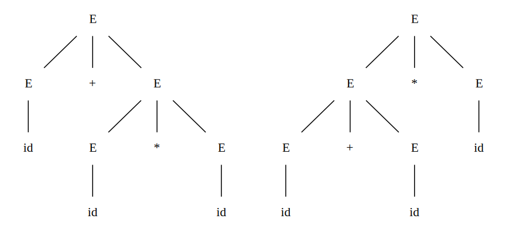

# Context-Free Grammars

[[toc]]

## Derivations
Beginning with the start symbol, each production rule rewrites a nonterminal by its right hand side. For example

(1)
$$E \rightarrow E+E \; \vert \; E*E \; \vert \; -E \; \vert \; \lparen E \rparen \; \vert \; \textbf{id}$$

The replacement of a single $E$ by $-E$ is written as

$$ E \Rightarrow -E$$

and is read as "$E$ derives $-E$".The symbol $\Rightarrow$ means **deriving in one step**.

We can take a single $E$ and repeatedly apply productions in any order to get a sequence of replacements. For example

$$E \Rightarrow -E \Rightarrow - \lparen E \rparen \Rightarrow - \lparen \textbf{id} \rparen$$

When a sequence of derivation steps $\alpha_1 \Rightarrow \alpha_2 \Rightarrow \cdots \Rightarrow \alpha{n}$ rewrites $\alpha_1$ to $\alpha_n$, we denote it as $\alpha_1 \xRightarrow{*} \alpha_n$, meaning **deriving in zero or more steps**. Likewise, the symbol $\xRightarrow{+}$ means **deriving in one or more steps**.

To understand how parsers work, we shall consider derivations in which the nonterminal to be replaced at each step is chosen as follows:

1. **leftmost** derivations: the leftmost nonterminal in each sentential is always chosen. We use the symbol $\xRightarrow[lm]{}$ to denote a leftmost derivation
1. **rightmost** derivations: the rightmost nonterminal in each sentential is always chosen. We use the symbol $\xRightarrow[rm]{}$ to denote a rightmost derivation

For example, (notice the leftmost nonterminal is always replaced before others)

$$E \xRightarrow[lm]{} -E \xRightarrow[lm]{} - \lparen E \rparen \xRightarrow[lm]{} - \lparen E+E \rparen \xRightarrow[lm]{} - \lparen \textbf{id} + E \rparen \xRightarrow[lm]{} - \lparen \textbf{id} + \textbf{id} \rparen$$

## Ambiguity
An ambiguous grammar is one that produces more than one leftmost derivation or more than one rightmost derivation for the same sentence. For example, the arithmetic expression grammar (1) permits two distinct leftmost derivations for the sentence $\textbf{id} + \textbf{id} * \textbf{id}$

$$\begin{matrix}
E & \Rightarrow & E+E \;\;\;\;\;\;\;\;              & E & \Rightarrow & E*E \;\;\;\;\;\;\; \\
  & \Rightarrow & \textbf{id} + E \;\;\;\;\;\;        &   & \Rightarrow & E+E*E \\
  & \Rightarrow & \textbf{id} + E*E                   &   & \Rightarrow & \textbf{id} + E*E \\
  & \Rightarrow & \textbf{id} + \textbf{id} * E         &   & \Rightarrow & \textbf{id} + \textbf{id} * E \\
  & \Rightarrow & \textbf{id} + \textbf{id} * \textbf{id} &   & \Rightarrow & \textbf{id} + \textbf{id} * \textbf{id} \\
\end{matrix}$$

However, we would normally evaluate an expression like $a+b*c$ as $a + \lparen b*c \rparen$, rather than as $\lparen a+b \rparen * c$.

