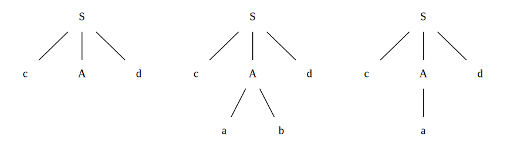
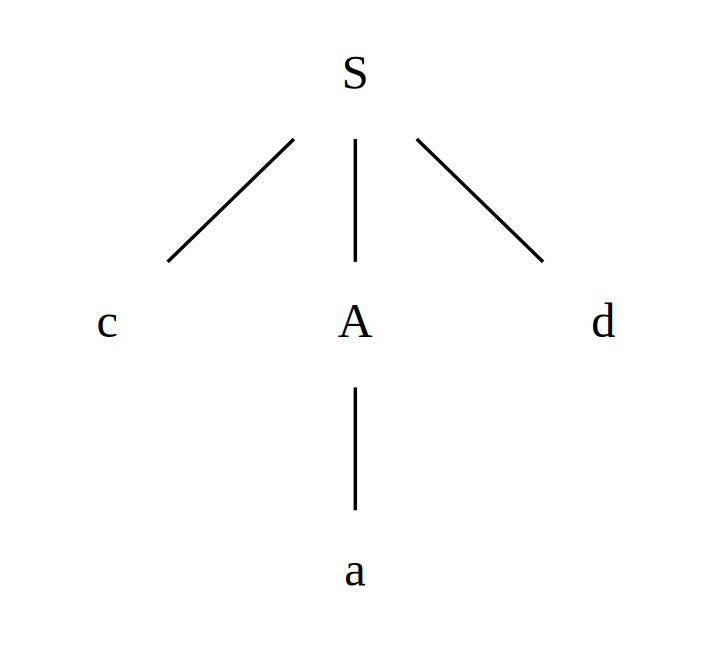
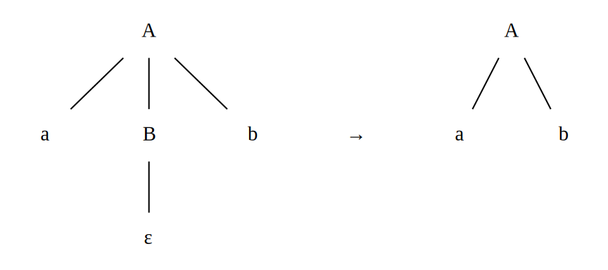
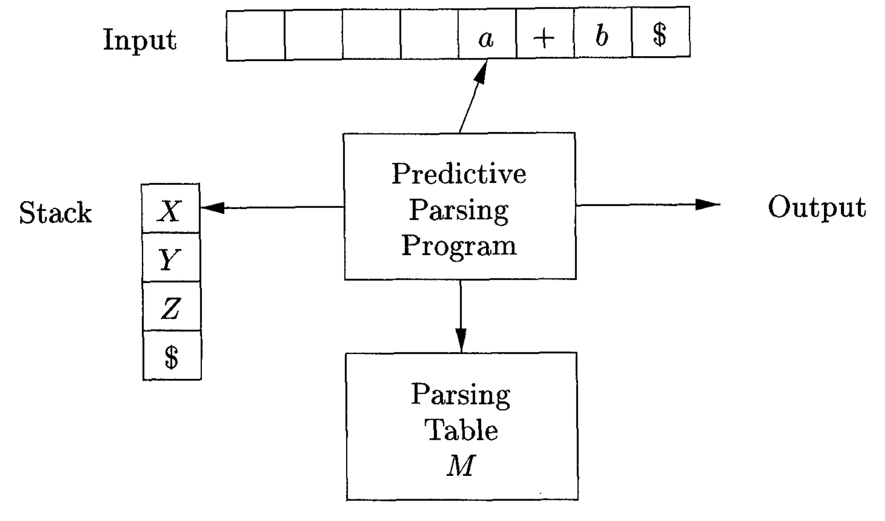
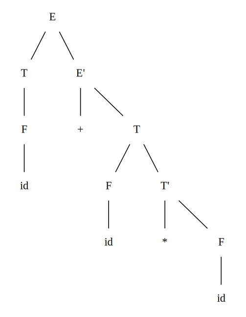

# Top-Down Parsing
The section begins with a general form of top-down parsing, called recursive-descent parsing, which may require backtracking to find the correct $A$-production to be applied. Later we'll introduce predictive parsing, a special case of recursive-descent parsing, where **no backtracking** is required. Predictive parsing chooses the correct $A$-production by looking ahead at the input a fixed number of symbols, typically we may look only at one (that is, the next input symbol).

[[toc]]

## Recursive-Descent Parsing
Consider the grammar

$$\begin{matrix}
S & \rightarrow & cAd \\
A & \rightarrow & ab \; \vert \; a \\
\end{matrix}$$

To construct a parse tree top-down for the input string $w = cad$, begin with the starting node $S$, and the input pointer pointing to the first character from left to right of the input, i.e., $c$.

1. Since $S$ has only one production, we use it to expand $S$ and obtain the tree of the lhs of the figure below.
1. The leftmost leaf, labeled $c$, matches the first symbol of input $w$, so we advance the input pointer to $a$. Now, use the first alternative $A \rightarrow ab$ to obtain the tree of the middle of the figure below.
1. Since $b$ does not match $d$, we report failure and go back to $A$ and retract the input pointer to seek for another alternative producing a match. The second alternative $A -> a$ produces the tree of rhs of the figure below. The leaf $a$ and $d$ match to the second and the third symbols of $w$ respectively, we halt and annouce successful completion of parsing.



Noted that a left-recursive grammar can cause a recursive-descent parser, even one with backtracking, to go into an infinite loop. That's why we've talked about the [elimination of left recursion](./writing-a-grammar.md#elimination-of-left-recursion). Also, the backtracking is not an efficient way to construct a parse tree, thus we shall see how to predict the right alternative below.

## FIRST Set
### Why FIRST
**Consider the production rule**

$$\begin{matrix}
S & \rightarrow & cAd \\
A & \rightarrow & bc \; \vert \; a \\
\end{matrix}$$

Assume the input string is $cad$. Scanning from left to write, upon reading $c$, we know that $S \rightarrow cAd$ may be applicable but only if $A$ produces a string led by $a$. Therefore, we need to know what comes first in $A$, i.e. $FIRST \lparen A \rparen$.

In this case, $FIRST \lparen A \rparen = \{b, a\}$, so we can tell that $A$ is applicable and use the production rule $A \rightarrow a$ to build the following parse tree.



### Rules for FIRST set
To compute $FIRST(X)$ for all grammar symbol $X$, apply the following rules until no more terminals or $\epsilon$ can be added to any FIRST set.

1. If $X$ is a terminal, then $FIRST(X) = \{X\}$.
1. If $X$ is a nonterminal and $X \rightarrow Y_1Y_2 \cdots Y_k$ is a production for some $k\geq 1$
    - Place $a$ in $FIRST(X)$ if for some $i$, $a$ is in $FIRST(Y_i)$, and  $\epsilon$ is in all of $FIRST(Y_1), \cdots , FIRST(Y_{i-1})$, i.e., $Y_1 \cdots Y_{i-1} \xRightarrow{*} \epsilon$.
    - Add $\epsilon$ to $FIRST(X)$ if $\epsilon$ is in $FIRST(Y_j)$ for all $j = 1, 2, \cdots ,k$.
3. If $X \rightarrow \epsilon$ is a production, then add $\epsilon$ to $FIRST(X)$.

::: tip Elaboration on the Rules

1. For example, suppose $A \rightarrow a \; \vert \; \lparen B \rparen$, then $FIRST(A) = \{ a , \lparen \}$, where $a$ and $\lparen$ are terminals
1. For example, everything in $FIRST(Y_1)$ is surely in $FIRST(X)$. If $Y_1$ does not derive $\epsilon$, then we add nothing more to $FIRST(X)$, but if $Y_1 \xRightarrow{*} \epsilon$, then we add $FIRST(Y_2)$, and so on.
1. The rule should be self-explanatory.

:::

### A simple example
Consider the production rules below

$$\begin{matrix}
E  & \rightarrow & TE' \;\;\;\;\;\;\; \\
E' & \rightarrow & +TE' \; \vert \; \epsilon \\
T  & \rightarrow & FT' \;\;\;\;\;\;\; \\
T' & \rightarrow & *FT' \; \vert \; \epsilon \\
F  & \rightarrow & \lparen E \rparen \; \vert \; \textbf{id} \\
\end{matrix}$$

Find the FIRST sets for the nonterminals
::: tip Solution
```
FIRST(F) = {(}
FIRST(F) = {(, id}

FIRST(E') = {+}
FIRST(E') = {+, ε}

FIRST(T') = {*}
FIRST(T') = {*, ε}

FIRST(T) = FIRST(F) = {(, id}
FIRST(E) = FIRST(T) = {(, id}
```

| Nonterminal | FIRST Set                  |
|-------------|----------------------------|
| $E$         | $\{ \lparen , \textbf{id}\}$ |
| $E'$        | $\{+, \epsilon \}$         |
| $T$         | $\{ \lparen , \textbf{id}\}$ |
| $T'$        | $\{*, \epsilon \}$         |
| $F$         | $\{ \lparen , \textbf{id}\}$ |

:::


## FOLLOW Set
### Why FOLLOW
**Consider the production rule**

$$\begin{matrix}
A & \rightarrow & aBb \\
B & \rightarrow & c \; \vert \; \epsilon \\
\end{matrix}$$

Suppose the string to parse is $ab$. Scanning from left to write, upon reading $a$, we know that $A \rightarrow aBb$ may be applicable but only if $B$ can vanish **and the character follows  $B$ is $b$**. That's why we need to know what follows $B$, i.e. $FOLLOW \lparen B \rparen$

In this case, $FOLLOW \lparen B \rparen = \{b\}$ and the current input (after scanned $a$) is $b$. Hence the parser applies this rule and generate the following parse tree



### Rules for FOLLOW set
To compute $FOLLOW(A)$ for all nonterminals $A$, apply the following rules until nothing can be added to any FOLLOW set.

1. Place $\$$ in $FOLLOW(S)$, where $S$ is the start symbol and $\$$ is the input right endmarker.
1. If there is a production $A \rightarrow \alpha B \beta$, then everything in $FIRST(\beta)$ except $\epsilon$ is in $FOLLOW(B)$.
1. If there is a production $A \rightarrow \alpha B$, or a production $A \rightarrow \alpha B \beta$, where $FIRST(\beta)$ contains $\epsilon$, then everything in $FOLLOW(A)$ is in $FOLLOW(B)$.

### A simple example
Continue the example above

$$\begin{matrix}
E  & \rightarrow & TE' \;\;\;\;\;\;\; \\
E' & \rightarrow & +TE' \; \vert \; \epsilon \\
T  & \rightarrow & FT' \;\;\;\;\;\;\; \\
T' & \rightarrow & *FT' \; \vert \; \epsilon \\
F  & \rightarrow & \lparen E \rparen \; \vert \; \textbf{id} \\
\end{matrix}$$

| Nonterminal | FIRST Set                  |
|-------------|----------------------------|
| $E$         | $\{ \lparen , \textbf{id}\}$ |
| $E'$        | $\{+, \epsilon \}$         |
| $T$         | $\{ \lparen , \textbf{id}\}$ |
| $T'$        | $\{*, \epsilon \}$         |
| $F$         | $\{ \lparen , \textbf{id}\}$ |

Find the FOLLOW sets for the nonterminals

::: tip Solution
```
FOLLOW(E) = {$}
FOLLOW(E) = {$, )}

FOLLOW(E') = FOLLOW(E) = {$, )}

FOLLOW(T) = FIRST(E') - {ε} = {+}
FOLLOW(T) = {+} ∪ FOLLOW(E) = {+, $, )}

FOLLOW(T') = FOLLOW(T) = {+, $, )}

FOLLOW(F) = FIRST(T') - {ε} = {*}
FOLLOW(F) = {*} ∪ FOLLOW(T) = {*, +, $, )}

```

| Nonterminal | FOLLOW Set                                   |
|-------------|----------------------------------------------|
| $E$         | $\{ \textdollar , \rparen \}$         |
| $E'$        | $\{ \textdollar , \rparen \}$         |
| $T$         | $\{ + , \textdollar , \rparen \}$     |
| $T'$        | $\{ + , \textdollar , \rparen \}$     |
| $F$         | $\{ * , + , \textdollar , \rparen \}$ |

:::


## LL(1) Grammars
Predictive parsers, that is, recursive-descent parsers needing no backtracking, can be constructed for a class of grammars called **LL(1)**. 

1. The first "L" in LL(1) stands for scanning the input from **left to right**, 
1. The second "L" for producing a **leftmost derivation**
1. The "1" for using **one input** symbol of lookahead at each step to make parsing action decisions.

### Definition of LL(1) grammars
A grammar $G$ is LL(1) if and only if whenever $A \rightarrow \alpha \; \vert \; \beta$ are two distinct productions of $G$, the following conditions hold:

1. No left-recursion or ambiguity
1. For no terminal $a$ do both $\alpha$ and $\beta$ derive strings beginning with $a$.
    - Equivalent to that $FIRST \lparen \alpha \rparen$ and $FIRST \lparen \beta \rparen$ are disjoint sets.
1. At most one of $\alpha$ and $\beta$ can derive the empty string.
1. If $\beta \xRightarrow{*} \epsilon$, then $\alpha$ does not derive any string beginning with a terminal in $FOLLOW \lparen A \rparen$, and vice versa.
    - Equivalent to that if $\epsilon$ is in $FIRST \lparen \beta \rparen$, then $FIRST \lparen \alpha \rparen$ and $FOLLOW \lparen A \rparen$ are disjoint sets, and vice versa.

## Nonrecursive Predictive Parsing
### Construction of a predictive parsing table
For each production $A \rightarrow \alpha$ of the grammar, do the following:

1. For each terminal $a$ in $FIRST \lparen \alpha \rparen$, add $A \rightarrow \alpha$ to $M \lbrack A, a \rbrack$
1. If $\epsilon$ is in $FIRST \lparen \alpha \rparen$, then for each terminal $b$ in $FOLLOW \lparen A \rparen$, add $A \rightarrow \alpha$ to $M \lbrack A, b \rbrack$. If $\epsilon$ is in $FIRST \lparen \alpha \rparen$ and $\$$ is in $FOLLOW \lparen A \rparen$, add $A \rightarrow \alpha$ to $M \lbrack A, \textdollar \rbrack$ as well.

Finally, set $M \lbrack A, a \rbrack$ to **error** if there's no production at all.

Use the same grammar above for example, but we'll use the standard BNF for a clearer view

$$\begin{matrix}
E  & \rightarrow & TE' \\
E' & \rightarrow & +TE' \\
E' & \rightarrow & \epsilon \\
T  & \rightarrow & FT' \\
T' & \rightarrow & *FT' \\
T' & \rightarrow & \epsilon \\
F  & \rightarrow & \lparen E \rparen \\
F  & \rightarrow & \textbf{id} \\
\end{matrix}$$

| Nonterminal | FIRST Set                  | FOLLOW Set                                   |
|-------------|----------------------------|----------------------------------------------|
| $E$         | $\{ \lparen , \textbf{id}\}$ | $\{ \textdollar , \rparen \}$         |
| $E'$        | $\{+, \epsilon \}$         | $\{ \textdollar , \rparen \}$         |
| $T$         | $\{ \lparen , \textbf{id}\}$ | $\{ + , \textdollar , \rparen \}$     |
| $T'$        | $\{*, \epsilon \}$         | $\{ + , \textdollar , \rparen \}$     |
| $F$         | $\{ \lparen , \textbf{id}\}$ | $\{ * , + , \textdollar , \rparen \}$ |

```
For E -> TE'
    1.  M[E, (]  = E -> TE'
        M[E, id] = E -> TE'

For E' -> +TE'
    1.  M[E', +] = E' -> +TE'

For E' -> ε
    2.  M[E', )] = E' -> ε
        M[E', $] = E' -> ε

For T -> FT'
    1.  M[T, (]  = T -> FT'
        M[T, id] = T -> FT'

For T' -> *FT'
    1.  M[T', *] = T' -> *FT'

For T' -> ε
    2.  M[T', +] = T' -> ε
        M[T', )] = T' -> ε
        M[T', $] = T' -> ε

For F -> (E)
    1.  M[F, (]  = F -> (E)

For F -> id
    1.  M[F, id] = F -> id
```

|      | $\textbf{id}$               | $+$                       | $*$                   | $\lparen$                         | $\rparen$                 | $\$$                      |
|------|---------------------------|---------------------------|-----------------------|-----------------------------------|---------------------------|---------------------------|
| $E$  | $E \rightarrow TE'$       |                           |                       | $E \rightarrow TE'$               |                           |                           |
| $E'$ |                           | $E' \rightarrow +TE'$     |                       |                                   | $E' \rightarrow \epsilon$ | $E' \rightarrow \epsilon$ |
| $T$  | $T \rightarrow FT'$       |                           |                       | $T \rightarrow FT'$               |                           |                           |
| $T'$ |                           | $T' \rightarrow \epsilon$ | $T' \rightarrow *FT'$ |                                   | $T' \rightarrow \epsilon$ | $T' \rightarrow \epsilon$ |
| $F$  | $F \rightarrow \textbf{id}$ |                           |                       | $F \rightarrow \lparen E \rparen$ |                           |                           |

### PREDICT sets and LL(1) verification
In some literature, the predictive parsing table can be viewed as **PREDICT sets**. For each production $A \rightarrow \alpha$ of the grammar, add $a$ into $PREDICT \lparen A \rightarrow \alpha \rparen$ if $M \lbrack A, a \rbrack$ is $A \rightarrow \alpha$.

| Production                        | PREDICT Set                             |
|-----------------------------------|-----------------------------------------|
| $E \rightarrow TE'$               | $\{ \textbf{id} , \lparen \}$             |
| $E' \rightarrow +TE'$             | $\{ + \}$                               |
| $E' \rightarrow \epsilon$         | $\{ \rparen , \textdollar \}$    |
| $T \rightarrow FT'$               | $\{ \textbf{id} , \lparen \}$             |
| $T' \rightarrow *FT'$             | $\{ * \}$                               |
| $T' \rightarrow \epsilon$         | $\{ +, \rparen , \textdollar \}$ |
| $F \rightarrow \lparen E \rparen$ | $\{ \lparen \}$                         |
| $F \rightarrow \textbf{id}$         | $\{ \textbf{id} \}$                       |

We can further combine the 2<sup>nd</sup> and 4<sup>th</sup> conditions in the [definition of LL(1) grammars](#definition-of-ll-1-grammars) into the examination of PREDICT sets. LL(1) contains exactly those grammars that have **disjoint PREDICT sets** for productions that share a common left-hand side. That is, at most **one** production can be added into each entry in the predictive parsing table $M$.

::: tip Example

| Production                        | PREDICT Set                             |
|-----------------------------------|-----------------------------------------|
| $E' \rightarrow +TE'$             | $\{ + \}$                               |
| $E' \rightarrow \epsilon$         | $\{ \rparen , \textdollar \}$    |

|      | $\textbf{id}$               | $+$                       | $*$                   | $\lparen$                         | $\rparen$                 | $\$$                      |
|------|---------------------------|---------------------------|-----------------------|-----------------------------------|---------------------------|---------------------------|
| $E'$ |                           | $E' \rightarrow +TE'$     |                       |                                   | $E' \rightarrow \epsilon$ | $E' \rightarrow \epsilon$ |

**LL(1)!**

| Production                        | PREDICT Set                             |
|-----------------------------------|-----------------------------------------|
| $T' \rightarrow *FT'$             | $\{ * \}$                               |
| $T' \rightarrow \epsilon$         | $\{ +, \rparen , \textdollar \}$ |

|      | $\textbf{id}$               | $+$                       | $*$                   | $\lparen$                         | $\rparen$                 | $\$$                      |
|------|---------------------------|---------------------------|-----------------------|-----------------------------------|---------------------------|---------------------------|
| $T'$ |                           | $T' \rightarrow \epsilon$ | $T' \rightarrow *FT'$ |                                   | $T' \rightarrow \epsilon$ | $T' \rightarrow \epsilon$ |

**LL(1)!**

| Production                        | PREDICT Set                             |
|-----------------------------------|-----------------------------------------|
| $F \rightarrow \lparen E \rparen$ | $\{ \lparen \}$                         |
| $F \rightarrow \textbf{id}$         | $\{ \textbf{id} \}$                       |

|      | $\textbf{id}$               | $+$                       | $*$                   | $\lparen$                         | $\rparen$                 | $\$$                      |
|------|---------------------------|---------------------------|-----------------------|-----------------------------------|---------------------------|---------------------------|
| $F$  | $F \rightarrow \textbf{id}$ |                           |                       | $F \rightarrow \lparen E \rparen$ |                           |                           |

**LL(1)!**
:::


### Table-driven predictive parsing

**Model of a table-driven predictive parser**



> Image credit to Compilers: Principles, Techniques, and Tools 2nd Edition

- Input: A string $w$ and a [parsing table](#construction-of-a-predictive-parsing-table) $M$ for grammar $G$.
- Output: A leftmost derivation of $w$ or an error indication.

Initially, the parser is in a configuration with $w\$$ in the input buffer and the start symbol $S$ of $G$ on top of the stack, above $\$$.

- Set the input pointer $ip$ to point to the first symbol of $w$
- Set $X$ to the top stack symbol and while $X \neq \$$ do the following

1. If $X$ is $a$, pop the stack and advance $ip$.
    - Else if $X$ is a terminal or $M \lbrack X, a \rbrack$ is an error entry ,error out.
    - Else if $M \lbrack X ,a \rbrack = X \rightarrow Y_1Y_2 \cdots Y_k$
        1. Output the production $X \rightarrow Y_1Y_2 \cdots Y_k$
        1. Pop the stack
        1. Push $Y_k, Y_{k-1}, \cdots , Y_1$ onto the stack, with $Y_1$ on top
1. Set $X$ to the top stack symbol.

#### Example
Continue from above

|      | $\textbf{id}$               | $+$                       | $*$                   | $\lparen$                         | $\rparen$                 | $\$$                      |
|------|---------------------------|---------------------------|-----------------------|-----------------------------------|---------------------------|---------------------------|
| $E$  | $E \rightarrow TE'$       |                           |                       | $E \rightarrow TE'$               |                           |                           |
| $E'$ |                           | $E' \rightarrow +TE'$     |                       |                                   | $E' \rightarrow \epsilon$ | $E' \rightarrow \epsilon$ |
| $T$  | $T \rightarrow FT'$       |                           |                       | $T \rightarrow FT'$               |                           |                           |
| $T'$ |                           | $T' \rightarrow \epsilon$ | $T' \rightarrow *FT'$ |                                   | $T' \rightarrow \epsilon$ | $T' \rightarrow \epsilon$ |
| $F$  | $F \rightarrow \textbf{id}$ |                           |                       | $F \rightarrow \lparen E \rparen$ |                           |                           |

**Moves made by a predictive parser on input** $\textbf{id} + \textbf{id} * \textbf{id}$

| Matched                             | Input                                 | Action                           | Stack                |
|-------------------------------------|---------------------------------------|----------------------------------|----------------------|
|                                     | $\textbf{id} + \textbf{id} * \textbf{id}\$$ |                                  | $E\$$                |
|                                     | $\textbf{id} + \textbf{id} * \textbf{id}\$$ | output $E \rightarrow TE'$       | $TE'\$$              |
|                                     | $\textbf{id} + \textbf{id} * \textbf{id}\$$ | output $T \rightarrow FT'$       | $FT'E'\$$            |
|                                     | $\textbf{id} + \textbf{id} * \textbf{id}\$$ | output $F \rightarrow \textbf{id}$ | $\textbf{id} T'E'\$$   |
| $\textbf{id}$                         | $+ \textbf{id} * \textbf{id}\$$           | match $\textbf{id}$                | $T'E'\$$             |
| $\textbf{id}$                         | $+ \textbf{id} * \textbf{id}\$$           | output $T' \rightarrow \epsilon$ | $E'\$$               |
| $\textbf{id}$                         | $+ \textbf{id} * \textbf{id}\$$           | output $E' \rightarrow +TE'$     | $+TE'\$$             |
| $\textbf{id} +$                       | $\textbf{id} * \textbf{id}\$$             | match $+$                        | $TE'\$$              |
| $\textbf{id} +$                       | $\textbf{id} * \textbf{id}\$$             | output $T \rightarrow FT'$       | $FT'E'\$$            |
| $\textbf{id} +$                       | $\textbf{id} * \textbf{id}\$$             | output $F \rightarrow \textbf{id}$ | $\textbf{id} T'E'\$$   |
| $\textbf{id} + \textbf{id}$             | $* \textbf{id}\$$                       | match $\textbf{id}$                | $T'E'\$$             |
| $\textbf{id} + \textbf{id}$             | $* \textbf{id}\$$                       | output $T' \rightarrow *FT'$     | $\textbf{id} *FT'E'\$$ |
| $\textbf{id} + \textbf{id} *$           | $\textbf{id}\$$                         | match $*$                        | $FT'E'\$$            |
| $\textbf{id} + \textbf{id} *$           | $\textbf{id}\$$                         | output $F \rightarrow \textbf{id}$ | $\textbf{id} T'E'\$$   |
| $\textbf{id} + \textbf{id} * \textbf{id}$ | $\$$                                  | match $\textbf{id}$                | $T'E'\$$             |
| $\textbf{id} + \textbf{id} * \textbf{id}$ | $\$$                                  | output $T' \rightarrow \epsilon$ | $E'\$$               |
| $\textbf{id} + \textbf{id} * \textbf{id}$ | $\$$                                  | output $E' \rightarrow \epsilon$ | $\$$                 |





