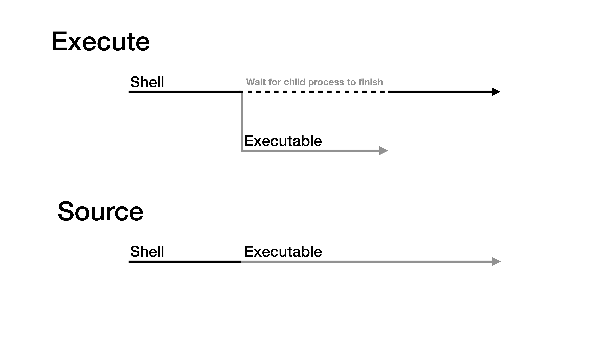

# Lecture 3
## Miscellaneous Commands

| Command         | Description                                |
|-----------------|--------------------------------------------|
| `sort (-gkrsR)` | Sort the lines of a file                   |
| `uniq (-c)`     | Delete repeated lines (leave unique lines) |
| `tr (-dc)`      | Replace (translate) or delete characteers  |
| `expr`          | Calculate an expression from arguments     |
| `seq`           | Create a sequence of numbers, 1 per line   |

### sort
Some useful flags:

- `-r`: **sort in reverse order.**
- `-g`: **performs a numeric sort.** if no `-g`, then it is **alphabetic** sort, meaning that **10** goes before **2**
- `-k`: **allows you to sort on different fields.** e.g. `sort -k3` sorts on the 3<sup>rd</sup> field.
- `-s`: **keeps lines that in the same sorting order maintain the original order.** e.g. `sort -k3 | sort -sk5` sorts based on the 5<sup>th</sup> field, with the 3<sup>rd</sup> field as a tie-breaker.
- `-R`: **sort in random order**

### uniq
`uniq` erases duplicate lines. However, it does not search the whole file but the preceding line.
```sh
% cat File
AA
BB
BB
AA
BB
% cat File | uniq
AA
BB
AA
BB
```
Therefore `uniq` is often used with `sort` to first make all duplicates adjacent.

### tr
#### Encoding
Perform **ROT13** encoding on file.txt
```sh
tr "a-zA-Z" "n-za-mN-ZA-M" < file.txt > file.enc
```
Since there're 26 letters in English, we can use the same command to decode it.
```sh
tr "a-zA-Z" "n-za-mN-ZA-M" < file.enc > file.dec
```

#### Delete
If you want to delete characters, use `tr -d` with one arguments. The flag `-c` (complement) may be used with the `-d` flag to delte everythig except for the set.

#### Corpus
Get corpus from a file contains lots of words.
```sh
cat ManyWords | tr " " "\n" | tr -cd "a-zA-Z\n" | sort | uniq > corpus
```
if we want it to be case-insensitive
```sh
cat ManyWords | tr " " "\n" | tr -cd "a-zA-Z\n" | tr "A-Z" "a-z"| sort | uniq > corpus
# Or in a more consice form
cat ManyWords | tr "A-Z " "a-z\n" | tr -cd "a-z\n" | sort | uniq > corpus

```

## More Miscellaneous Commands
### split
`split` splits a file into a set of smaller files, each with the indicated numver of bytes or lines.
### touch
`touch` literally **touches** the file. Many including me thought it was for creating files, but it actually touches the file and consequently update a file's **timestamp**. If the file doesn't exist, create it.
### which
`which` identifies where an executable is located. In fact, just like your `a,out` generated by `gcc`, all the commands you've learned so far are essentially a executable, so there must be some places to store all these executables. That brings us to the next part of this note.

## Shell Basic
```sh
gcc main.c
./a.out
```
You've probably done this before. The above command calls GNU C Compiler to compile a c source code into an executable, then executes it. More specifically, the shell **forks** a new process by executing gcc. When it finished, the shell then forks a new process running your program.



On the other hand, if you use **source**, the action is placed on the current process, that is, the shell. Common files that we would use **source** include

- **shell configuration files:** e.g., `.zshrc`, `.bashrc`, because we want to see the config takes place in the current shell.
- **shell scripts:** a shell script is a list of commands that you can run just by one execution on the script. If you execute it without `source`, you fork a new shell and execute the commands, and vice versa.

```sh
source .zshrc
source myscript.sh
```

### Why which
We said that all those commands are just like your `a.out`, executables, but why we use `./a.out` but `ls` without dot-slash?

Because the dot-slash specifies that the file `a.out` is under the current directory. However `ls` and other commands are not in there. Where to find them? Try this
```sh
% echo $PATH
/usr/local/opt/tcl-tk/bin:/usr/local/bin:/usr/bin:/bin:/usr/sbin:/sbin:/Library/TeX/texbin:/Library/Apple/usr/bin
```
`$PATH` is a predefined variable that stores the directories containing the command executables. The directories are seperated by colons, let's look into `/bin`
```sh
% ls /bin
[		dash	expr		ln		pwd		sync
bash	date	hostname	ls		rm		tcsh
cat		dd		kill		mkdir	rmdir	test
chmod	df		ksh		    mv		sh		unlink
cp		echo	launchctl	pax		sleep	wait4path
csh		ed		link		ps		stty	zsh
```
Something familiar? Okay, but still, why which? There might be multiple executables sharing the same name. What if there are all under directories in `$PATH`? Then we can make sure **which** one the shell would execute by `which`.

### Shells
What is a shell? A shell is a command interpreter that reacts to what you type at the command prompt. A shell itself is an executable also! You can fork one shell from another.
#### Some popular shells

| Shell         | Full name          | Notes                                             |
|---------------|--------------------|---------------------------------------------------|
| **sh**        | Bourne Shell       | The first shell                                   |
| **ksh**       | Korn Shell         |                                                   |
| **csh, tcsh** | C Shell            | The one Steve teach                               |
| **bash**      | Bourne-Again Shell | The most common shell on Linux                    |
| **zsh**       | Z Shell            | The one I use, simply because it comes with macOS |

::: danger Inconsistency in Bash
Different shells have different behaviors. However, watch out fot the seemingly convenience but actually dangerous features. Take bash for example
```sh{3-4,6-7}
% ls a*b
no matches found: a*b
% echo a*b
a*b
% touch ab a12345b
% echo a*b
ab a12345b
```
However, csh and zsh would always treat `a*b` as a wildcard pattern.
:::

### Shell scripts
A shell scripts is a list of commands. For example
```sh
% cat myscript.sh
date
sleep 1
date
sleep 2
date
sleep 3
date
% source myscript.sh
Sun Apr 11 10:22:58 CST 2021
Sun Apr 11 10:22:59 CST 2021
Sun Apr 11 10:23:01 CST 2021
Sun Apr 11 10:23:04 CST 2021
```
But you probably want to run the script in a new shell to prevent from messing up the current one. You can use `./myscript.sh` to execute it, but which shell would be forked? You can specify with `#!/bin/zsh` at the very first line of a script. Typically, lines start with `#` would be comment lines, however only at the first line, we can use `#!` to specify the shell in which the script would run.
```sh{7}
# My default shell is zsh, so let's test if we can specify the shell by bash
% cat myscript.sh
#!/bin/bash
ps | fgrep sh
% ./myscript.sh
 6204 ttys000    0:00.45 -zsh
10886 ttys002    0:00.00 /bin/bash ./myscript.sh
10888 ttys002    0:00.00 fgrep sh
% source myscript.sh
 6204 ttys000    0:00.45 -zsh
10891 ttys002    0:00.01 fgrep sh
```
We saw that if we `source` the script, then the shell will still be the current one.

### Variables
We will learned the usage of variable in **C-shell**
#### set
Use `set` to define a variable with **string** or another vairable. An **expression** would not work. Once defined, we can access it with a `$` prefix. For example
```sh
% set X = 1 && echo $X
1
% set X = Y && echo $X
Y
% set X = $Y && echo $X
Y: Undefined variable.
% set Y = "I am defined"
% set X = $Y && echo $X
I
% set X = "$Y" && echo $X
I am defined
% set X = 1+1 && echo $X
1+1
% set X = 1 + 1 && echo $X
set: Variable name must begin with a letter.
```
::: warning Variables in Shell Are Evaulated by Substitution
From the above we saw that expression won't work, and if the string contains spaces, it must be wrapped by `""`. More importantly, when accessing a variable, the variable is subsititute with its value **without the `""`**, so we have to add it ourselves to ensure the integrity.
:::

We can also define variable with a `@` and a space by numbers or expressions
```sh
% @ X = 1 && echo $X
1
% set Y = NaN
% @ X = $Y && echo $X
@: Expression Syntax.
% set Y = 123
% @ X = $Y && echo $X
123
% @ X = 100 + 23 + $Y && echo $X
246
```
With the same idea, `@` only works when the value of `$Y` is a number because it subsititue `$Y`. Finnaly, we can use `unset` to undefined a defined variable, for example `unset $X`.

### Arrays
Arrays are defines by using parentheses and elements are seperated by spaces. The index of an array starts with 1.

- Use `()` to define an array
- Use `[]` to access elements
    - Use `-` to access an range of elements
    - Use `[-]`, `[*]`, or the name of an array to get all elements
- Use `$#` to get an array's size
- Use `shift` to kill the first element (inplace)
    - Also use `[2-]` to kill the first element (copy)

```sh
% set arr = (Apple Banana Cherry)
% echo $arr \| $arr[-] \| $arr[*]
Apple Banana Cherry | Apple Banana Cherry | Apple Banana Cherry
% echo $arr[3] $arr[2] $arr[1]
Cherry Banana Apple
% echo $arr[2-] \| $arr
Banana Cherry | Apple Banana Cherry
# the original arr remains intact
% shift arr && echo $arr
Banana Cherry
# when using shift, $ is not needed
# the original arr has been modified
% set arr = (Apple $arr) && echo $arr
Apple Banana Cherry
% echo $arr[-`expr $#arr - 1`]
Syntax Error.
# backticks in the brackets do not work
% @ size = $#arr - 1 && echo $arr[-$size]; unset size
Apple Banana
# shift right (remove the last element)
```

#### argv
There's a built-in array `argv` in every shell scripts. It's defined by the arguments when we execute the script.
```sh
% cat myscript.sh
#!/bin/tcsh
echo $argv[*]
% ./myscript.sh arg1 arg2 arg3
arg1 arg2 arg3
% cat myscript.sh
#!/bin/tcsh
echo $argv[1]
% ./myscript.sh arg1 arg2 arg3
arg1
```
For our convenience, we can omit `argv`. 

- \$argv[1] $\equiv$ \$1
- \$argv[\*] $\equiv$ \$\*
- \$#argv $\equiv$ \$#

::: warning Exception
```sh
% cat myscript.sh
#!/bin/tcsh
echo With argv: $argv[0]
echo -------
echo Without argv: $0
% ./myscript.sh
With argv:
-------
Without argv: ./myscript.sh
```
We can only access the script's name by `$0` but `$argv[0]`
:::

::: warning shift
Since `argv` is an array, we can also shift it by `shift argv` or **without argv** `shift`.
```sh
% cat myscript.sh
#!/bin/tcsh
shift argv; echo $argv
shift; echo $*
% ./myscript.sh arg1 arg2 arg3
arg2 arg3
arg3
```
:::
## Command Coordination: More Detailed
### Exit status
`$?` holds the exit status of last command (execution)
```sh
% echo success; echo $?
success
0
% cat fail; echo $?
cat: fail: No such file or directory
1
```
Any non-zero return value means the command failed. Why not use 0 to indicate failure? Because there're plenty reasons for a command to fail and we can use error code to identify them, while we don't care that much why a command successes.

Remeber `&&` and `||`? Those operator make decision based on the exit status. Moreover, in our C/C++ program, we typically `return 0;` in the `main` function. It's served the same purpose.

## Exercise
```sh
% ls sdgflkd
ls: sdgflkd: No such file or directory
% echo $?
1
% eco "hello world"
eco: Command not found.
% echo $?
1
% echo "hello world
Unmatched '"'.
'# fix hightlighting in this note
% echo $?
1
% echo $?
0
% echo "hello world" || echo $?
hello world
% echo $?
0
% echo "hello world" && echo $?
hello world
0
% echo $?
0
% cat argumentative
# this program uses the first argument as an exit code
exit $1
% ./argumentative 5
% echo $?
5
% echo $?
0
% ./argumentative 5 || echo $?
5
% ./argumentative 5 && echo $?
% ./argumentative 0 || echo $?
% ./argumentative 0 && echo $?
0
% set x = 3
% echo $?x
1
% echo $?
0
% echo $?
0
% echo $x
3
% echo $?
0
% echo $?x
1
% echo $y
y: Undefined variable.
% echo $?
1
% echo $?y
0
% set y = 0
% echo $?y
1
% echo $y
0
% unset y
% echo $?y
0
% echo $y
y: Undefined variable.
```
