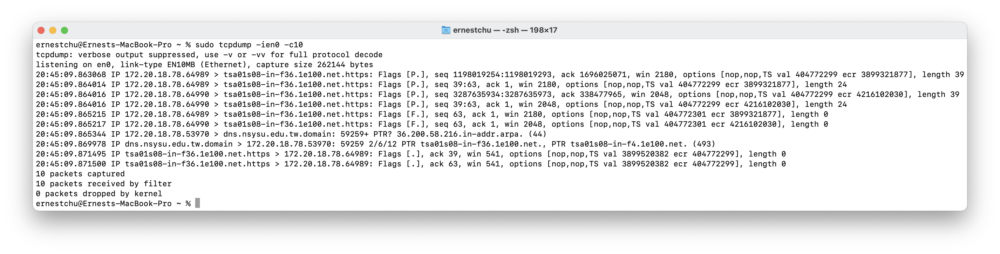

# Homework 1
##### CSE491 Network Application Programming, Sping 2021
##### Instructor: You-Chiun Wang
##### Author: B073040018 朱劭璿
##### National Sun Yat-sen University

## Introduction

| Environments     |                                 |
|------------------|---------------------------------|
| Device           | MackBook Pro (15-inch, 2017)    |
| Operating system | macOS Big Sur 11.2.3            |
| Location         | Info-Libaray Building 3F, NSYSU |
| Wi-Fi SSID       | TANetRoaming                    |


First, inspect the Internet interfaces on my computer
```sh
networksetup -listallhardwareports
```
I got ports for Wi-Fi, Bluetooth PAN, and many Thunderbolt ports since I don't have Ethernet port on my device but four Thunderbolt ports in the form of USB Type-C.

```
Hardware Port: Wi-Fi
Device: en0
Ethernet Address: 8c:85:90:67:f8:e6

Hardware Port: Bluetooth PAN
Device: en6
Ethernet Address: 8c:85:90:63:29:04

Hardware Port: Thunderbolt 1
Device: en1
Ethernet Address: 82:da:01:04:08:01
```

> Other Tunderbolt ports are truncated

I'm using Wi-Fi so I'll focus on only en0. Also, I'll filter out the connections with Apple's server, with which my computer constantly exchange data with, by `not host 17.248`. For example

```sh
tcpdump -ien0 not host 17.248
```

## HTTPS
Let's first watch a YouTube Video on the browser and listen for packets through port 443. I assume YouTube would use TCP since it presents high quality videos. When a connection is established in TCP, we may observe **SYN** and **ACK**. Let's look at the TCP header.

<table>
    <tr>
        <th colspan="16">0</th>
        <th colspan="16">15</th>
    </tr>
    <tr>
        <td colspan="16">source port number</td>
        <td colspan="16">destination port number</td>
    </tr>
    <tr>
        <td colspan="32">32-bit sequence number</td>
    </tr>
    <tr>
        <td colspan="32">32-bit acknowledgement number</td>
    </tr>
    <tr>
        <td colspan="4">header length</td>
        <td colspan="6">6-bit reserved</td>
        <td colspan="1">U</td>
        <td colspan="1">A</td>
        <td colspan="1">P</td>
        <td colspan="1">R</td>
        <td colspan="1">S</td>
        <td colspan="1">F</td>
        <td colspan="16">window size</td>
    </tr>
    <tr>
        <td colspan="16">TCP checksum</td>
        <td colspan="16">urgent pointer</td>
    </tr>
</table>

Assume we store the header in an array `tcp` with `sizeof(tcp)` equals 1 byte. Then the flags are located at `tcp[13]` (little endian). We can check if a packet is a

- **ACK** by `tcp[13] & (1<<4) != 0`
- **SYN** by `tcp[13] & (1<<1) != 0`.

Therefore, try this command and start playing YouTube
```sh
tcpdump -ien0 -c4 -q 'tcp[13] & 2 != 0' and port 443 and not host 17.248
```
where `-c4` specifies showing only 10 next records, and `-q` gives us a shorter output. We than get
```
19:28:23.269026 IP 172.20.18.78.64089 > cache.google.com.https: tcp 0
19:28:23.269670 IP 172.20.18.78.64090 > cache.google.com.https: tcp 0
19:28:23.271292 IP cache.google.com.https > 172.20.18.78.64089: tcp 0
19:28:23.274418 IP cache.google.com.https > 172.20.18.78.64090: tcp 0
```
Cool! Four SYN packets were captured within 0.01 second. Both of my computer and the server from Google were sending packets, that probabily means a handshaking. Let's invite ACK to join the party!
```sh
tcpdump -ien0 -q -c10 'tcp[13] & 18 != 0' and port 443 and not host 17.248
```
We got
```
IP 172.20.18.78.64328 > tsa03s06-in-f22.1e100.net.https: tcp 123
IP tsa03s06-in-f22.1e100.net.https > 172.20.18.78.64328: tcp 0
IP tsa03s06-in-f22.1e100.net.https > 172.20.18.78.64328: tcp 113
IP tsa03s06-in-f22.1e100.net.https > 172.20.18.78.64328: tcp 1418
IP 172.20.18.78.64328 > tsa03s06-in-f22.1e100.net.https: tcp 0
IP tsa03s06-in-f22.1e100.net.https > 172.20.18.78.64328: tcp 1418
IP tsa03s06-in-f22.1e100.net.https > 172.20.18.78.64328: tcp 1418
IP tsa03s06-in-f22.1e100.net.https > 172.20.18.78.64328: tcp 1418
IP tsa03s06-in-f22.1e100.net.https > 172.20.18.78.64328: tcp 1418
IP tsa03s06-in-f22.1e100.net.https > 172.20.18.78.64328: tcp 1418
```

> Timestamps are truncated

There're many packets with size of **1418**, I can somehow assure that they are **DATA** segments. Two of them have size of **0**, judging from above where we only capture SYN, I think then're SYN packets. Finally, two of them are in between the SYNs but have size of around **120**, I think they are **ACK** packets without data payload.

> If you look up the address `tsa03s06-in-f22.1e100.net`, you'll find it's also of Google's

## SSH
Next up, let's login to **ptt.cc** via ssh. It's TCP also.
```sh
ssh bbsu@ptt.cc
```
Since ssh uses port 22. We would listen for packets through port 22. This time, we catch all types of packets.
```
tcpdump -ien0 -q -c10 port 22 
```
Because this port isn't as busy as HTTPS, we got a much cleaner output
```
IP 172.20.18.78.64512 > 140.112.172.1.ssh: tcp 0
IP 140.112.172.1.ssh > 172.20.18.78.64512: tcp 0
IP 172.20.18.78.64512 > 140.112.172.1.ssh: tcp 0
IP 172.20.18.78.64512 > 140.112.172.1.ssh: tcp 21
IP 140.112.172.1.ssh > 172.20.18.78.64512: tcp 0
IP 140.112.172.1.ssh > 172.20.18.78.64512: tcp 40
IP 172.20.18.78.64512 > 140.112.172.1.ssh: tcp 0
IP 172.20.18.78.64512 > 140.112.172.1.ssh: tcp 1392
IP 140.112.172.1.ssh > 172.20.18.78.64512: tcp 1072
IP 172.20.18.78.64512 > 140.112.172.1.ssh: tcp 0
```

> Timestamps are truncated

`140.112`, It's NTU of course! With the experiment above, we can now analyze these packets more easily. First, our computer sends a **SYN** and the server from NTU sends a ACK of SYN. Oh no, it seems that our inference above was wrong. Based on what we've learned in class, the first three packets are usually for three-way handshaking, thus both SYN and ACK with no data are of size **0**.

## UDP
With most of the applications using TCP, I wonder how can I find a application using UDP. Well, let's just directly listen on packets using UDP.
```sh
tcpdump -ien0 -q -c10 udp
```
Got
```
IP 172.20.18.78.57834 > dns.nsysu.edu.tw.domain: UDP, length 32
IP 172.20.18.78.54530 > dns.nsysu.edu.tw.domain: UDP, length 32
IP 172.20.18.78.61543 > dns.nsysu.edu.tw.domain: UDP, length 43
IP dns.nsysu.edu.tw.domain > 172.20.18.78.57834: UDP, length 82
IP dns.nsysu.edu.tw.domain > 172.20.18.78.54530: UDP, length 296
IP dns.nsysu.edu.tw.domain > 172.20.18.78.61543: UDP, length 166
IP 172.20.18.78.53708 > 239.255.255.250.ssdp: UDP, length 174
IP 172.20.18.78.33063 > 239.255.255.250.ssdp: UDP, length 174
IP 172.20.18.78.53555 > dns.nsysu.edu.tw.domain: UDP, length 46
IP dns.nsysu.edu.tw.domain > 172.20.18.78.53555: UDP, length 103
```

> Timestamps are truncated

Turn out, **DNS** uses UDP, and it constently synchrnized with my computer. We know that DNS has a hierarchy and since I'm under the Wi-Fi of NSYSU, the closest DNS server is located in the campus network. I also noticed that UDP typically uses ports with higher value around 50000-60000.

The other interesting thing is the **ssdp** suffix. It seems to be a protocol under **UPnP**. And it's **dangerous** according to many forum. Is there anything I need to worry?

## Screen Shot


