# Transport Layer Protocols
[[toc]]
## Introduction
### Jobs of tranport layer
- Addressing
    - Determine which application process a packet belongs to (through **ports**).
- Error control
    - Detect if the received data is valid
- Reliability
    - Ensure that the transferred data will reach its destination
- Rate control
    - Adjust how fast the sender should transfer the data to the receiver (avoid packet dropping)
- UDP vs. TCP
    - Both **user datagram protocol (UDP)** and **transmission control protocol (TCP)** are two well-known protocols in the transport layer. But TCP is more **sophisticated** and **complicated** than UDP

| Protocol | Addressing | Error control | Reliability | Rate control |
|----------|------------|---------------|-------------|--------------|
| UDP      | ✔️          | Optional      | ❌          | ❌           |
| TCP      | ✔️          | ✔️             | ✔️           | ✔️            |

However, TCP is more difficult to implement since it needs to

- Establish an **end-to-end logical connection** between the sender and receiver
- Keep necessary **per-connection** state information

### Internet socket
When deveoping network applications, hopefully, you don't have to bother with how packets are transmitted. The Internet **socket** serves as an **API** for programmers to access the *underlying services of IP suite*. You've probably heard the term API. Think about training a neural network model. If everybody has to write their own backpropagation function to compute gradients, Deep Learning woudln't have been so popular. Instead, we use ML frameworks such as Pytoch and every function provided by Pytoch is just like an **interface** which let us build Convolution layer without knowing how it's implemented in the backend.

A good **documentation** explaining the API is a fundamental requirement for any well-known frameworks, otherwise users like us would have no idea how to use these APIs.

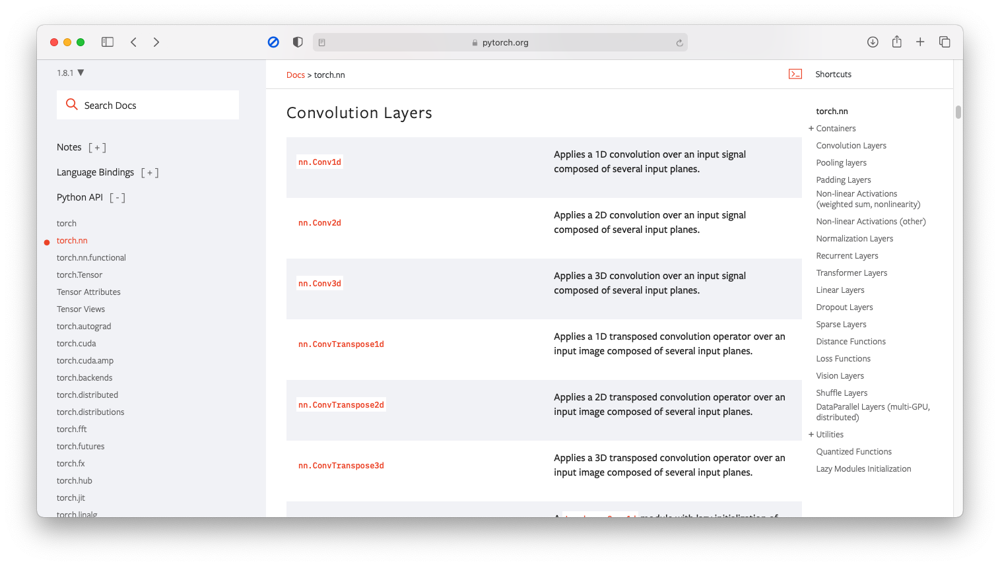

However, applications can sometimes bypass transport layer and directly use the services provided by, for example

- Network layer: routing table
- Data link layers: LAN card driver

### Communications

|                  | Host-to-host | Process-to-process   |
|------------------|--------------|----------------------|
| **Latency**      | short        | long                 |
| **Jitter**       | small        | large                |
| **Flow control** | easy         | need extra protocols |

> Jitter: you can think it as *variance*
> | small | large |
> |-------|-------|
> | 0.1s  | 0.01s |
> | 0.2s  | 0.3s  |
> | 0.1s  | 20s   |
> | 0.1s  | 0.01s |

While host-to-host communication in IP or data link layers has low latency and small jitter, the process-to-process communication has relatively opposite. Therefore, you need extra protocols (or layer) to control the flow rate in a multi-hop networ, that is **Transport layer**.

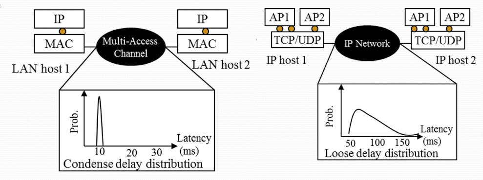

> Image credit to Professor Wang's slides

### Functions in transport layer

1. Addressing
1. Error control & reliability
1. Rate control
1. Socket programming interface

#### Addressing

There are many process runnning on a host, so transport lyer defines the **port number** (16 bits in the Internet solution) to multiplex and demultiplex. When pacekts arrive on your computer based on the IP address, they need to knowhich process do they go next, i.e., demultiplexing. And vice versa when packets go out from each process.

Port number can be either **well-known** (e.g. SSH uses port 22) or *dynamically assigned*.

#### Error control & reliability

Transport layer usually adopts cyclic redundancy check ([CRC](https://en.wikipedia.org/wiki/Cyclic_redundancy_check)) and **checksum** for error detection to guarantee data integrity. Here we give a simple example of the checksum calculation. Suppose that we have the following three 16-bit words.
```
0110011001100000
0101010101010101
1000111100001100
```
The sum of first two of these 16-bit words is
```
0110011001100000
0101010101010101
---------------- addition
1011101110110101
```
Adding the third word to the above sum gives
```
1011101110110101
1000111100001100
---------------- addition
0100101011000010
```
Note that the second addition had overflow, which the leading 1 was wrapped around and add to the trailing bit.

Finally, perform 1's complement then we get the checksum
```
0100101011000010
---------------- 1's complement
1011010100111101
```
#### Rate control

- **Window-based** control regulates the sending rate by controlling the number of *outstanding* packets (i.e. a packet that has been sent but its **ACK** has not returned yet) which can be *simultaneously* in transit.
- **Rate-based** control allows the sender to directly adjust its sending rate when receiving an explicit notification of how fast it should send.

#### Socket programming interface

- TCP socket vs. UDP socket
    - We'll discuss in details later
- BSD socket interface semantic
    - Explained below

### BSD socket interface
#### Procedures for outgoing packets

1. An app can choose either `sendto()` (UDP, RAW) or `write()` (TCP) to send data.
1. Allocate an `skb` buffer in kernel-space memory.
1. Copy data from user-space memory to `skb` buffer (kernel space).
1. Insert `skb` in `sk_write_queue` of [`struct sock`](https://www.kernel.org/doc/htmldocs/networking/API-struct-sock.html).
1. Push out data from the queue and forward it to the IP layer.


> Image credit to Professor Wang's slides

#### Procedure for incoming packets
1. An appl calls either `recvform()` (UDP, RAW) pr `read()` (TCP) to obtain data from socket data structure.
1. Call a non-blocing function call `io_local_deliver_finish` to retrieve `struck sock` of that packet and insert the received packet into flow's queue.
1. When the data is ready in the queue, notify the app taht data are available for receipt.
1. Then Remove data from queue corresponding to the flow into an `skb` space.
1. Finally, copy data from kernel-space memory to user-space one.

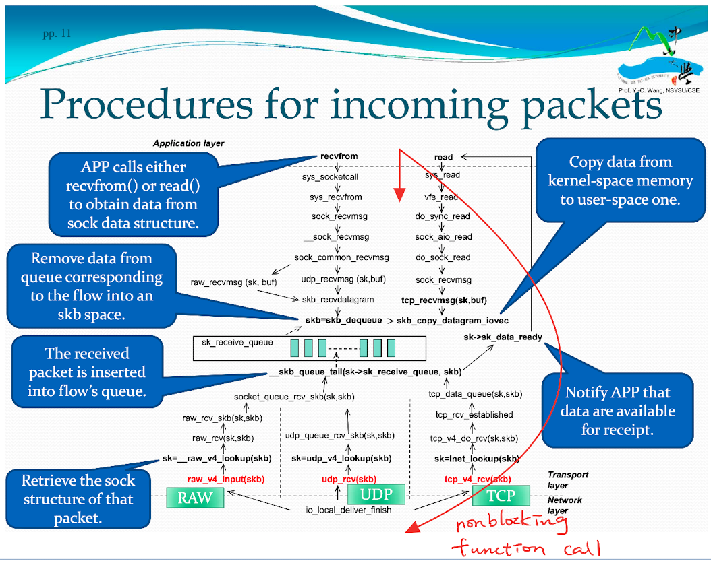

> Image credit to Professor Wang's slides

## Unreliable Protocol: UDP
UDP is used to transmit **urgent** or **real-time** data.

1. Unreliable connectionless protocol
    - Does not provide **reliability** and **rate control**.
1. Stateless protocol
    - Sending and receiving of a segment is **independent** of that of any other segments, thus packets may arrive out-of-order due to different route.

### UDP header format
UDP header supports **addressing** and error detection.
A **socket pair** of 5-tuple
1. src IP addr
1. src port
1. dst IP addr
1. dst port
1. transport portocol

uniquely identifies a communication flow.

- UDP header
    - source/destination **port numbers**
- IP header (not shown here)
    - source/destination **IP addresses** and **transport protocol**

<table>
    <tr>
        <td>0</td>
        <td>15</td>
    </tr>
    <tr>
        <td>source port number</td>
        <td>destination port number</td>
    </tr>
    <tr>
        <td>UDP length (of data)</td>
        <td>UDP checksum (optional)</td>
    </tr>
    <tr>
        <td colspan=2>data (if any)</td>
    </tr>
</table>

Socket pair is **full-duplex**, meaning that data can be transmitted through the socket connection in *both directions simultaneously*, whereas half-duplex means one direction at a time.

#### UDP header supports addressing and **error detection**

- UDP header provides a 16-bit **checksum** for data integrity, but it can be disabled by setting the chekcsum field to zero.
- UDP receivers will *drop the datagrams* whose checksum field does not match the result they calculated *(without retransmission)*

UDP checksum field stores **1's complement** of the sum over all 16-bit words in both *header* and *payload* (not including itself obviously). We've already cover the 1's complement checksum above.

**Cross-layer checking**
UDP checksum also covers a 96-bit pseudo header, which consists of four fields in IP header

1. Source IP address, 32 bits
1. Destination IP address, 32 bits
1. Protocol, 16 bits
1. Total length, 16 bits

## Reliable Protocol: TCP

- [Connection managemnet](#connection-management)
- [Reliability of data transfers](#reliability-of-data-transfers)
- [Flow control and congestion control](#flow-control-and-congestion-control)
- [Header format and timer management](#header-format-and-timer-management)

### Connection management
In the Internet, packets are sent to their destinations in a **store-and-forward** manner

- TCP restricts the **maximum lifetime** of a packet to 120 seconds.

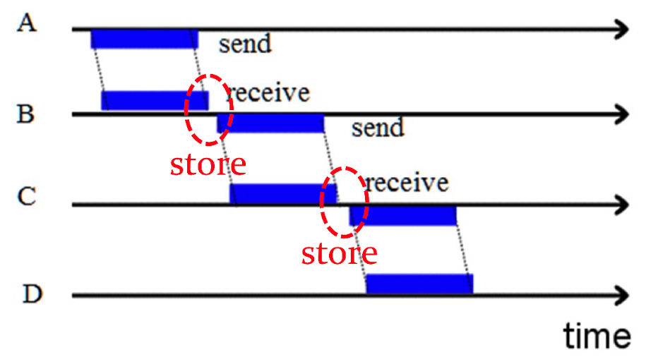

> Image credit to Professor Wang's slides

- TCP adopts a **Three-way handshake protocol** for connection establishment and termination.

When a client would like to make a request to the server, a connection must be first established. The client would sent a **SYN** (synchronize) to the server. If the server do receive the SYN, it would reply with an **ACK** acknowledgement. However, the server will also send another SYN, and if the client receive this SYN, it also reply with a ACK. When the server receive this ACK, at this moment, the connection is finally established. All of these above is so called **three-way handshaking**.

You may ask, why do we need so many SYNs and ACKs? Why don't we just use 2-way handshaking? There're many reasons for it, one of them is to enable **full-duplex**. We'll talk about other reasons later.

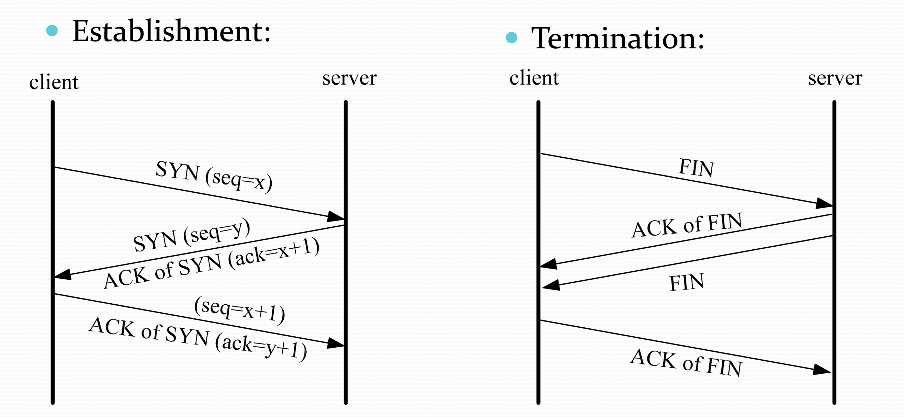

> Image credit to Professor Wang's slides

#### Various connection cases
**TCP state transition diagram**
It's useful to get familiar with these states in order to understand various cases below.

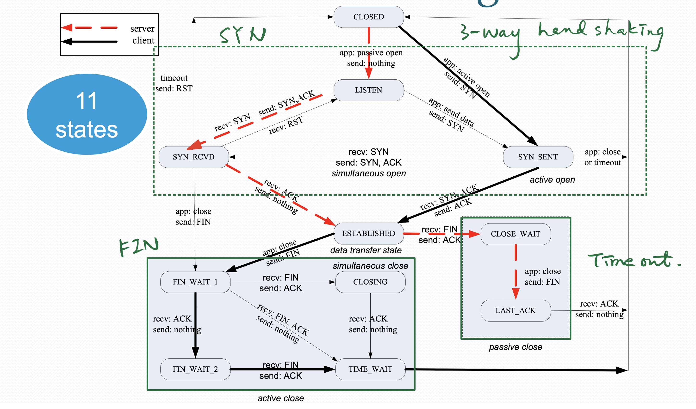

> Image credit to Professor Wang's slides

**Normal case**

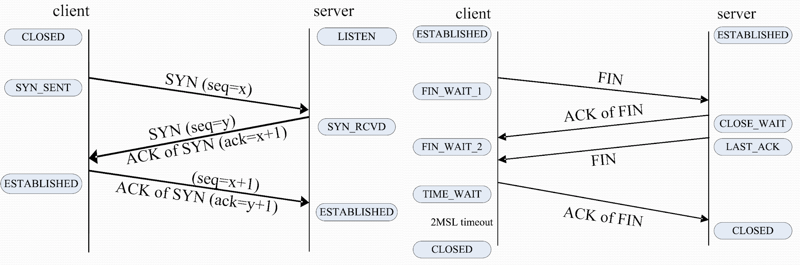

> Image credit to Professor Wang's slides

Note that during establishment (right), the client establishes the connection upon receving the first ACK, whereas the server establishes one upon the second ACK, which is one of the reason of using 3-way handshaking.

**Special case: simultaneous open or close**

Sometimes, the server would actively connect with the client also by sending a SYN. However, if the client also send a SYN at the same time, a **simultaneous open** happends. With the design of the state transition, TCP can still successfully establishes connection. The same logic can be applied on the case of termination.

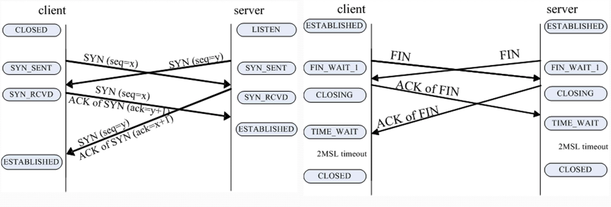

> Image credit to Professor Wang's slides

#### Loss in establishment
**Case 1: SYN sent by the client is lost**

TCP uses **timeout** to get out.


> Image credit to Professor Wang's slides

**Case 2: SYN sent by the server is lost**

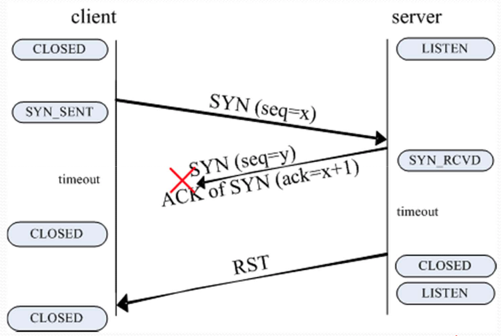

> Image credit to Professor Wang's slides

Why does the server send **RST** even if the client is closed, we shall see the answer in the next case.

**Case 3: ACK of SYN sent by the client is lost**

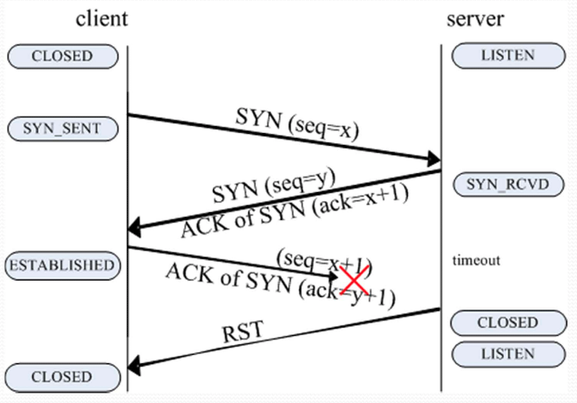

> Image credit to Professor Wang's slides

With the same state transition design, it can handle both case 2 & 3 regardless of whether the client is closed or established.

#### TCP state implementation
**In `struct sock`**
```c
volatile unsigned char state, //connection state
```
The `volatile` keyword prevent an optimizing compiler from optimizing away subsequent reads or writes and thus incorrectly reusing a state value or omitting writes. In other words, the CPU has to take the value from the memory every time the variable is used instead from the register. Because the register might not be synchronized with the memory.
**State names**
```c
static char *statename[] = {
    "Unused"    ,"Established"  ,"Syn Sent"     ,
    "Syn Recv"  ,"Fin Wait 1"   ,"Fin Wait 2"   ,
    "Time Wait" ,"Close"        ,"Close Wait"   ,
    "Last ACK"  ,"Listen"       ,"Closing"
};
```

### Reliability of data transfers
#### Data Integrity and reliability

- Data integrity
    - Successfully received packets are exactly the same as they are transmitted.
- Data reliability
    - **Every** transmitted packet is successfully **received** and is exactly the same as the original transmitted one.

**In TCP**

- Per-segment integrity
    - Checksum (same as UDP but mandatory)
- Per-flow reliability
    - Sequence number and acknowledgment (**ACK**)

#### Per-flow reliability

- The **sequence number** of a segment is the sequence number of its first data byte (octet)
    - TCP header has a field of 32-bit sequence number.
    - TCP sender numbers and tracks its data octets that have been **sent** and wait for their **ACKs**
- On receiving a data segment, TCP receiver replies with an **ACK** that carries an acknowledgment number indicating
    1. The expected sequence number of the **next** data segment (the fisrt of the **unACKed** segments)
    2. All data octets preceding (not including) the specified ACK number have been successfully received

#### Acknowledgment
There are three popular types of ACKs. Assume the sender has sent the following sequence

<span style="font-size: large; color: blue;">1 2 3 <span style="text-decoration: line-through; color: red;">4 5</span> 6</span>

Where the strikethroughed/red denotes the lost sequence, i.e. not received by the receiver.

1. Selective ACK, **adopted by IP**
    - Indicate that the receiver has received a segment whose sequence number is **equal** to the specified ACK number
    - ACK: <span style="color:blue">1 2 3 6</span>
1. Cumulative ACK, **adopted by TCP**
    - Indicate that all previous data octets preceding the specified ACK number have been received
    - ACK: <span style="color:blue">4</span>
1. Negative ACK
    - Indicate that the receiver has **not** received a segment whose sequence number is **equal** to the specified ACK number
    - ACK: <span style="color:blue">45</span>

#### TCP culmulative ACK
Culmulative ACK can solve the following problem

1. Packet loss
1. Delay
1. ACK loss
1. Out of order sequence number

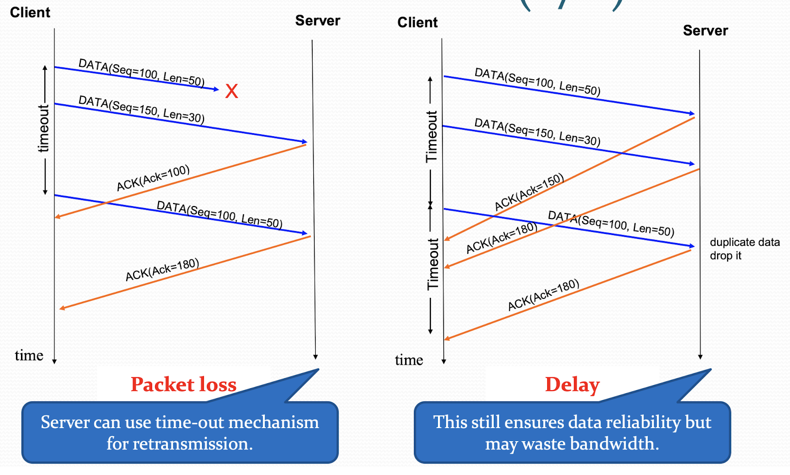

> Image credit to Professor Wang's slides

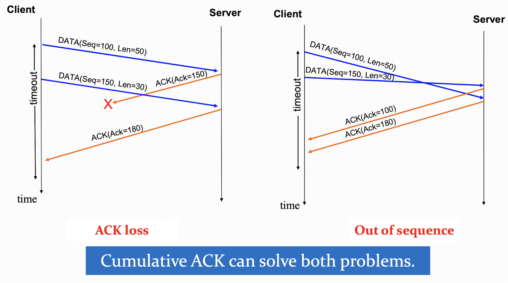

> Image credit to Professor Wang's slides

### Flow control

- Flow control: TCP sender avoid to **overflowing its receiver's buffer** (possibly depends on the receiving host's memory size)
- Congestion control: TCP sender acoid to overburdening the **shared network** reseource

#### TCP window size
The bandwidth of TCP is determined by its window size

- **RWND**: **r**eceiver **w**i**nd**ow size
    - advertised by the **receiver**
- **CWND**: **c**ongestion **w**i**nd**ow size
    - calculated by the **sender**

In the real implementation, the window size is counted in **bytes** (rather in segments). TCP receiver advertised the buffer size (in bytes) into the **16-bit window size** in TCP header.

::: tip TCP Window Size
TCP window size = min(RWND, CWND)
:::

#### TCP flow control
Sliding-window mechanism for flow control

- Sender maintains a sending window to record the starting and ending sequence numbers of data segments being sent.
- Segements sent but **not ACKed** are kept in a **retransmission buffer**.

**Pseudo code**
```sh
SWS = send window size
LAR = last acknowledgement received

if the sender has data to send
    Transmit up to $SWS packets starting from $LAR
    # Send the whole window
endif

if an $ACK arrives
    if $ACK > $LAR
        LAR = $ACK # The window is slid
    endif
endif
```

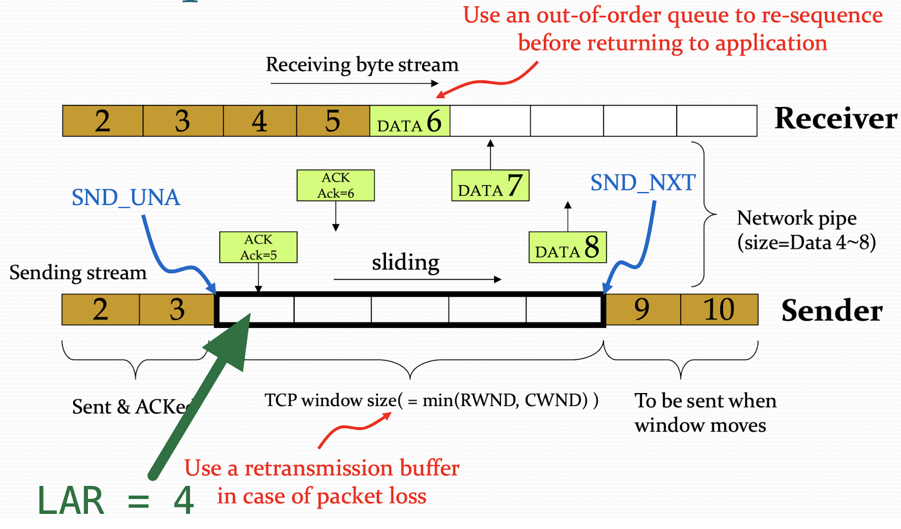

> Image credit to Professor Wang's slides

**Example**
::: tip Normal Case
The green boxes represent segments that just arrived and about to send the ACK. In this cas, the window is slid by on segment at a time.
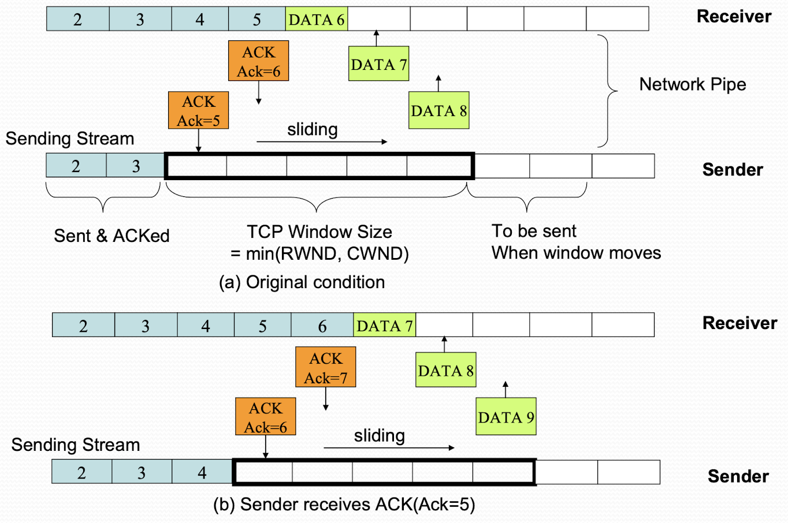

> Image credit to Professor Wang's slides

:::
::: warning Out-Of-Sequence Case
In this case, the window may be slid by multiple segments
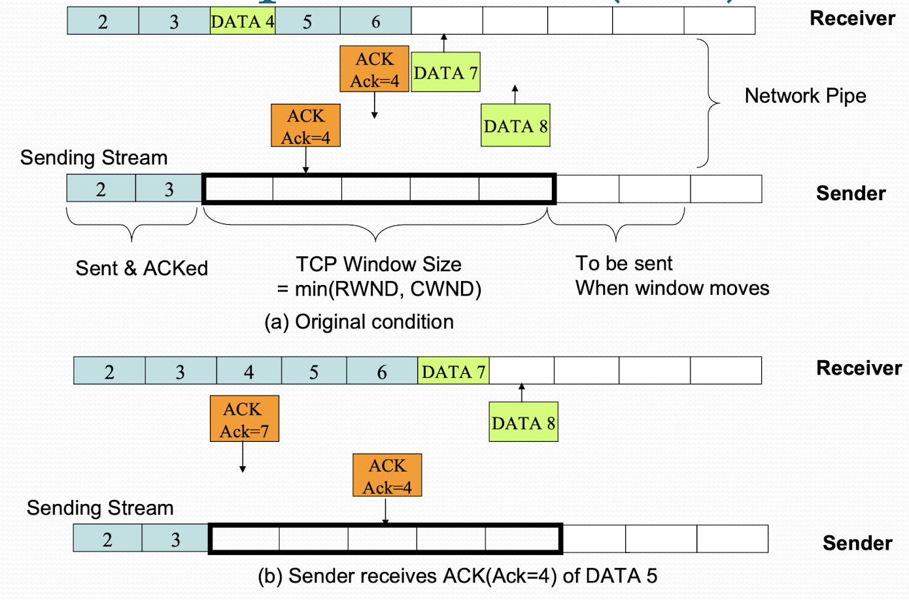
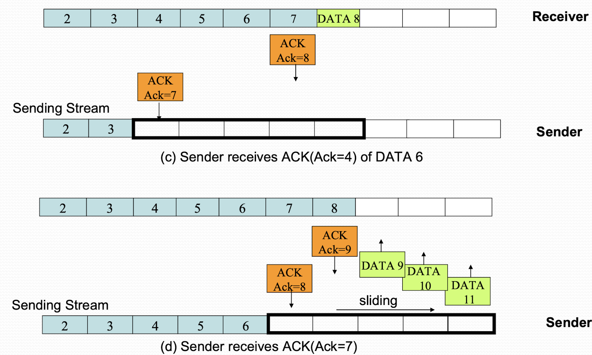

> Image credit to Professor Wang's slides

:::

### Congetsion control
TCP sender infers network congestion in a try-and-error fashion. It detects the **loss** events of data segments. If there's loss, it **slows** down its transmission rate to avoid network congestion.

#### TCP Tahoe
TCP Tahoe uses a **congestion window** (cwnd) to control the amount of transmitted data in one RTT (round-trip time, the time it takes from the sender to the receiver and ACK back to the sender). Maximum value of cwnd is contrained by maximum window **mwnd**.

- cwnd: congestion window
- ssth: slow start threshold

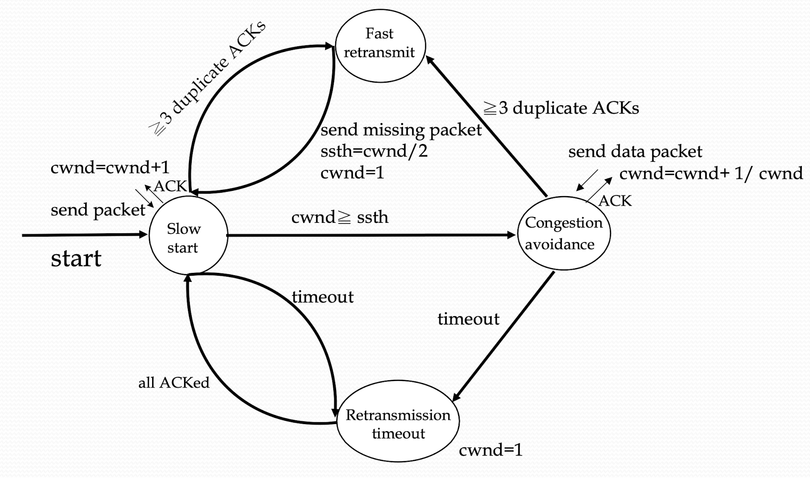

> Image credit to Professor Wang's slides

**Slow start**

Initially, `cwnd=1`. And `cwnd++` upoon receiving **1 ACK**. This results in a **exponential** growth. The below example assume no sequence is lost.

| cwnd (sent) | ACK | Increment (= 1*ACK) |
|-------------|-----|-------------------|
| 1           | 1   | 1                 |
| 2 (1+1)     | 2   | 2                 |
| 4 (2+2)     | 4   | 4                 |
| 8           | 8   | 8                 |
| 16          | 16  | 16                |

Until...

- No loss
    - When `cwnd` reaches `ssth`, enter the **congestion avoidance** state.
- Sequence lost
    - If **triple duplicate ACKs** (because of the lost sequence) are received, enter the **fast retransmit** state
    - If no ACK is received before **timeout**, enter the **retransmission timeout** state and reset `cwnd=1`

**Congestion avoidance**

`cwnd = cwnd + 1/cwnd` upon receiving **1 ACK**. This results in a **linear** growth.

| cwnd (sent) | ACK | Increment (= (1/cwnd)*ACK) |
|-------------|-----|----------------------------|
| 16          | 16  | 1/16*16 = 1                |
| 17 (16+1)   | 17  | 1/17*17 = 1                |
| 18          | 18  | 1                          |
| 19          | 19  | 1                          |

Until sequence lost and same as **slow start** state...

- **triple duplicate ACKs**: enter the **fast retransmit** state
- **timeout**: enter the **retransmission timeout** state and reset `cwnd=1`

**Fast retransmit**
Fast retransmit aims at sending the lost packet **immediately** without waiting for the timeout

- Duplicate ACKs may be caused by
    1. A lost packet
    1. An out-of-order packet
- The sender assumes that packet loss occurs upon receiving 3 or more duplicate ACKs
- After successfully retransmitting the lost packet, set `ssth=cwnd/2` and reset `cwnd=1` then go back to **slow start** state.

**Retransmission timeout**
If a timeout occurs, the sender sets `ssth=cwnd/2` and return to the slow start state.

**Example**

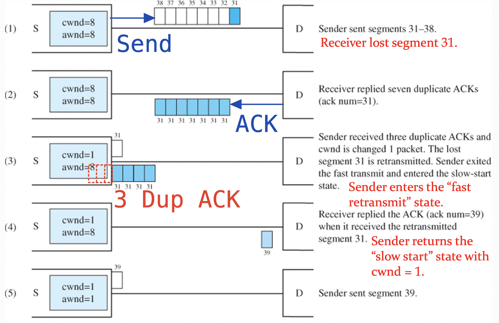

> Image credit to Professor Wang's slides

If you're wandering what is `awnd`, see [here](#awnd)
#### TCP Reno
Add a new state: **fast recovery** state
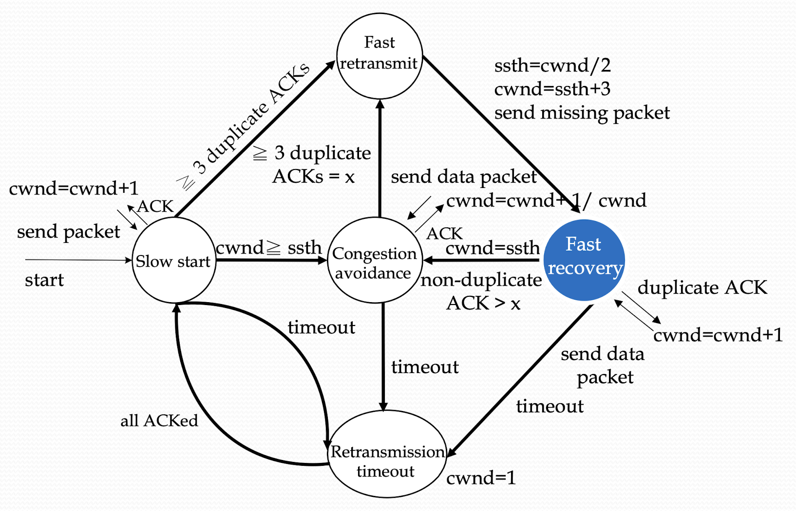

> Image credit to Professor Wang's slides

**Fast recovery**
When fast retransmit is performed, the sender retransmit the lost packet sets

- `ssth = cwnd/2`
- `cwnd = ssth+3`
    - Because 3 duplicate ACKs will trigger 3 `cwnd++` in fast recovery state

Then enter the **fast recovery** state to transmit new packets if allowed. In this state, `cwnd++` upon receiving an ACK.

When ACK of the **lost packet** is received, set `cwnd=ssth` and go back to **congestion avoidance** state.

**Example**
##### awnd

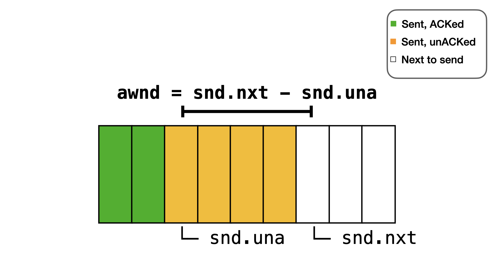

- `snd.una`: the first sequence number of the sent but not ACKed packets
    - The receiver always ACK with the sequence number of the earilest not-received packet (culmulative), i.e., first of the unACKed (not-received) packets.
- `snd.nxt`: the sequence number of the next packet to sent

TCP use `cwnd-awnd` to count **outstanding** packets, i.e. number of packets to send in order to fill the window. In other words, send the next packet if `awnd` < `cwnd`, otherwise stop.

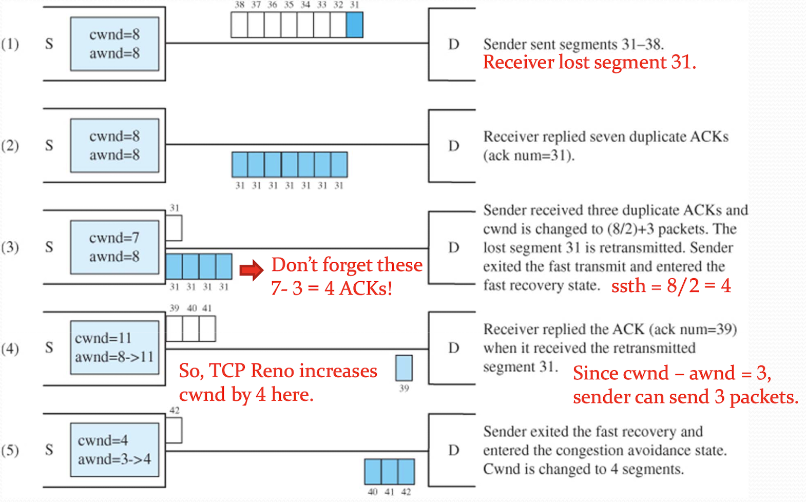

Notice that since the `cwnd` only reduced to `ssth` instead of 1, and `cwnd++` upon receiving an ACK, the sender can send new packets during recovery state.

**Tahoe vs. Reno**

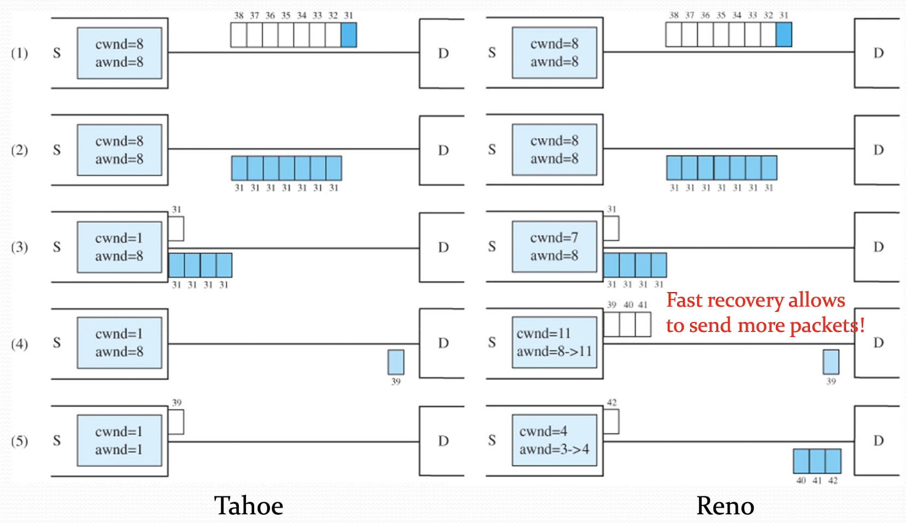

> Image credit to Professor Wang's slides

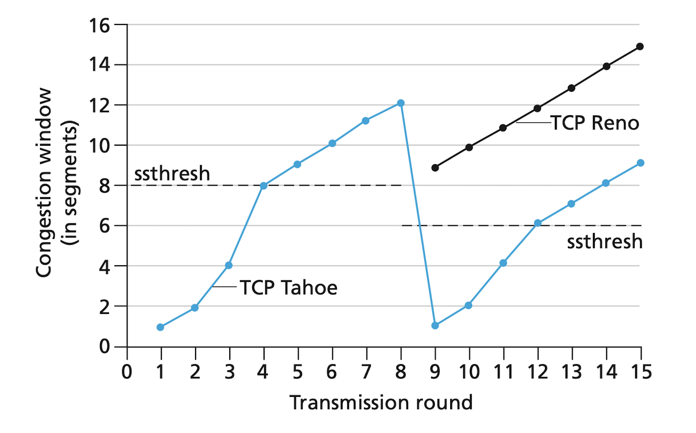

> Image credit to Computer Networking: A Top-down Approach, 7th Edition


### Header format and timer management

<table>
    <tr>
        <th colspan="16">0</th>
        <th colspan="16">15</th>
    </tr>
    <tr>
        <td colspan="16">source port number</td>
        <td colspan="16">destination port number</td>
    </tr>
    <tr>
        <td colspan="32">32-bit sequence number</td>
    </tr>
    <tr>
        <td colspan="32">32-bit acknowledgement number</td>
    </tr>
    <tr>
        <td colspan="4">header length</td>
        <td colspan="6">6-bit reserved</td>
        <td colspan="1">U</td>
        <td colspan="1">A</td>
        <td colspan="1">P</td>
        <td colspan="1">R</td>
        <td colspan="1">S</td>
        <td colspan="1">F</td>
        <td colspan="16">window size</td>
    </tr>
    <tr>
        <td colspan="16">TCP checksum</td>
        <td colspan="16">urgent pointer</td>
    </tr>
    <tr>
        <td colspan="32">option (if any)</td>
    </tr>
    <tr>
        <td colspan="32">data</td>
    </tr>
</table>

- Since the length of options is variable, you need a **header length**
- TCP receiver should tell the sender about it's buffer length (rwnd, in bytes) via the **window size** slot in the header.

#### Control bits

- URG bit
- ACK bit
- PSH bit
- RST bit
- SYN and FIN bits

**URG bit**

URG bit indicates that the 16-bit urgent pointer is valid.

- Urgent pointer is an offset from the first data byte in **payload**, which indicates the last urgent data type.
- It facilitates the **in-band signaling** of a TCP connection
    - E.g. Users use ^C to trigger an urgent signal to cancel an operation

**ACK bit**

ACK bit inidcates that the 32-bit acknowledgemnet number is valid. Acknowledgement number contains the next sequence number that the receiver is expecint to receive.

**PSH bit**

PSH bit asks the receiver to flush out the data in the receiver buffer immediately

**RST bit**

RST bit will reset a connection. Any host receiving an RST-set packet should immediately **close** the connection associated with that packet.

**SYN and FIN bits**

- SYN bit initializes a connection
- FIN bit initializes that no more data will be sent hence close the connection on both sides.

#### Options

- End of option list
- No operation
- Maximum segment size
- Window scale factor
- Timestamp

#### Timer

| Timer          | Function                                                                                             |
|----------------|------------------------------------------------------------------------------------------------------|
| Connection     | If no response of the SYN after this timeout, the connection is aborted                              |
| Retransmission | TCP resends the data if unACKed or the timer expires                                                 |
| Delayed ACK    | The receiver must wait till delayed ACK timeout to send the ACK, otherwise a ACK storm might happend |
| Persist        | Solve a deadlock problem of `rwnd=0`                                                                 |
| Keepalive      | Clear the idle connections                                                                           |

**Persist timer**

A deadlock problem if `rwnd=0`

- Receiver sends an ACK with a receiver window size of 0, which tells the sender to wait
- Then the receiver advertises its updated window size, but the packet is **lost**.
- So both the sender and receiver are waiting for each other to do someting

TCP persist timer is used to prevent the above deadlock

- When sender receives an ACL with `rwnd=0`, it sets a persist timer
- When the persist timer goes off and sender hasn't heard anything from the receiver, it transmits a **probe** to the receiver
- The receiver can respond to the probe, which gives its window size
- If the `rwnd` still equals zero, the sender sets another persist timer and keep waiting

**Keepalive timer**

Keepalive timer keeps unnecessary resources from being allocated forever

- An empty packet is sent periodically over an idle connection, which should invoke
    - an ACK from the receiver if it is still up
    - a reset by RST if it has been rebooted
    - a timeout if it is down (close connection)
