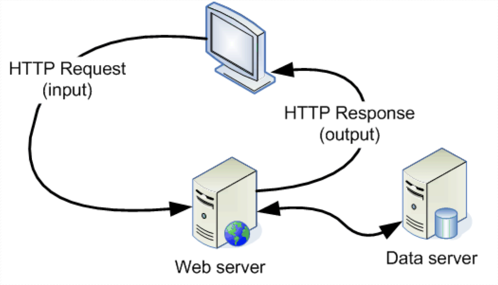
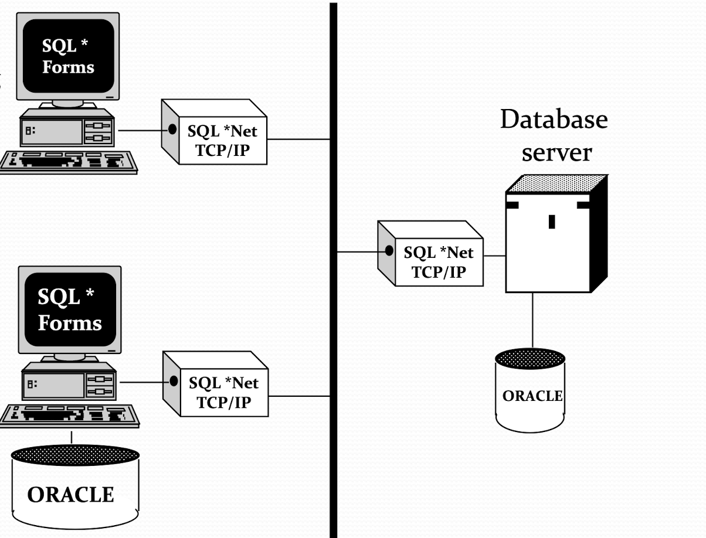
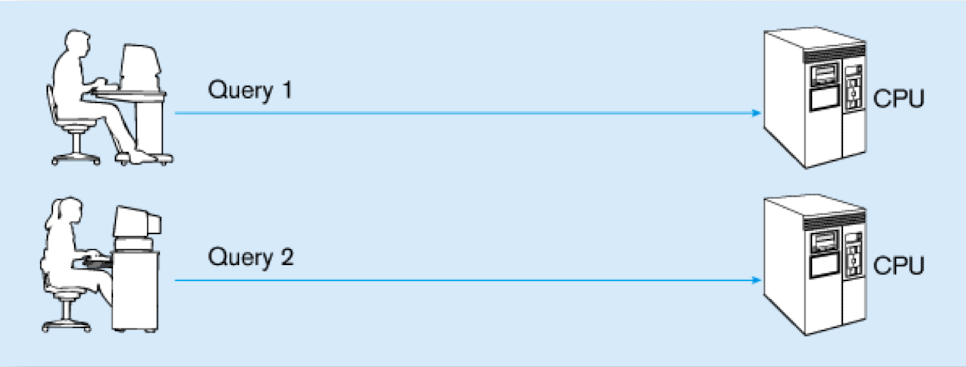
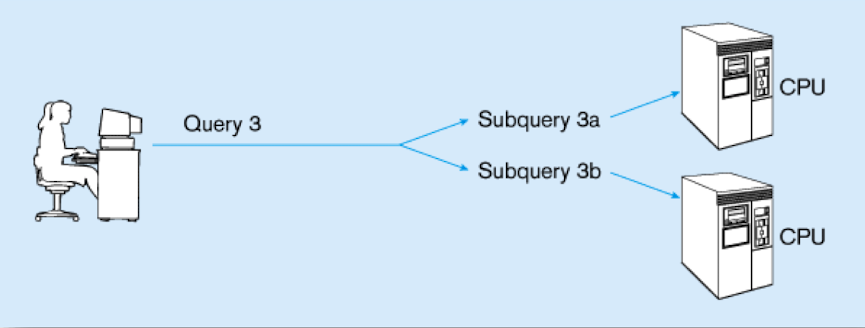
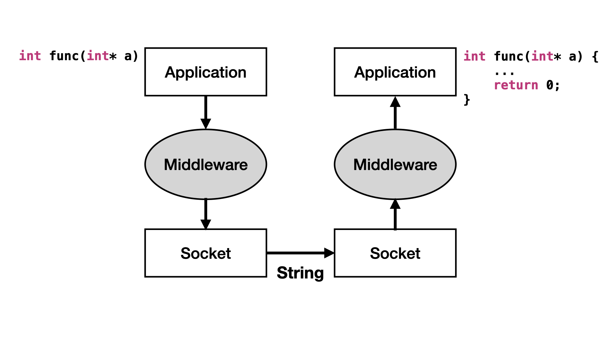
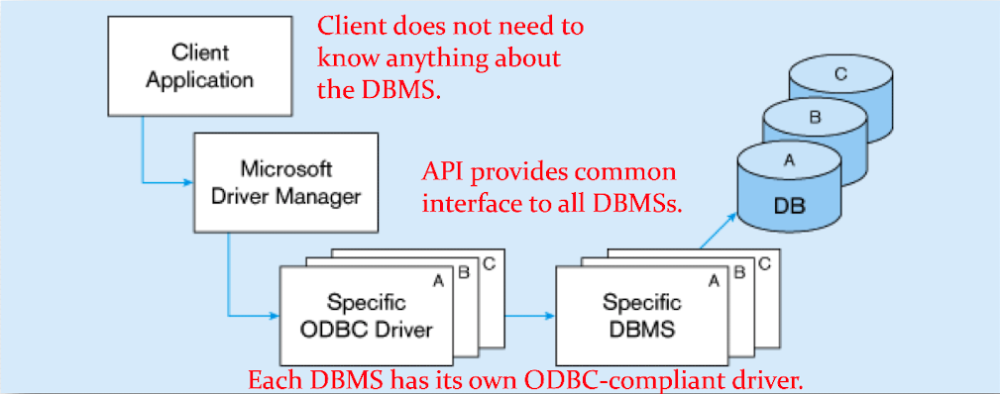

# Client-server Model
[[toc]]
## Introduction

- Client-server model
    - Asymmetric relationship
    - Client predominately makes **requests**, while server makes **replies**.
- Peer-to-peer model
    - Symmetric relationship
    - Each computer may request from or reply to **any computer**

### Client-server model
Client program running on the local machine requests a service from another program running on the remote machine (i.e., server). Server provides service to any client, not a particular client.

- Client program may run only when **it is needed**.
- Server program should run **all the time** (while loop), since it does not know when its service will be needed.

### Two types of open

1. Active open: (client)
    - Client opens the communication channel using IP address of the remote host and port address of the server program.
    - Request-response may be repeated several times, and the client process runs for only a while.
    - Client close the communication channel with an active close.
1. Passive open: (server)
    - Server program opens its door for incoming requests from clients but never initiates a service unless explicitly requested. 
    - Server program runs forever unless a problem occurs.

### Iterative & concurrent clients

- Iterative client:
    - One client program must start, run, and **terminate** before another client program starts
- Concurrent client:
    - Two or more client programs can run at the same time (concurrently) on a machine using **time-sharing** mechanism. For example, browsing the web while on an Internet call with your friend.

### Iterative & concurrent servers

- Iterative server:
    - Iterative server can process only one request at a time.
    - Connectionless iterative server: servers using **UDP** are usually iterative (using one single port; arriving packets will wait in line).
- Concurrent server:
    - Concurrent server can process many requests at the same time (time sharing)
    - Connection-oriented concurrent server: Servers using **TCP** are usually concurrent (using multiple ports; arriving packets may be handled by multiple processes or threads).

## Categories of Servers
Servers are usually identified by their functions. Most common servers include:

1. [File server](#file-server)
1. [Compute server](#compute-server)
1. [Data server](#data-server)
1. [Database server](#database-server)
1. [Communication server](#communication-server)
1. [Video server](#video-server)

### File server
- File server manages **application and data files** of a working group, so these files can be shared by that group.
    - E.g. Office NAS
- Usually, file servers are very **I/O-oriented**.
    - File server pulls a large amount of data off the storage subsystem and passes these data over network. 
    - This requires large-bandwidth network connections and a large-capacity, fast hard-disk subsystem.

### Compute server
Compute servers perform application and logic processing. Compute server requires

1. Processors (GPU) with high performance capabilities
1. Large amounts of memory
1. Relatively low disk subsystems (I/O are super slow)

By separating data from the computation processing, compute server’s processing capability can be optimized. And it get data from the **data server**.

### Data server
Data servers are mainly used for data storage and **management**. Since a data server can serve more than one compute server, compute-intensive applications can be spread among multiple severs (watch out for the **data race**).

- However, data servers do not prefer any application and logic processing.
- Data server performs processes such as **data validation** (different from file servers), required as part of data management function. 
- Data server requires fast processors, large amount of memory, and substantial hard disk capacity.

::: tip Example of Data Server
A system composed of both **web server** and **data server**. This design prevent the direct access of the data server from users, providing 

- Security: add firewall between web and data server
- Performance: only get data when needed

> Image credit to Professor Wang's slides

:::

### Database server
Database servers are the most typical use of technology in a client-server model. These servers accept data requests (queries), retrieve data from their database (or further request data from another server), and then pass results back to the client.

- Database server = Compute server + Data server
- Database servers store the dedicated **database**
- They handle the query language (mysql, etc.) from the user and query the corersponding data from the database
- Server requirement depends on
    - Size of database
    - Speed that database must be updated
    - The number of users
    - The type of network used

::: tip Example of Database Server

- Distributed processing application connects to remote database
- It can also have a local caching database (just like proxy, DNS)

> Image credit to Professor Wang's slides

:::

### Communication server
Communication server acts as a gateway to connect with other LANs, networks, or computers.
- E.g. Email server and Internet server 
- It requires modest system resource:
    - Multiple network slots
    - Fast processor to translate networking protocols

### Video server
Video servers can be used in a number of contexts, some of which include:

1. News
1. Production
1. Instruction
1. Public access
1. Surveillance
1. Entertainment

## Client-server Architecture
### Three logic layers

| Client-side software | Server-side software |
|----------------------|----------------------|
| Service logic        | Service logic        |
| Application logic    | Application logic    |
| Presentation logic   |                      |

The server-side software typically don't have the **presentation logic** since is do not require a complex UI.

#### Service logic
Provide inter-process communication (IPC) service, which is what we've mostly learn so far.

#### Application logic

1. Processing component logic:
    - Business rules logic
    - Data management logic
    - Identifies the data necessary for processing transaction or query
    - E.g. **compute** the mean score of the class
1. Storage component logic:
    - Deal with data storage and retrieval from physical storage devices. 
    - Database management system (DBMS) activities occur here.
    - E.g. **filter** the score larger than 60 (no computation).

#### Presentation logic
Format and present data on user’s output device (e.g., screen) and manage user input from user’s input device (e.g., keyboard). 

### Client-server architectures
There are three types of client-server architectures, **from fat client to thin client**

1. File server architecture
1. Database server architecture
1. Three-tier architecture

::: tip Example
Before dive into the each architecture, let's see a example first.

**Task**: Get the mean score of the class

**File server**

1. Transmit the entire DBMS to the client
1. Filter out the socres info on the client
1. Compute the mean on the client

**Database server**

1. Queries the database for scores only
1. Transmit the socres to the client
1. Compute the mean on the client

**Three-tier**

1. Queries the database for scores only
1. Compute the mean on the server
1. Transmit the mean score to the client

:::

#### File server architecture

Clients handles

1. Processing logic
1. Storage logic
1. Presentation logic

Each clients is called a **fat** client since most processing occurs on the client side. While the file servers is a device that manages file operations and is shared by each of client PCs attached to LAN.

- Each file server acts as an additional hard disk for each client. 
- **Entire files** are transferred from server to client for processing.

##### Problems

1. Huge amount of data has to be transferred on network.
    - The whole files are transfered. Server is doing very little work. 
    - Network is congested
    - The client is busy with extensive data manipulation.
1. Each client is authorized to use DBMS when a database application program runs on that PC.
    - There is one database but many concurrently running copies of DBMS (one on each PC), so heavy resource demand on clients.
1. DBMS copy in each client PC must manage the shared **database integrity**
    - Shared locks and integrity checks
    - Multi-user database environment
        - Concurrency control
        - Recovery control
        - Security control

#### Database server architecture
- A **two-tiered** approach. Client is responsible for
    1. User interface
    1. I/O processing logic
    1. Data processing logic
    1. Some business rules logic (front-end program)
- **Database server** performs all **data storage** and **access processing** (back-end functions).
- DBMS is only on the server

Thus, clients need not be powerful. Only database server requires processing power to handle the database.

- Server can be tuned to optimize data processing performance
- Reduces data traffic on network, since only records (rather than whole tables) that match the requested criteria are transmitted.
- This also improves data integrity since it is all processed centrally.

##### Advantages

The unified API is provided by the back-end program which handles the application logic

- Enhance performance for compiled **SQL statements**
- Reduce network traffic and improve security since only the records are transmitted
- Improve data integrity since the unified API
- Thinner clients

##### Disadvantages

- Proprietary nature reduces portability
- Performance degrades when the number of online users increases.

#### Three-tier architecture
3-tier architecture provides a dedicated application server to handle application logic and a database server to handle data processing logic.

- Client
    - Presentation logic (pure front-end)
    - I/O processing logic
- Application Server
    - Application logic (pure backend)
    - Business rules
    - API
- Database Server
    - Data processing logic
    - DBMS

##### Advantages

1. Scalability
    - Middle tier reduces the load on database sever by using a transaction processing monitor to reduce connections to a server.
    - More application servers can be added to distribute application load.
1. Technological flexibility
    - Middle tier can be moved to a different platform (i.e., easier to change DBMS engines). 
    - Simplified presentation makes it easier to implement new GUI, even on multi-platform (desktop, mobile)
1. Improved customer service
    - Multiple interfaces (desktop, mobile) on different clients can access the same business process.
1. Long-term cost reduction
    - With seperated, interchangeable modules, it's easier to maintain or upgrade a specific part instead of the entire system.
1. Better match of systems to business needs
    - Can be substitued with the domain-specific modules
1. Competitive advantage
    - Quick react to **business change** by changing small modules

##### Challenges

1. High short-term costs
    - More costs on a tiny project
1. Lack of Tools, training, and experience
1. Incompatible standards
1. Lack of compatible end-user tools

## Parallel Computer Architecture
### Application Partitioning
Placing portions of application code in different locations (client vs. server) after it is written, has several advantages

1. Improve performance
1. Enhance interoperability
1. Balance workloads across the tiers
1. Object-oriented development is suitable for this concept
1. Necessary in web environment, in order to achieve desired performance in an unpredictable distributed environment

Moreover, the ability to handle high transaction volumes, complex queries, and new data types has shown to be problematic in a uniprocessor environment.

### Parallel Queries/Transaction
Relational DBMS (RDBMS) and SQL lend themselves to a parallel environment in two ways:

1. Parallel queries
1. Parallel transactions

#### Parallel queries
If multiple queries can be run in parallel on different processors, they are called parallel queries.

> Image credit to Professor Wang's slides

#### Parallel transactions
SQL acts as a non-procedural set processing language in most queries. Queries can be divided into parts, each of which can be run on a different processor simultaneously. This is called parallel transactions.

> Image credit to Professor Wang's slides

### Parallel computer architectures

- SMP (tightly-coupled)
    - CPUs share the **common** memory space
    - More expansive
- MPP (loosely-coupled)
    - Each CPU has its **own** memmory space
    - More common

#### SMP
In symmetric multi-processing (SMP) architecture, tightly coupled processors have the common shared memory. 

- Single copy of the operating system resides in the shared memory. 
- Bottlenecks are lessened compared to uniprocessor systems, because all processors share all tasks. 
- For situations where data must remain in memory during processing to achieve the desired performance/
    - But this may lead to potential problems of contention (data race) for the shared memory.

#### MPP
In massively parallel processing (MPP) architecture, each loosely coupled process has its own memory.  It requires a copy of the operating system to be resident in each dedicated memory.

- Easier to add processors incrementally since there is (almost) no memory contention problem. 
- Applications that have large tasks can easily be divided up and worked on simultaneously.

## Middleware
Generally speaking, middleware is the glue that holds client and server applications together. Middleware is a software that allows an application to interoperate with other software, without asking users to code low-level operations (e.g. socket use pure string) used to achieve interoperability.

- With synchronous systems, the requesting system waits for a response to the request in real time. 
- Asynchronous systems send a request but do not wait for a response in real time. The response is accepted when it is received.

### Types of middleware

1. Asynchronous remote procedure call (RPC)
    - Client makes calls to procedures running on remote computers, but does not wait for a response. 
    - If connection is lost, the client must reestablish connection and send request again. 
    - It is high scalability but low recovery, so this middleware is largely replaced by synchronous RPC.
1. Synchronous RPC
    - Distributed program using this middleware may call services available on different computers. 
    - It is possible to achieve this without undertaking detailed coding.
    - E.g. Java remote method invocation (RMI)
1. Publish/subscribe (also called push technology)
    - Server monitors activity and sends information to client when available. 
    - It is asynchronous, so clients (i.e., subscribers) perform other activities between notifications from server. 
    - It is useful for monitoring situations where actions need to be taken when particular events occur.
1. Message-oriented middleware (MOM)
    - MOM sends messages that are collected and stored until they are acted upon, while the client continues with other processing (in other words, MOM is asynchronous).
1. Object request broker (ORB)
    - ORB provides object-oriented management of communications between clients and servers. 
    - It tracks location of each object and routes requests to each object.
1. SQL-oriented data access
    - This is a middleware between applications and database servers.
    - It has the capability to translate generic SQL into SQL specific to database.
1. Database middleware: ODBC
    - ODBC is an application program interface (API) to provide a common language for user programs to access SQL databases independent of the particular RDBMS that is accessed.

> Image credit to Professor Wang's slides

