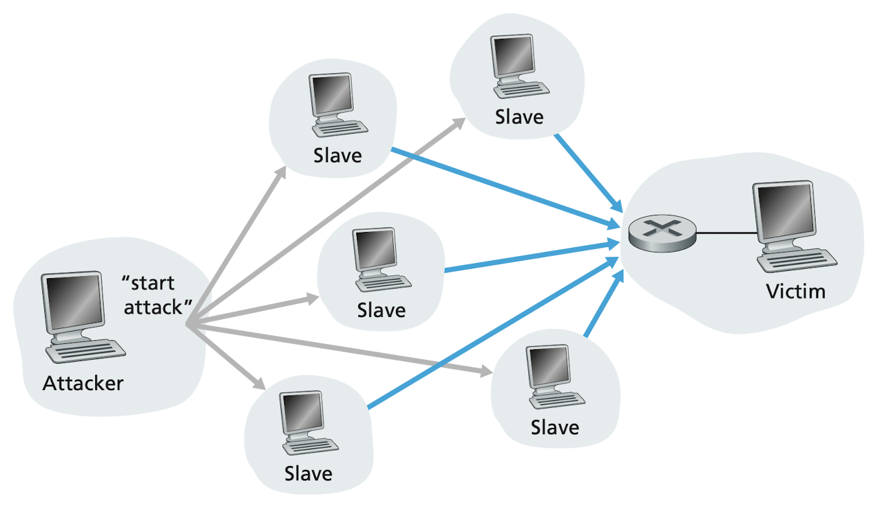

# Computer Networks and the Internet

[[toc]]

## What Is the Internet?
### A Nuts-and-Bolts Description
#### Communication links
They are made up of different types of physical media, including

- Coaxial cable
- Copper wire
- Optical fiber
- Radio spectrum

Different links have different **transmission rate** (bits/second). The sending end system will segment the data into **packets** with additional header info. They're then sent through the network to the destination end system, where they are reassembled into the original data.

#### Packet switch
Two main type

- Router
- Link-layer switches

Link-layer switches are typically used in access networks, while routers are typically used in the network core.

The sequence of communication links and packet switch from the sending end to the receiving end is known as **route** or **path** through the network.


**A transportation analogy**

Consider a factory that move a large amount of cargo to some destination warehouse located thousands of kilometers away. At the factory, the cargo is distributed to many trucks. Each of the trucks independently travels trough the network of highways, roads and intersections. At the destination warehouse, all of the cargo from the same shipment are gathered.

| Network            | Transportation   |
|--------------------|------------------|
| packet             | truck            |
| communication link | highway and road |
| packet switch      | intersection     |
| end system         | building         |

### Internet Service Providers (ISPs)
Each ISP is in itself a network of communication links and packet switches, providing a variety of network access, including residential broadband access

- Cable modem
- DSL

or mobile wireless access.

- Terrestrial radio channel
- Satellite radio channel

ISPs also provide Internet access to content providers such as **Google**, connecting Web sites and video servers directly to the Internet.

The lower-tire ISPs are interconnected through national and international upper-tier ISPs.


> Image from [TWNIC](https://map.twnic.tw)


> Image credit to Computer Networking: A Top-down Approach, 7th Edition

#### Protocols
Two of the most important protocols in the Internet.

- Transmission Control Protocol (TCP)
- Internet Protocol (IP)

Together, they're known as **TCP/IP**. Still, there are many other protocols including HTTP (for Web) and SMTP (for e-mail).

### A Services Description
Let's say you have an idea for a **distributed Internet application**. What does that mean? Any program that needs the ability to communicate with other end systems through the network. But how can your Java, C or Python program instruct the Internet to deliver data?

End systems attached to the Internet provide a **socket interface** that specifies how a program running on one end system asks the Internet infrastructure to deliver data to a specific destination. Feel difficult to relate? Take postal service for example, Alice want to send a mail to Bob but she cannot just write the content and throw it out of her window. Instead, the postal service requires that Alice put the letter in an envelope; write Bob's full name, address, and zip code in the center of the envelop; seal the envelop; put a stamp in the upper-right-hand corner of the envelop; and finally, drop the envelop into an official postal service mailbox. All these tedious procedures are required as the "postal service interface", or set of rules. Similarly, the Internet has a socket interface that programs need to follow.

### What Is a Protocol?
#### A human analogy
We humans execute protocols all of the time. When asking someone for the time of day, we first offer a greeting. If we get a response of “Hi”, that indicates we can proceed and ask for the time of day. A different response like “Don't bother me!” might indicate an unwillingness to communicate. In this case, we would rather find someone to ask. If there isn't a common sense of communication, it hence hard to live our lives.

The other analogy, assume we are in a class, the lecturer stops to ask, “Are there any questions?“ You raise your hand and the lecturer kindly says “Yes...?“. Then you can finally ask a question. That's a kind of **Three-way handshaking**!

#### Network protocols

**Hardware-implemented protocols**

Two physically connected computers control the flow of bits on the **wire** between the two **network interface cards**.

**Congestion-control protocols**

Control the rate at which packets are transmitted between sender and receiver.

**Router protocols**

Determine a packet's path from source to destination.

**Request a Web page**


1. Your computer send a connection request message to the Web server and wait for a replay.
1. The Web server receive your request and return a connection reply message.
1. Knowing that it's okay to request the Web document by the reply message, your computer proceeds to send the name of the Web page it wants to fetch in a **GET** message.
1. The Web server returns the Web page (file) to your computer.

> *A **protocol** defines the format and the order of messages exchanged between two or more communicating entities, as well as the actions taken on the transmission and/or receipt of a message or other event.*


> Image credit to Computer Networking: A Top-down Approach, 7th Edition

## The Network Edge
**Edge**, a.k.a. **end systems**, also **host** can be divide into two categories.

**Client**


- Desktop
- Smartphones
- IoT


**Server**


- Super computer
- Distribute Web pages
- Stream video

They are called end systems because they sit at the edge of the Internet.

### Access Networks
#### Digital Subscriber Line (DSL)
A residence typically obtains DSL Internet access from the same local telephone company (telco) that provides its wired local phone access. Thus, the customer's telco is also its ISP. The home's DSL modem uses the existing telephone line (twisted copper wire) to exchange data with a DSL access multiplexer (DSLAM) in the telco's central office (CO).

- The home's DSL modem takes digital data and translates it to high-frequency tones for transmission over telephone wire to the CO.
- The DSLAM takes analog signals from many houses and translates it back to digital format.

On a single telephone line, there are

- A high-speed downstream channel, in the 50 kHz to 1 MHz band
- A medium-speed upstream channel, in the 4 kHz to 50 kHz band
- An ordinary two-way telephone channel, in the 0 to 4 kHz band

This approach makes the single DSL link appear as if there were three separate links, so that a telephone call and an Internet connection can share the DSL link at the same time. The downstream rates are typically higher than the upstream rates. That is so called asymmetric DSL (ADSL).


> Image credit to Computer Networking: A Top-down Approach, 7th Edition

#### Cable Internet Access
Cable internet access makes use of the cable television company's existing cable television infrastructure. The cable television company is also the ISP for its customer. The fiber optics are used between the cable modem termination system (CMTS) and the fiber nodes, while the traditional coaxial cable is used between the fiber nodes and individual houses.


> Image credit to Computer Networking: A Top-down Approach, 7th Edition

One important characteristic of cable Internet access is that it is a shared broadcast medium. Every down-streamed-packet travels on every link to every home. Therefore, if several users are simultaneously downloading a video file on the downstream channel, the individual downstream rate will be significantly lower than the aggregate one. Also, because the upstream channel is also shared, a distributed multiple access protocol is needed to coordinate transmissions and avoid collision.

#### FTTH
Provide an optical fiber path from the CO directly to the home. Each fiber leaving the CO is shared by many homes. When the fiber get relatively close to the homes, it's split into individual customer-specific fibers.

**Passive optical networks (PONs)**

Each home has an optical network terminator (ONT), which is connected by dedicated optical fiber to a neighborhood splitter. And the splitter connected an optical line terminator (OLT) in the CO via a single, shared optical fiber. In contrast to active optical networls (AONs), in the PONs architecture, all the packets sent from OLT to the splitter are replicated at the splitter then send to each home (similar to a cable head end).


> Image credit to Computer Networking: A Top-down Approach, 7th Edition

#### LAN, Ethernet and WiFi
Local area network (LAN) is used to connect an end system to the edge router.

**Ethernet**

As the most prevalent LAN technology, users use twisted-pair cooper wire to connect to an Ethernet switch.

**Wireless LAN (WiFi)**

In a WiFi setting, wireless user transmit/receive packets to/from an access point (AP) that is connected into the LAN (most likely using wired Ethernet), which in turn is connected to the wired Internet.

```
Internet
|
|   Fiber optics
V
ISP's CO
|
|   Twisted-pair copper wire, Coaxial cable, Fiber Optics
V
DSL, Cable modem, FTTH
|
V
Router
|
V
Ethernet switch
| \
|  \Twisted-pair copper wire
V   \
PC   -> WiFi AP 
        |
        |   Wireless
        V
Laptop, Smartphone, IoT
```


> Image credit to Computer Networking: A Top-down Approach, 7th Edition

### Physical Media
#### Guided media
With guided media, the waves are guided along a solid medium, such as the following

**Twisted-pair copper wire**


- Used by telephone networks for more than a hundred years
- The least expensive and most commonly used medium
- Used by DSL


> Image from Amazon


**Coaxial cable**


- Like twisted pair, coaxial cable consists of two copper conductors, but the two conductors are concentric rather than parallel
- Quite common in cable television systems
- Guided shared medium, a number of end systems can be connected directly to the cable


> Image from Amazon


**Fiber optics**


- A single optical fiber can support tremendous bit rates, up to tens or even hundreds of gigabits per second
- Immune to electromagnetic interference, have very low signal attenuation up to 100 kilometers, and are very hard to tap
- High cost


> Image from Amazon

#### Unguided media
With unguided media, the waves propagate in the atmosphere and in outer space, such as the following

**Terrestrial radio channels**


**Spatial classification into three types**


- Wireless personal area network (WPAN): wireless headsets, keyboards
- Wireless LAN (WLAN): WiFi
- Municipal wireless network (MWN) under MAN: Cellular

> Reference: [Wikipedia](https://en.wikipedia.org/wiki/Municipal_wireless_network)


> Image from Wikipedia


**Satellite radio channels**


**Geostationary satellite**

Geostationary satellite permanently remain above the same spot on Earth. This is achieved by placing the satellite in orbit at the altitude of 36,000 kilometers. Significant latency of around 280 milliseconds.


**Low-earth orbiting (LEO) satellite**

[Starlink](https://www.starlink.com) from SpaceX achieves downstream rates from 50Mb/s to 150Mb/s and latency from 20ms to 40ms by LEO. And it is still in progress.


## The Network Core
### Packet Switching
To send a message from a source end system to a destination end system, the source breaks long messages into smaller chunks of data known as **packets**. Each packets travels trough **communication link** and **packet switches** (**routers** and **link-layer switches**).

If a source is sending a packet of $L$ bits over a link with transmission rate $R$ bits/sec, then the transmission time is $L/R$ seconds. This is not the time it takes for the bits to travel across the wire, which refers to **propagation delay**. Instead, this is caused by the store-and-forward mechanism.

#### Store-and-forward transmission
Store-and-forward transmission means that the packet switch must receive the entire packet before it can begin to transmit the first bit of the packet onto the outbound link. Which means not until the last bit arrives the packet switch, the other bits are stored in the router and wait for it before they proceed to be transmitted to the next router.


> Image credit to Computer Networking: A Top-down Approach, 7th Edition


**Example**

$L$ is the packet length, $R$ is the transmission rate and the propagation delay is ignored. Assume there is only one router between the source and the destination

- At time $0$ the first bit of a packet arrives the current router.
- At time $L/R$ the current router receives the entire packet and begin to transmit it to the end system.
- At time $2L/R$ the end system receives the entire packet and the transmission complete.

So the total delay of this end-to-end transmission is $2L/R$


**Generalize**

Assume there are $N$ links each of rate $R$ from source to destination, thus there are $N-1$ routers. We will have the end-to-end delay

$$d_{\text{end-to-end}} = N{L\over R}$$

#### Queuing delays and packet loss
Each packet switch has multiple links attached to it. For each link, the packet switch has an **output buffer**, a.k.a. **output queue**. If an arriving packet needs to be transmitted onto a link that is busy with another packet, the arriving packet must wait in the output buffer. Thus, in addition to the store-and-forward delays, the **queuing delays** are introduced.


> Image credit to Computer Networking: A Top-down Approach, 7th Edition

Since the amount of buffer space is finite, an arriving packet may find that the buffer is completely full with other packets waiting for transmission. In this case, **packet loss** will occur—either the arriving packet or one of the already-queued packets will be dropped.

#### Forward tables and routing protocols
In the Internet, every end system has an address called an IP address. When a source end system want to send a packet to a destination end system, the source includes the destination's IP address in the packet's header. This address has a hierarchical structure. When a packet arrives at a router in the network, the router examines a portion of the packet's destination address and forwards the packet to an adjacent router based on its **forwarding table**, which maps (portions of) destination addresses to that router's outbound links.


**Analogy**

Suppose you're at National Sun Yat-sen University, a prestigious university in the southern Taiwan. You want to go to National Taiwan University to find a friend. The full address of which is `No. 1, Sec 4, Roosevelt Rd., Taipei 10617, Taiwan`.

1. You ask as your brother, he looks at the last portion of the address and suggests you to take the Taiwan high speed rail (THSR) to Taipei.
1. After you get out off the train at Taipei station, you ask a station staff. After finding `Roosevelt Rd.` in the address, She advises you to take Taipei metro to Gongguan station.
1. After arriving Gongguan, you show the address to a pedestrian, and he tells you the direction to get to `No. 1, Sec 4`. And that's how you find the route to NTU.

In the above analogy, your brother, the staff and the pedestrian are analogous to routers which extract a portion of the IP address and direct the packets to the next router/destination.


**Routing protocols**

You might ask, how do forwarding tables get set? Are they hand-crafted configured like our national address system? Well, that's why we need **routing protocols**. They are used to automatically set the forwarding tables. A routing protocols may determine the shortest path from each router to each destination. This can be achieved by the famous Dijkstra algorithm that you might've learned in the algorithm class.

### Circuit Switching
In packet switch, those resources are **shared** so packets may have to wait for access to a communication link.

In contrast to packet switch, the resources needed along a path to provide for communication between the end systems are **reserved** for the duration of the communication session in circuit switch .

Traditional telephone networks are examples of circuit-switched networks. As long as the connection between the caller and the receiver is built, the network reserves a constant transmission rate in the network's links for the duration of the connection. Such connection is called **circuit**. The sender can transfer the data to the receiver at the guaranteed constant rate.

The figure below illustrates a circuit-switched network. Each of the links has four circuits, so that each link can support four simultaneous connections. When two hosts want to communicate, the network establishes a dedicated end-to-end connection. Each router is responsible to distribute the packets to the reserved circuit. Since the figure above has four circuits each link, a circuit gets one fourth of the link's total transmission capacity. For example, if each link has a transmission rate of 1Mbps, then each end-to-end connection gets 250 kbps of dedicated transmission rate.


> Image credit to Computer Networking: A Top-down Approach, 7th Edition

#### Multiplexing in circuit-switched networks

**Frequency-division multiplexing (FDM)**

With FDM, the frequency spectrum of a link is divided up among the connections established across the link. In telephone networks, this frequency band typically has a width of 4kHz. The width of the band is called the **bandwidth**. FM radio stations also use FDM to share the frequency spectrum between 88 MHz and 108 MHz, with each station being allocated a specific frequency band.


**Time-division multiplexing (TDM)**

For a TDM link, time is divided into frames of fixed duration, and each frame is divided into a fixed number of time slots. When the network establishes a connection across a link, the network dedicates one time slot in every frame to this connection. These slots are dedicated for the sole use of that connection, with one time slot available for use (in every frame) to transmit the connection’s data.


> Image credit to Computer Networking: A Top-down Approach, 7th Edition


**Exercise**

How long it takes to send a file of 640,000 bits from Host A to Host B over a circuit-switched network. Suppose all links in the network use TDM with 24 slots and have a bit rate of 1.546 Mbps. Also suppose it takes 500 msec to establish an end-to-end circuit beform the host can begin to transmit the file.

- Each circuit has a transmission rate of 1.536 Mbps / 24 = 64 kbps
- It takes 640,000 bits / 64 kbps = 10s to transmit the file
- Adding $0.5s$ due to the circuit establishment time, we get $10.5s$

Note that the transmission time is independent of the number of links.

#### Packet switching versus circuit switching

| Packet switching                           | Circuit switching             |
|--------------------------------------------|-------------------------------|
| Better sharing of transmission capacity    | smaller transmission capacity |
| Simple, efficient and cheap                | Complex signal design, costly |
| Variable delays (due to the queuing delay) | Constant rates                |


**Exercise**

Suppose users share a 1 Mbps link and they either generate data at a constant rate of 100 kpbs or do nothing (idle). Suppose a user is active only 10 percent of the time.

**Circuit switching**

- 100 kbps must be reserved for each user at all time.
- Can only support 1 Mbps / 100 kbps = 10 simultaneous users.

**Packet switching**

- When the number of active users is less or equal to 10, the aggregate arrival rate is less or equal to the output rate of the link, i.e. no packet has to wait.
- When the number of active users is more than 10, the aggregate arrival rate is more than the output rate of the link, and the output queue will begin to grow.
- If there are 35 users, the probability that there are 10 or less simultaneously active users is 0.9996
- In other words, there're 99.9% of chance that packet-switched networks provide same performance as the circuit one, however, allowing more than three times the number of users.

Let's consider a second example. Suppose there are 10 users and one of them suddenly generates data of 1 Mb, while others idle.

**Circuit switching**

- The user can only use his own portion of the transmission capacity while the others idle.
- The transmission rate is therefore 1 Mbps / 10 = 0.1 Mbps.
- It takes 1 Mb / 0.1 Mbps = 10s to transmit data.

**Packet switching**

- The user can continuously send its packets at the full link rate of 1 Mbps, since there are no other users generating packets.
- It takes 1 Mb / 1 Mbps = 1s to transmit data.

Although packet switching and circuit switching are both prevalent in today’s telecommunication networks, the trend has certainly been in the direction of packet switching. Even many of today’s circuit-switched telephone networks are slowly migrating toward packet switching. In particular, telephone networks often use packet switching for the expensive overseas portion of a telephone call.

### A Network of Networks
Today’s Internet—a network of networks—is complex, consisting of a dozen or so tier-1 ISPs and hundreds of thousands of lower-tier ISPs. As we pay CHT's HiNet for Internet access, HiNet needs to pay the upper-tier ISP as well. A upper-tier ISP is call **provider** while the lower-tier ISP or end users are called **customer**. We as end user, connect with each other via our ISPs which are also interconnected via their ISP or directly.

#### Tier-1 ISPs
Tier-1 ISPs don't have to pay anyone for connect with other Tier-1 ISPs. Since there're only a dozen of them in the world, they are interconnected directly. Except for the bottom level ISPs (because they don't have customer ISPs), points of presence (PoP) exists in all levels of the hierarchy. A **PoP** is simply a group of routers in the **provider's network** where customer ISPs can connect into the provider ISP through these routers.

#### Multi-home
Any ISP (except for tier-1 ISPs) may choose to multi-home, which means connecting to two or more provider ISPs so it can continue to send and receive packets even if one of its providers has a failure.

#### Peering, Internet exchange points (IXPs)
To reduce the costs, two lower-tier nearby ISPs at the same level can peer instead of pay an upper-tier ISPs. When two ISPs peer, it is typically settlement-free, i.e., neither ISP pays the other. Tier-1 ISPs also peer with one another.

Also, a third-party company can create an IXP, which is a meeting point where multiple ISPs can peer together.

#### Content provider
Google is by far the leading example of a content-provider network. The Google data centers are all interconnected via Google's private TCP/IP network, which spans the entire globe but is nevertheless separate from the public Internet. Google attempts to bypass the upper tiers by peering with lower-tier ISPs, either by directly connecting with them or by connecting with them at IXP.

The image below shows the current status of Google's connectivity in Taiwan. We can also see the examples of peering and IXPs (blue boxes).


> Image from [TWNIC](https://map.twnic.tw)


> Image credit to Computer Networking: A Top-down Approach, 7th Edition

## Delay, Loss, and Throughput in Packet-Switched Networks
### Overview of Delay in Packet-Switched Networks
#### Types of delay


> Image credit to Computer Networking: A Top-down Approach, 7th Edition


**Nodal processing delay**


- The time required to examine the packet's header and determine where to direct the packet
- Typically on the order of microseconds or less


**Queuing delay**


- The time of waiting to be transmitted onto the link
- Depends on the number of packets already queued
- No queuing delay of the queue is empty
- On the order of microseconds to milliseconds


**Transmission delay**


- The time required to push all of the packet's bits into the link
- If the length of the packet is $L$ bits, and the transmission rate of the link is $R$ bits/sec
- The transmission delay is $L/R$
- On the order of microseconds to milliseconds


**Propagation delay**


- The time required to propagate from the beginning of the link to destination router
- Depends of the physical medium of the link (fiver optics, twisted-pair copper wire, etc)
- Propagation speed $s$ is about $2 \times 10^8$ meters/sec to $3 \times 10^8$ meters/sec
- Denote the distant between two router by $d$, the propagation delay is $d/s$.
- On the order of milliseconds

#### Comparing transmission and propagation delay
The difference between transmission and propagation delay is usually difficult to understand at first.

- The transmission delay is the amount of the time required for the router to push out the packet. It's a function of the **packet's length** and the **transmission rate** of the link
- The propagation delay is the time it takes a bit to propagate from one router to the next. It's a function of the distance between two routers and the physical medium of the link.


**A caravan analogy**


> Image credit to Computer Networking: A Top-down Approach, 7th Edition

Suppose there are a ten-car caravan on the highway and there's a toll booth every 100 km. The first car arriving tollbooth has to wait at the entrance until the other nine cars have arrived. Also suppose each tollbooth services a car at a rate of one car per 12 seconds. The time required for the tollbooth to push the entire caravan onto the highway is
::: tip Equation
10 car $\times$ 12 sec = 2 min
:::
This time is analogous to the **transmission delay** in a router.

Suppose the cars are driven in the speed of 100 km/hour, the time required for a car to travel from the exit of of one tollbooth to the next tollbooth is
::: tip Equation
100 km / 100 (km/hour) = 1 hour
:::
which is analogous to the propagation delay.

In summary, the total nodal delay is given by

$$d_{\text{nodal}} = d_{\text{proc}} + d_{\text{queue}} + d_{\text{trans}} + d_{\text{prop}}$$

### Queuing Delay and Packet Loss

The most dominant delay in the packet-switched networks is nobody but the queuing delay. Let's consider

- The **average** rate at which packets arrive is $a$ packets/sec
- The transmission rate is $R$ bits/sec
- The length of packets are all $L$ bits

Then the average rate at which bits arrive at the queue is $La$ bits/sec. Also, assume the queue is very big, so that it can hold an infinite number of bits.

The ratio $La/R$ is called the **traffic intensity**. If the traffic intensity is greater than 1, it means that the average rate exceeds the transmission rate. Therefore, the queue will tend to increase without bound, which results into the infinite queuing delay!

On the other hand, you might think if ${La/R \leq 1}$, then the queue will always be empty, i.e., no queuing delay!. Unfortunately, that only happens in the case that the packets come with a constant time interval. Since we are talking about the **average** rate $a$, the packets is allowed, and in most cases, to arrive in **bursts**.

For example, suppose $N$ packets arrive simultaneously every ${L\over R}N$ seconds, where a packet arrives every $L\over R$ seconds in average. The first packet has no queuing delay; the second packet has a queuing delay of $L\over R$ seconds; and the $n$th packet would has a queuing delay of ${(n-1)L}\over R$ seconds. Then ultimately leads to a significant average queuing delay!


> Image credit to Computer Networking: A Top-down Approach, 7th Edition

Solutions to this problem include flow control, congestion control and packet dropping.

#### Packet Loss
If a packet arrives to find a full queue, with no place to store such packet, a router will **drop** that packet. That is, the packet will be **lost**.

### End-to-End Delay
#### Traceroute
In macOS, Traceroute is pre-install. You can run it in the built-in terminal
```sh
traceroute [host name]
```
For example, I want to see how many routers would it needs to connect with Prof. Lai's laboratory, which is at `140.117.172.136`.
```sh
traceroute 140.117.172.136
```
And I get the output
```sh
 1  dir-820l.localdomain (192.168.0.1)  1.921 ms  1.203 ms  1.241 ms
 2  h254.s98.ts.hinet.net (168.95.98.254)  3.795 ms  2.324 ms  2.515 ms
 3  nkn1-3311.hinet.net (168.95.36.42)  4.093 ms  4.955 ms  3.405 ms
 4  skc1-3021.hinet.net (220.128.23.226)  12.025 ms
    skc1-3021.hinet.net (220.128.23.6)  3.666 ms  3.320 ms
 5  skc1-3311.hinet.net (220.128.24.237)  4.336 ms  3.911 ms
    skc1-3311.hinet.net (220.128.24.149)  3.641 ms
 6  skc1-4935.hinet.net (211.22.224.157)  6.030 ms  5.034 ms  5.681 ms
 7  61-221-170-181.hinet-ip.hinet.net (61.221.170.181)  8.608 ms  5.016 ms  3.908 ms
 8  140.117.232.34 (140.117.232.34)  5.356 ms  5.748 ms  5.940 ms
 9  140.117.232.86 (140.117.232.86)  6.206 ms  5.980 ms  6.200 ms
10  * * *
11  140.117.172.136 (140.117.172.136)  5.824 ms  5.207 ms  9.291 ms
```
We'll see, there are 8 routers between my computer and the laboratory. Domestic Internet in Taiwan is typically served by ChungHwa Telecom's ISP, HiNet. We can see from hop 8, the packets enter the networks of NSYSU, which holds the IP address under `140.117`. And at hop 10, there're three asterisks. That's because Traceroute place the asterisk when the message is lost due to packet loss. At each router, Traceroute perform three experiments by sending three packets, that why in the last three column, there're three round-trip delays (end-to-end delay times two).

Let's connect to Google this time
```sh
traceroute google.com.tw
```

```sh
 1  dir-820l.localdomain (192.168.0.1)  2.121 ms  1.410 ms  1.190 ms
 2  h254.s98.ts.hinet.net (168.95.98.254)  3.919 ms  2.285 ms  3.621 ms
 3  nkn1-3311.hinet.net (168.95.36.42)  4.548 ms  4.596 ms  3.945 ms
 4  * * *
 5  * * *
 6  220-128-12-189.hinet-ip.hinet.net (220.128.12.189)  11.022 ms  8.216 ms
    220-128-12-241.hinet-ip.hinet.net (220.128.12.241)  11.977 ms
 7  72.14.202.178 (72.14.202.178)  10.647 ms * *
 8  * * *
 9  108.170.244.65 (108.170.244.65)  36.794 ms
    tsa03s01-in-f227.1e100.net (216.58.200.227)  11.452 ms
    209.85.254.232 (209.85.254.232)  8.912 ms
```
As we see, there're only 4 router in this path, which match what we've covered earlier: Google as a content provider, creates its own networks and doesn't usually rely on the upper-tier ISPs.

Finally, we use the cellar Internet to give one last try and connect to the laboratory again.
```sh
 1  172.20.10.1 (172.20.10.1)  3.149 ms  1.520 ms  6.155 ms
 2  10.159.65.128 (10.159.65.128)  223.259 ms  235.398 ms  235.530 ms
 3  10.159.65.1 (10.159.65.1)  36.140 ms
    10.159.65.5 (10.159.65.5)  26.953 ms
    10.159.65.1 (10.159.65.1)  42.872 ms
 4  10.159.67.55 (10.159.67.55)  40.129 ms  18.929 ms  36.041 ms
 5  10.159.67.65 (10.159.67.65)  19.935 ms  31.558 ms
    10.159.67.66 (10.159.67.66)  36.738 ms
 6  skc1-3311.hinet.net (210.65.126.194)  34.254 ms  31.034 ms
    skc1-3312.hinet.net (210.65.126.198)  27.993 ms
 7  skc1-3021.hinet.net (220.128.24.170)  31.940 ms
    skc1-4935.hinet.net (211.22.224.157)  20.578 ms
    skc1-3021.hinet.net (220.128.24.170)  37.443 ms
 8  61-221-170-181.hinet-ip.hinet.net (61.221.170.181)  43.769 ms  19.136 ms  29.484 ms
 9  skc1-4935.hinet.net (211.22.224.157)  39.100 ms  30.549 ms
    140.117.232.34 (140.117.232.34)  35.737 ms
10  61-221-170-181.hinet-ip.hinet.net (61.221.170.181)  27.239 ms  43.566 ms  45.112 ms
11  140.117.232.34 (140.117.232.34)  32.506 ms  37.896 ms  36.441 ms
12  140.117.172.136 (140.117.172.136)  36.402 ms
    140.117.232.86 (140.117.232.86)  34.182 ms  30.947 ms
```
Not surprisingly, at hop 2, the round-trip delays are relatively high. That is because of the wireless cellular Internet. Also, we need to travel through more routers before entering the HiNet's backbone networks.

### Throughput in Computer Networks
In addition to delay and packet loss, another critical performance measure in computer networks is end-to-end throughput. The **instantaneous throughput** at any instant of time is the rate at which the destination is receiving the file, i.e., download speed. If the file consists of $F$ bits and the transfer takes $T$ seconds for the destination host to receive all $F$ bits, then the **average throughput** of the file transfer is $F/T$ bits/sec. Different applications require different throughput.

- For Internet telephony, it's desirable to have a low delay and a throughput consistently above some threshold (over 24 kbps for audio, 256 kps for video)
- For file transfer, delay is not critical, but it is desirable to have the highest possible throughput (so we don't have to spend a long time downloading it)

Recall the **Max-flow problem** from the algorithm class, the notion is similar for the throughput. Let's think about a simple example in which there are two links and one router between the server and the client. Let $R_s$ (resp. $R_c$) denote the rate of the link between the server (resp. client) and the router. If $R_s > R_c$, then the throughput would be $R_c$ since we don't want the packet loss in the router due to the higher rate of $R_s$, and vice versa. In a more general case, suppose there're $N$ links and $N-1$ routers and the rate on link $n$ is denoted as $R_n$, then the throughput would be

$$min\{R_1, R_2, ..., R_N\}$$

where that very decisive link is called the **bottleneck link**.


> Image credit to Computer Networking: A Top-down Approach, 7th Edition

## Protocol Layers and Their Service Models
### Layered Architecture


> Image credit to Computer Networking: A Top-down Approach, 7th Edition

Comparing the seven-layer model with the five-layer one, the presentation and session layers are added. For the former, it's where the encryption and the decryption take place; for the latter, it serves the functionality of synchronization of video and audio content.

| Layer        | Function                                                                                                                   |
|--------------|----------------------------------------------------------------------------------------------------------------------------|
| Application  | Data generated by and usable by software applications                                                                      |
| Presentation | Data is translated into a form the application can accept                                                                  |
| Session      | Controls connections between computers                                                                                     |
| Transport    | Provides the means for transmitting data between the two connected parties, as well as controlling the quality of service  |
| Network      | Handles the routing and sending of data between different networks                                                         |
| Data Link    | Handles communications between devices on the same network                                                                 |
| Physical     | Packets are converted into electrical, radio, or optical pulses and transmitted as bits over wires, radio waves, or cables |

#### Name of the packet in different layers

| Name     | Layer       |
|----------|-------------|
| Message  | Application |
| Segment  | Transport   |
| Datagram | Network     |
| Frame    | Link        |
| **bit**  | Physical    |

#### Application layer
The application layer includes many protocols

- HTTP, for Web document request and transfer
- SMTP, for e-mail
- FTP, for file transfer

#### Transport layer

**TCP**


- Connection-oriented
- Guarantee delivery, flow control, congestion control
- Break long message into shorter segments


**UDP**


- Connectionless
- No reliability, no flow control, no congestion control

#### Network layer
Just as you would give the postal service a letter with a destination address. TCP/UDP passes a transport-layer segment and a destination address the network layer. The network layer then provides the service of delivering the segment to the transport layer in the destination host. Although the network layer contains both the IP protocol and numerous routing protocols, it is often simply referred to as the IP layer.

#### Link layer
The link layer route a datagram through a series of routers. At each node, the network layer passes the datagram down to the link layer, which delivers the datagram to the next node along the route. Examples of link-layer protocols include Ethernet and WiFi.

#### Physical layer
The job of the physical layer is to move the **individual bits** within the frame from one node to the next.


### Encapsulation


> Image credit to Computer Networking: A Top-down Approach, 7th Edition

The above figure shows the physical path that data takes down a sending end system's protocol stack. Not all systems implement all the layers, take link-layer switches and routers for example, while the former implement layers 1 and 2, the latter implement layers 1 through 3. This means link-layers are lack of the ability to recognize IP address due to the absence of the network layer. Also, since nobody but the end systems have implemented the transport layer, it has no idea how the packets travel. It's crucial for the design of TCP and UDP.

The figure also illustrates the concept of **encapsulation**. In every layer, the message is composed of two fields: **header field** and **payload field**. First, the header field may contains important information required by the receiver. And it's usually added by the current layer before passing **down**. Second, the payload field includes the data to be transferred and one or more headers from the **upper** layers. Each layer **encapsulates** the upper headers and the data into the payload field and adds it's own header. The header is analogous to the information on a envelop like address, sender's name, etc. The payload is analogous to the mail inside the envelop.

Just like mails, the receiver must first check the envelop to ensure it's a mail for him. Yet unlike mails, the receiving layer doesn't read the contents on the mail sheet. Instead, it passes **up** the entire payload field to the upper layers and keeps the first header to itself.


## Networks Under Attack
When the Internet was created, those intelligent scientists had to assume that everybody using the Internet is good guy in order to purpose a feasible architecture. However, as the number of users increases, there're are more and more people with bad intentions that make the Internet a insecure place. Thus, we need to understand different forms of attacks n order to fight against them.

### The bad guys can put malware into your host via Internet.
The goodness of thee Internet is nothing but the ability to provide unlimited amount of interesting contents. However, along with all that good stuff comes malicious stuff, **malware**. It can pose a great danger to our devices, including deleting our files and install spyware that collects our private information (though it seems not a big deal as Google surveils our society).

### Thee bad guys can attack servers and network infrastructure
#### Denial-of-service (DoS)
The attacker sends a deluge of packets to the targeted host, so many pockets that the target's access link becomes clogged, preventing legitimate packets from reaching the server. Fortunately, this can be easily prevented by block the attackers IP address. However, in another case of **distributed Dos (DDoS)**, the attacker controls multiple sources and has each source blast traffic at the target, which can be achieved by the malware mentioned above. This kind of attack is hard to defend because it's hard to identify which source is malicious and which is from a normal user.



> Image credit to Computer Networking: A Top-down Approach, 7th Edition

<!---

## History of Computer Networking and the Internet
### The Development of Packet Switching: 1961-1972
### Proprietary Networks and Internetworking: 1972-1980
### A Proliferation of Networks: 1980-1990
### The Internet Explosion: The 1990s
### The New Millennium

-->

## Summary
In this chapter we’ve covered a tremendous amount of material! We’ve looked at the various pieces of hardware and software that make up the Internet in particular and computer networks in general. We started at the edge of the network, looking at end systems and applications, and at the transport service provided to the applications running on the end systems. We also looked at the link-layer technologies and physical media typically found in the access network. We then dove deeper inside the network, into the network core, identifying packet switching and circuit switching as the two basic approaches for transporting data through a telecommunication network, and we examined the strengths and weaknesses of each approach. We also examined the structure of the global Internet, learning that the Internet is a network of networks. We saw that the Internet’s hierarchical structure, consisting of higher and lower-tier ISPs, has allowed it to scale to include thousands of networks.

In the second part of this introductory chapter, we examined several topics central to the field of computer networking. We first examined the causes of delay, throughput and packet loss in a packet-switched network. We developed simple quantitative models for transmission, propagation, and queuing delays as well as for throughput; we’ll make extensive use of these delay models in the homework problems  throughout this book. Next we examined protocol layering and service models, key architectural principles in networking that we will also refer back to throughout this book. We also surveyed some of the more prevalent security attacks in the Internet day. We finished our introduction to networking with a brief history of computer networking. The first chapter in itself constitutes a mini-course in computer networking.

So, we have indeed covered a tremendous amount of ground in this first chapter! If you’re a bit overwhelmed, don’t worry. In the following chapters we’ll revisit all of these ideas, covering them in much more detail (that’s a promise, not a threat!). At this point, we hope you leave this chapter with a still-developing intuition for the pieces that make up a network, a still-developing command of the vocabulary of networking (don’t be shy about referring back to this chapter), and an ever-growing desire to learn more about networking. That’s the task ahead of us for the rest of this book.


