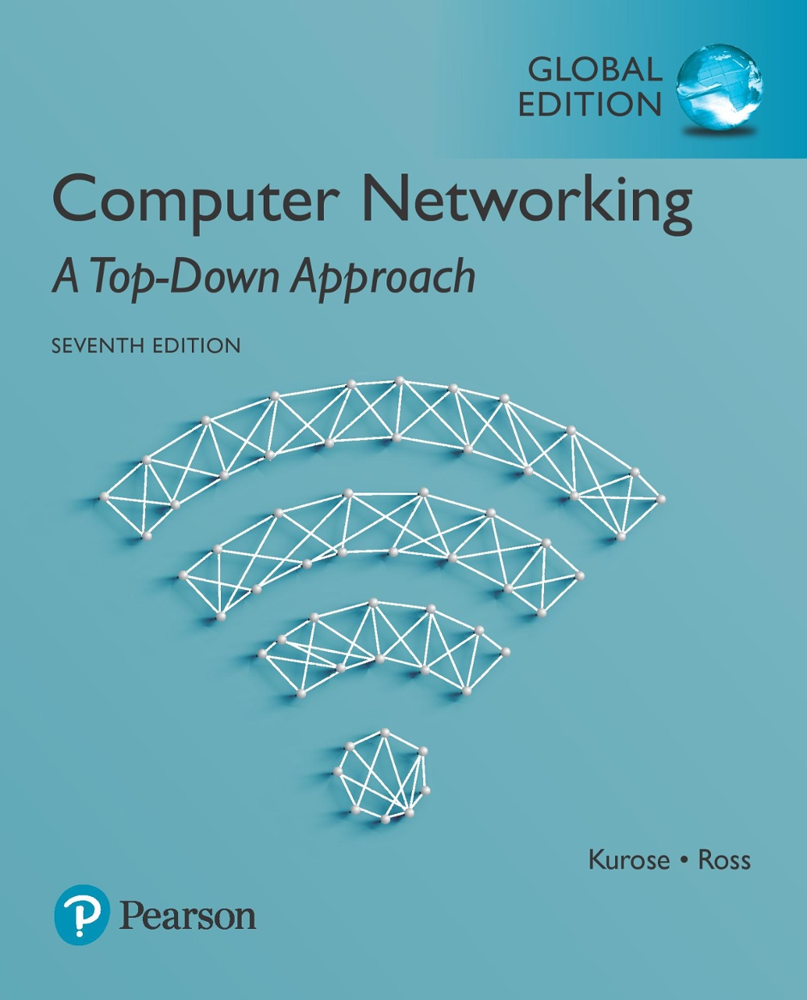

---
sidebar:
  - README.md
  - chapter-1.md
  - chapter-2.md
---

# Introduction
## CSE350 Computer Network
#### Spring 2021
#### National Sun Yat-sen University

## Instructor
#### Wei-Kuang Lai ([website](http://www.hsnl.cse.nsysu.edu.tw/wklai/))

## Materials
The materials used in this course include slides and textbooks. Here's the textbooks list.

1. Computer Networking: A Top-Down Approach, 7th Edition (ISBN: 978-1292153599)

> Image from Amazon

## Notes
This website includes the notes I took throughout the course. The contents are mainly taken from the textbook plus some personal explanations.
### Table of contents

| Chapter | Content                                                   | Slide                                                                          |
|---------|-----------------------------------------------------------|--------------------------------------------------------------------------------|
| 1       | Computer Networks and the Internet ([notes](./chapter-1)) | [Link](https://drive.google.com/file/d/1r5EYuv9FPyGUPjYfQ9VjeBDhpr4Ddg14/view) |
| 2       | Application Layer ([notes](./chapter-2))                  | [Link](https://drive.google.com/file/d/1aLIXhP3oFs6LZ_NDjjl88yHo_kByIcyG/view) |
| 3       | Transport Layer ([notes](/courses/cse491-network-application-programming/chapter-2))                    | [Link](https://drive.google.com/file/d/10Ym8pb5DrEh2LX2KYhEbJxlTuF_IKKdA/view) |
