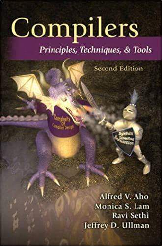

---
sidebar:
  - README.md
  - compiler-design.md
  - text: Lexical Analysis
  - children:
      - lexical-analysis/finite-automata.md
      - lexical-analysis/from-regular-expressions-to-automata.md
      - lexical-analysis/optimization-of-dfa-based-pattern-matchers.md
  - text: Syntax Analysis
  - children:
      - syntax-analysis/context-free-grammars.md
      - syntax-analysis/writing-a-grammar.md
      - syntax-analysis/top-down-parsing.md
---

# Introduction
## CSE360 Design And Implementation of Compiler
#### Spring 2021
#### National Sun Yat-sen University

## Instructor
#### Ye-In Chang ([website](http://db.cse.nsysu.edu.tw))

## Materials
The materials used in this course include slides and textbooks. The slides are not provided due to the copyright issue. Here's the textbooks list.

1. Compilers: Principles, Techniques, and Tools 2nd Edition (ISBN: 978-0321486813)

> Image from Amazon

2. [Compiler Design Tutorials, GeeksforGeeks](https://www.geeksforgeeks.org/compiler-design-tutorials/)

## Notes
This website includes the notes I took throughout the course. The contents are mainly taken from the professor's slides, textbook plus some personal explanations.
### Table of contents

1. [Compiler Design](./compiler-design)
1. Lexical Analysis
    - [Finite Automata](./lexical-analysis/finite-automata)
    - [From Regular Expressions to Automata](./lexical-analysis/from-regular-expressions-to-automata)
    - [Optimization of DFA-Based Pattern Matchers](./lexical-analysis/optimization-of-dfa-based-pattern-matchers)
1. Syntax Analysis
    - [Context-Free Grammars](./syntax-analysis/context-free-grammars)
    - [Writing a Grammar](./syntax-analysis/writing-a-grammar)
    - [Top-Down Parsing](./syntax-analysis/top-down-parsing)
