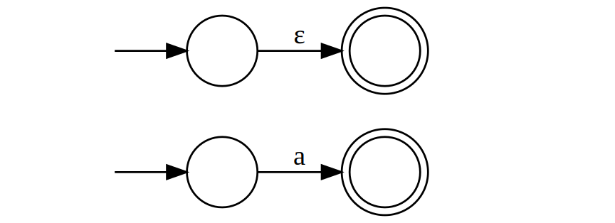
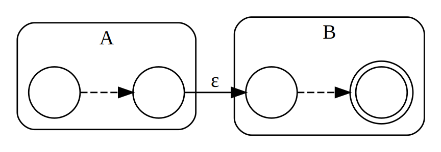
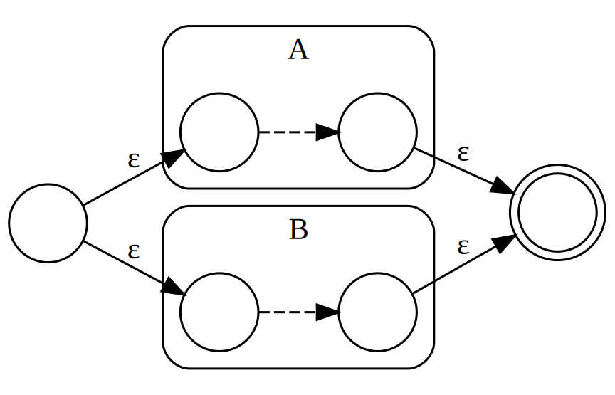
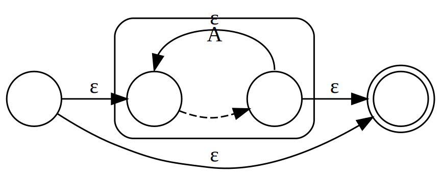
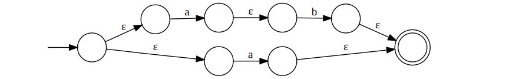
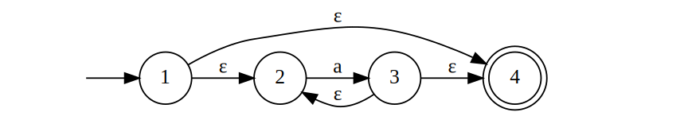
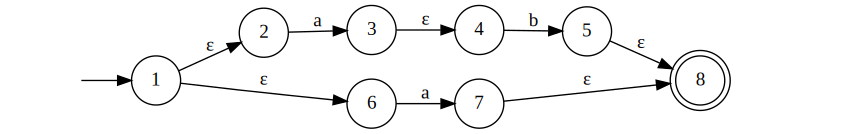
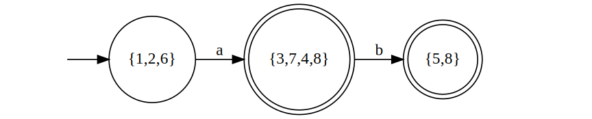
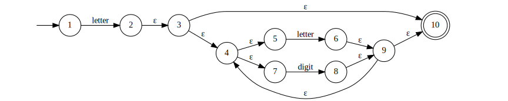
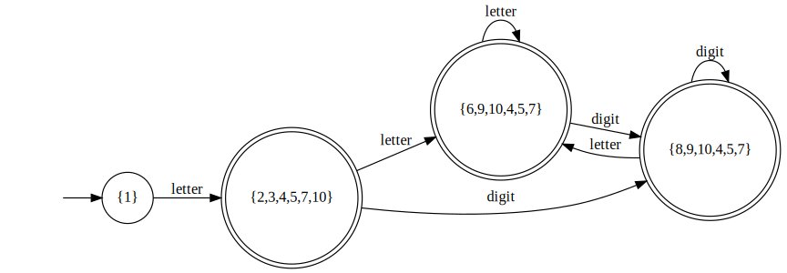

# From Regular Expressions to Automata
The regular expression is the notation of choice for describing lexical analyzers and other pattern-processing software. However, implementation of that software requires the simulation of a DFA. 

In this section we shall first show how to convert regular expressions to NFA's using **Thompson's construction**. Next, we show how to convert NFA's to DFA's using the **subset construction**.

## From a Regular Expression to an NFA
Consider the following basic element of regular expressions

| Element       | Example              |
|---------------|----------------------|
| Empty string  | $\lambda , \epsilon$ |
| Character     | a                    |
| Concatenation | AB                   |
| Alternative   | A\|B                 |
| Repetition    | A*                   |

We shall see how to use NFA transition graphs to recognize them.

#### Empty string & character

#### Concatenation

Where the dashed arrows mean that there could be multiple states and transitions within A and B respectively.

#### Alternative

#### Repetition

### Example
Translate the regular expression `ab|a` into an NFA according to Thompson's construction.

First, use the **concatenation** technique on `ab`

Then we form another copy of the machine for `a` and use the **alternative** technique get the complete NFA for `ab|a`

## From an NFA to a DFA
For each state $s$, the closure set $\{ \overline{s} \}$ is a set of NFA states reachable from NFA state $s$ on $\epsilon$-transitions alone.

Consider the following NFA corresponding to the regular expression `a*` under Thompson’s construction

In this NFA, we have

- $\{ \overline{1} \} = \{ 1,2,4 \}$
- $\{ \overline{2} \} = \{ 2 \}$
- $\{ \overline{3} \} = \{ 2,3,4 \}$
- $\{ \overline{4} \} = \{ 4 \}$

As we can see, the closure set $\{ \overline{s} \}$ for state $s$ must contains itself. Next, we shall find the transitions between these closure sets. We start from $\{ \overline{1} \} = \{ 1,2,4 \}$, and we examine what states we can go to from state 1, 2 and 4 but not using $\epsilon$-transition. Here, there's only one transition, $a$, therefore

$\{ 1,2,3 \} \xrightarrow{a} \{ 3 \}$

And keep going with $\{ \overline{3} \}$

$\{ \overline{3} \} = \{ 2,3,4 \}$

By now, we've walk through all of the transitions and we get a DFA transition graph

### Example 1
Let's look at a more complicated example

Perform the same procedures as above

$$\begin{matrix}
                &                   & \{ \overline{1} \}    & = & \{ 1,2,6 \} \\
\{ 1,2,6 \}     & \xrightarrow{a}   & \{ \overline{3,7} \}  & = & \{ 3,7,4,8 \} \\
\{ 3,7,4,8 \}   & \xrightarrow{b}   & \{ \overline{5} \}    & = & \{ 5,8 \} \\
\end{matrix}$$

Noted that if the new state contains a final state, then it becomes a final state as well.

### Example 2
Consider the regular expression and the corresponding NFA transition graph

`letter(letter|digit)*`

$$\begin{matrix}
                    &                       & \{ \overline{1} \}    & = & \{ 1 \} \\
\{ 1 \}             & \xrightarrow{letter}  & \{ \overline{2} \}    & = & \{ 2,3,4,5,7,10 \} \\
\{ 2,3,4,5,7,10 \}  & \xrightarrow{letter}  & \{ \overline{6} \}    & = & \{ 6,9,10,4,5,7 \} \\
\{ 2,3,4,5,7,10 \}  & \xrightarrow{digit}   & \{ \overline{8} \}    & = & \{ 8,9,10,4,5,7 \} \\
\{ \overline{6} \}  & \xrightarrow{letter}  & \{ \overline{6} \}    & = & \{ 6,9,10,4,5,7 \} \\
\{ \overline{6} \}  & \xrightarrow{digit}   & \{ \overline{8} \}    & = & \{ 8,9,10,4,5,7 \} \\
\{ \overline{8} \}  & \xrightarrow{letter}  & \{ \overline{6} \}    & = & \{ 6,9,10,4,5,7 \} \\
\{ \overline{8} \}  & \xrightarrow{digit}   & \{ \overline{8} \}    & = & \{ 8,9,10,4,5,7 \} \\
\end{matrix}$$

