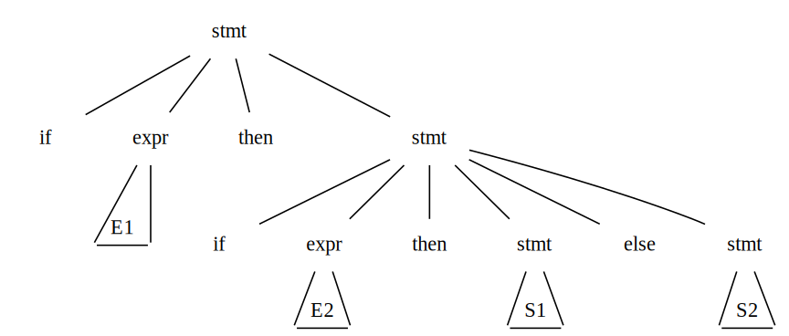
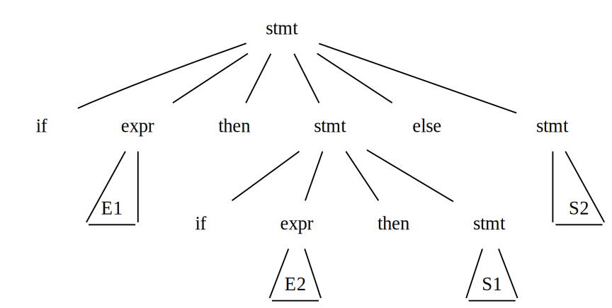

# Writing a Grammar
This section begins with a discussion of how to divide work between a lexical analyzer and a parser. We then consider several transformations that could be applied to get a grammar more suitable for parsing. One technique can **eliminate ambiguity** in the grammar, and other techniques, **left-recursion elimination** and **left factoring**, are useful for rewriting grammars so they become suitable for **top-down parsing**.

[[toc]]

## Lexical Versus Syntactic Analysis
We typically use **regular expressions** to construct **lexical analyzers** while using **grammars** to construct **parsers**. In fact, everything that can be described by a regular expression can also be described by a grammar. We may ask, why use regular expressions to define the lexical syntax. There are several reasons:

1. The lexical rules of a language are frequently quite simple, and to describe them we do not need a notation as powerful as grammars.
1. Regular expressions generally provide a more concise and easier-to-understand notation for tokens than grammars.

## Eliminating Ambiguity
Sometimes an ambiguous grammar can be rewritten to eliminate the ambiguity. As an example, we shall eliminate the ambiguity from the following "dangling-else" grammar:

$$\begin{matrix}
\textit{stmt}   & \rightarrow   & \textbf{if} \; \textit{expr} \; \textbf{then} \; \textit{stmt} \;\;\;\;\;\;\;\;\;\;\;\;\;\;\;\; \\
                & \vert         & \textbf{if} \; \textit{expr} \; \textbf{then} \; \textit{stmt} \; \textbf{else} \; \textit{stmt} \\
                & \vert         & \textbf{other} \;\;\;\;\;\;\;\;\;\;\;\;\;\;\;\;\;\;\;\;\;\;\;\;\;\;\;\;\;\;\;\;\;\; \\
\end{matrix}$$ (1)

Here $other$ stands for any other statement. According to this grammar, the compound conditional statement

$$\textbf{if} \; E_1 \; \textbf{then} \; \textbf{if} \; E_2 \; \textbf{then} \; S_1 \; \textbf{else} \; S_2$$

is an example showing Grammar (1) is ambiguous since it has two parse trees

In all programming languages with conditional statements of this form, the **first** parse tree is preferred. The general rule is, Match each $\textbf{else}$ with the **closest** unmatched $\textbf{then}$. This disambiguating rule can be incorporated directly into a grammar by using the following observations.

- A statement appearing between a $\textbf{then}$ and a $\textbf{else}$ must be matched ($\textbf{if-then-else}$ pairs).
- Thus statements must split into kinds: $\textit{matched}$ and $\textit{unmatched}$.
- The unambiguous grammar for $\textbf{if-then-else}$ statements can be described as 

$$\begin{matrix}
\textit{stmt}               & \rightarrow   & \textit{matched\_stmt} \;\;\;\;\;\;\;\;\;\;\;\;\;\;\;\;\;\;\;\;\;\;\;\;\;\;\;\;\;\;\;\;\;\;\;\;\;\;\;\;\;\;\;\;\;\;\;\;\;\;\;\;\;\; \\
                            & \vert         & \textit{unmatched\_stmt} \;\;\;\;\;\;\;\;\;\;\;\;\;\;\;\;\;\;\;\;\;\;\;\;\;\;\;\;\;\;\;\;\;\;\;\;\;\;\;\;\;\;\;\;\;\;\;\;\;\; \\
\textit{matched\_stmt}      & \rightarrow   & \textbf{if} \; \textit{expr} \; \textbf{then} \; \textit{matched\_stmt} \; \textbf{else} \; \textit{matched\_stmt} \;\;\; \\
                            & \vert         & \textbf{other} \;\;\;\;\;\;\;\;\;\;\;\;\;\;\;\;\;\;\;\;\;\;\;\;\;\;\;\;\;\;\;\;\;\;\;\;\;\;\;\;\;\;\;\;\;\;\;\;\;\;\;\;\;\;\;\;\;\;\;\;\;\;\;\;\;\; \\
\textit{unmatched\_stmt}    & \rightarrow   & \textbf{if} \; \textit{expr} \; \textbf{then} \; \textit{stmt} \;\;\;\;\;\;\;\;\;\;\;\;\;\;\;\;\;\;\;\;\;\;\;\;\;\;\;\;\;\;\;\;\;\;\;\;\;\;\;\;\;\;\;\;\;\;\;\;\; \\
                            & \vert         & \textbf{if} \; \textit{expr} \; \textbf{then} \; \textit{matched\_stmt} \; \textbf{else} \; \textit{unmatched\_stmt} \\
\end{matrix}$$

## Elimination of Left Recursion
A grammar is *left recursive* if it has a nonterminal $A$ such that there is a derivation $A \xRightarrow{+} A \alpha$ for some string $\alpha$. Top-down parsing methods cannot handle left-recursive grammars, so a transformation is needed to eliminate left recursion.

### A simple left recursion
The left-recursive production $A \rightarrow A \alpha \vert \beta$ could be replaced by non-left-recursive productions without changing the strings derivable from $A$.

$$\begin{matrix}
A  & \rightarrow & \beta A' \;\; \\
A' & \rightarrow & \alpha A' \; \vert \; \epsilon \\
\end{matrix}$$

#### Exercise
Consider the following grammar for arithmetic expressions.

$$\begin{matrix}
E & \rightarrow & E + T \; \vert \; T \\
T & \rightarrow & T * F \; \vert \; F \\
F & \rightarrow & \lparen E \rparen \; \vert \; \textbf{id} \;\;\; \\
\end{matrix}$$

Eliminating the immediate left recursion (production of the form $A \xRightarrow{+} A \alpha$) to the production for E and then for T.

::: tip Solution
$E \rightarrow E + T \; \vert \; T$ are replaced by

$$\begin{matrix}
E  & \rightarrow & TE' \;\;\;\;\;\; \\
E' & \rightarrow & +TE' \; \vert \; \epsilon \\
\end{matrix}$$

$T \rightarrow T * F \; \vert \; F$ are replaced by

$$\begin{matrix}
T  & \rightarrow & FT' \;\;\;\;\;\; \\
T' & \rightarrow & *FT' \; \vert \; \epsilon \\
\end{matrix}$$

:::

### The general case
Here, we shall deduce the general form for this formula. Immediate left recursion can be eliminated by the following technique, which works for any number of $A$-productions. First, group the productions as

$$A \rightarrow A \alpha_1 \; \vert \; A \alpha_2 \; \vert \; \cdots \; \vert \; A \alpha_m \; \vert \; \beta_1 \; \vert \; \beta_2 \; \vert \; \cdots \; \vert \; \beta_n$$

where no $\beta_i$ begins with an $A$. Then replace the $A$-productions by

$$\begin{matrix}
A  & \rightarrow & \beta_1 A' \; \vert \; \beta_2 A' \; \vert \; \cdots \; \vert \; \beta_n A' \;\;\;\;\;\; \\
A' & \rightarrow & \alpha_1 A' \; \vert \; \alpha_2 A' \; \vert \; \cdots \; \vert \; \alpha_m A' \; \vert \; \epsilon \\
\end{matrix}$$

This eliminates all immediate left recursion, but it doesn't eliminate left recursion involving derivations of two ore more steps (not immediate). For example

$$\begin{matrix}
S & \rightarrow & Aa \; \vert \; b \;\;\;\;\;\;\; \\
A & \rightarrow & Ac \; \vert \; Sd \; \vert \; \epsilon \\
\end{matrix}$$ (2)

The nonterminal $S$ is left recursive because $S \Rightarrow Aa \Rightarrow Sda$ but it is not immediately left recursive. Hence it can not be eliminate by the above technique. But still, in some cases we can try to handle it by the substitution. The second production in the grammar (2) becomes

$$A \rightarrow Ac \; \vert \; Aad \; \vert \; bd \; \vert \; \epsilon$$

Eliminating the immediate left recursion among these $A$-productions yields the
following grammar.

$$\begin{matrix}
S  & \rightarrow & Aa \; \vert \; b \;\;\;\;\;\;\;\;\;\;\; \\
A  & \rightarrow & bdA' \; \vert \; A' \;\;\;\;\;\; \\
A' & \rightarrow & cA' \; \vert \; adA' \; \vert \; \epsilon \\
\end{matrix}$$

## Left Factoring
Left factoring is a grammar transformation that is useful for producing a grammar suitable for predictive, or top-down, parsing. When the choice between two alternative $A$-productions is not clear, we may be able to rewrite the productions to defer the decision until enough of the input has been seen that we can make the right choice.

For example, if we have the two productions

(1)
$$\begin{matrix}
\textit{stmt}   & \rightarrow   & \textbf{if} \; \textit{expr} \; \textbf{then} \; \textit{stmt} \;\;\;\;\;\;\;\;\;\;\;\;\;\;\;\; \\
                & \vert         & \textbf{if} \; \textit{expr} \; \textbf{then} \; \textit{stmt} \; \textbf{else} \; \textit{stmt} \\
                & \vert         & \textbf{other} \;\;\;\;\;\;\;\;\;\;\;\;\;\;\;\;\;\;\;\;\;\;\;\;\;\;\;\;\;\;\;\;\;\; \\
\end{matrix}$$

on seeing the input token $\textbf{if}$, we cannot immediately tell which production to choose to expand $\textit{stmt}$. In general, suppose a grammar $A \rightarrow \alpha \beta_1 \; \vert \; \alpha \beta_2 \; \vert \; \cdots \; \vert \; \alpha \beta_n \; \vert \; \gamma$ where $\gamma$ represents all alternatives that do not begin with $\alpha$, and the input begin with a nonempty string derived from $\alpha$, we do not know which production to use.

However, we may defer the decision by changing the grammar into

$$\begin{matrix}
A  & \rightarrow & \alpha A' \; \vert \; \gamma \;\;\;\;\;\;\;\;\;\;\;\;\;\; \\
A' & \rightarrow & \beta_1 \; \vert \; \beta_2 \; \vert \; \cdots \; \vert \; \beta_n \\
\end{matrix}$$

Here $A'$ is a new nonterminal. Repeatedly apply this transformation until no two alternatives for a nonterminal have a common prefix.

### Left factoring conditional statement

The grammar (1) becomes

$$\begin{matrix}
\textit{stmt}   & \rightarrow   & \textbf{if} \; \textit{expr} \; \textbf{then} \; \textit{stmt} \; \textit{stmt'} \; \vert \; \textbf{other} \\
\textit{stmt'}  & \rightarrow   & \textbf{else} \; \textit{stmt} \; \vert \; \epsilon \;\;\;\;\;\;\;\;\;\;\;\;\;\;\;\;\;\;\;\;\;\;\;\;\;\;\;\;\;\; \\
\end{matrix}$$

