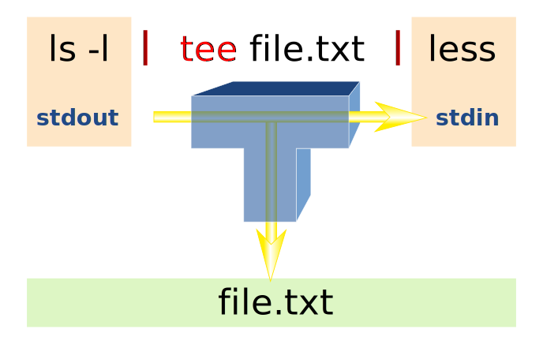

# Lecture 2
## Miscellaneous Commands

| Command             | Description                                                 |
|---------------------|-------------------------------------------------------------|
| `echo [string]`     | print the string, use `-n` to prevent newline               |
| `wc [filename]`     | word count. \[#lines]\[#words]\[#characters]\[filename]     |
| `cut [filename]`    | `cut` charaters(`-c`) or fields(`-f`) from each input line  |
| `alias `            | create a command shortcut                                   |
| `basename [string]` | print the end part of the argument sent to it               |
| `history`           | list the history of commands you typed                      |
| `![number|prefix]`  | return an old command based on its history number or prefix |

### cut
`-c` and `-f` can be followed by indices or ranges, where the index start from 1 instead of 0.
```sh
% cat file
abcdefghijklmno
% cut -c4-5,10 file
dej
```
Other useful flags are `--complement` and `-d`

`--complement` shows everything except charaters or fields specified by `-c` and `-f` repectively.
```sh
% cut --complement -c4-5,10 file
abcfghiklmno
```
`-d` specifies the **delimiter** to seperate fields, the delimiter is default to tab `\t` if not specified.
```sh
% cat file
apple banana cherry
% cut -f1 file
apple banana cherry
% cut -f1 -d" " file
apple
```


## Redirection

> `cmd` is abbr. for **command** and `fn` is abbr. for **filename**

| Command                    | Description                                                          |
|----------------------------|----------------------------------------------------------------------|
| `[cmd] < [fn]`             | Redirect keyboard input to come from a file                          |
| `[cmd] >, 2>, &> [fn]`     | Redirect screen output to a file                                     |
| `[cmd] >>, 2>> [fn]`       | Redirect screen output to the end of a file                          |
| `[cmd] | [cmd]`            | Redirect screen output to the input of the next command              |
| `[cmd] | tee [fn] | [cmd]` | Redirect screen output to both a file and the next command           |
| `` `[cmd]` ``              | Redirect the output to become an inplace argument                    |
| `[cmd] | xargs [cmd]`      | Redirect the output of former command to the arguments of latter one |

### Redirection can affect commands
As we've learned above, `wc -c File` will output the number of characters followed by the filename. However, if we didn't specify the filename, `wc` would take standard input as a file. In this case, no filename will be output, because there's no file. Also, we can use redirection to redirect standard input to come from a file. Same as above, `wc` have no idea of the existance of the file.
```sh
% wc -c File
100 File
% wc -c
> This is typed
> by ourselves
> as input fed into wc
> ^D
48
% wc -c < File
100
```
A special case for `paste` command is that if we use `-` as the argument instead of a filename, `paste` would take input as the file (can be standard input or redirection).
```
% paste File1 File2
a	1
b	2
c	3
d	4
% paste File1 - < File 2
a	1
b	2
c	3
d	4
% paste - - < File 1
a   b
c   d
```

### Various redrection modes
```sh
% cat File
Hello World!
% echo End of the world :( > File
% cat File
End of the world :(
```
we can see that `echo` with the redirection `>` overwrites the existing content in the file. How to prevent that? Use `>>` instead!
```sh
% cat File
Hello World!
% echo End of the world :) >> File
% cat File
Hello World! End of the world :)
```
`>>` append the output of a command to the end of a file. In fact, there're serveral different redirection modes.

| Redirection symbol | Description                               |
|--------------------|-------------------------------------------|
| &>                 | Redirect stdout&stderr                    |
| 2>                 | Redirect stderr only                      |
| >>                 | Redirect stdout to the end of a file only |
| 2>>                | Redirect stderr to the end of a file only |

In addition, if you just want to hide the output by redirection and you don't a dummy file to be generated, in Unix-like system, you can simply redirect the output to `/dev/null`, which is an abyss and you do not bother what's inside it.

### The pipe
You can link commands together into a single command sequence using pipes `|`. For example, to count how many files are in a directory
```sh
ls | wc -l
```

#### Tee
You can use `tee` to redirect the output to a file and the next command at once
```sh
ls -l | tee file.txt | less
```



> Image credit to Wikipeida

#### Backtick
The command within the `` `[command]` `` would first be evaluated before run the entire command. For example

```sh
% ls -l
total 0
lrwxr-xr-x  1 ernestchu  staff  16 Apr 10 16:10 home -> /Users/ernestchu
% cd home
% cd `pwd -P`
% pwd
/Users/ernestchu
```

`pwd -P` first show the genuine path to current directory, in constrast to the symbolic one, then `cd` change the current directory to the **argument** generated by `pwd -P`.

#### xargs
Consider a scenario that you want to find a keyword in all of the files under current directory. The candidate commands are
```sh
find . -type f -name "*"
fgrep [keyword] [filename]
```
We know that `find` gives us a list of file names, but how can we feed those file names to `fgrep`? Maybe
```sh
find . -type f -name "*" | fgrep "int main("
```
However, this would be evaluated as 
```sh
fgrep "int main(" "file1 file2 file3 ..."
```
`fgrep` searches for the patterns in the string `"file1 file2 file3 ..."` and of course, `"int main("` is not in that string. How would we use that string as individual arguments of file names? Use `xargs` instead.
```sh
find . -type f -name "*" | xargs fgrep "int main("
```
The command above would be evaluated as
```sh
fgrep "int main(" file1 file2 file3 ...
```

Of course, if I were not writting note on `xargs`, I would just use backticks
```sh
fgrep "int main(" `find . -type f -name "*"`   
```
But there's also cases where `xargs` is irreplaceable.

## Command Coordination
There are three operator that connect commands

- Semicolon `;`
- Double ampersands `&&`
- Double bars `||`

### Semicolon
```sh
cd; ls
```
The semicolon linking two commands just enables them to be typed on the same line. The command above is equivalent to
```sh
cd 
ls
```

### Double ampersands and bars
You may have seen `&&` in C programming language expression. In Unix shell, it can also be used to produce an boolean expression. But more frequenly, it is used with **short circuit evaluation**. Consider
```sh
cat ExistingFile &> /dev/null && echo echo executed
```
If the `ExistingFile` do exist, then to get the boolean value of the expression we still need to consider the latter command. So the output will be `echo executed`. However, if the filename lied, the file cannot be found, then right after the former command is evaluated as false due to the error, the result of the entire expression is determined to be **false**. Therefore, the latter command needn't and won't be executed. There would be no output.

On the other hand, consider
```sh
cat ExistingFile &> /dev/null || echo echo executed
```
If the first command succeeded, then the result of the expression is determined and there would be no output, vice versa.

Though we'll meet if else later in the shell script, but we can purely use `&&` and `||` to mimic the conditional statement. Since we've not learned the if else syntax in shell script, let's use C-fashion syntax!
```sh
if (cmd1)
    do cmd2
else
    do cmd3
```
This command snippet can be written in the following form
```sh
cmd1 && cmd2 || cmd3
```
You can think a little bit to figure it our why it works. It's pretty simple! if you need a nested if else, just use parenthesis to wrap the expression up.
