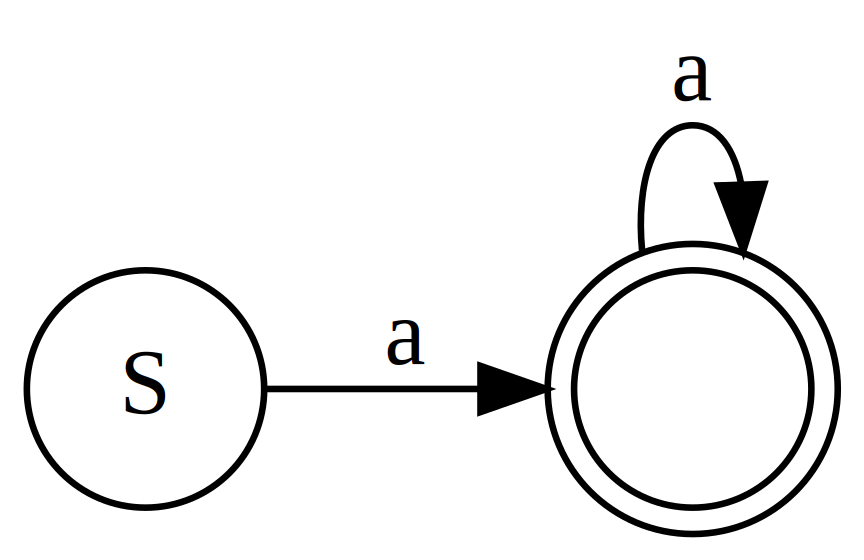
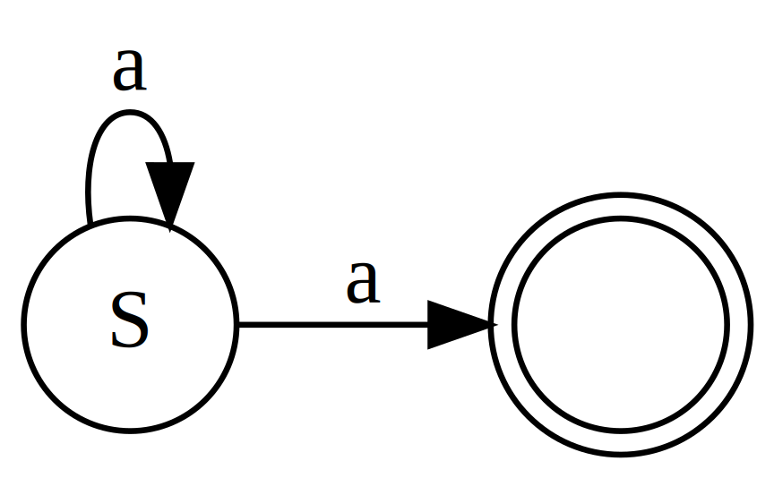

# Lecture 5
## The greps

- `fgrep`: **f**ixed-string **grep** to searches for strings (not regex).
- `grep`: **g**et **r**egular **e**xpression and **p**rint to search for regular expression patterns.
- `egrep`: **e**xtended **grep** for an alternative pattern description system (extended regex)

### Important flags

| Flag      | Description                                                            |
|-----------|------------------------------------------------------------------------|
| `-i`      | Case **i**nsensitive                                                   |
| `-n`      | Display line **n**umbers                                               |
| `-v`      | In**v**ert the matches                                                 |
| `-w`      | **W**hole word matches                                                 |
| `-o`      | **O**nly display the matches, not the entire line                      |
| `-e`      | After this goes a reg**e**x                                            |
| `-A`      | Set the # of lines of context to print **a**fter each match            |
| `-B`      | Set the # of lines of context to print **b**efore each match           |
| `-C`      | Set the # of lines of **c**ontext to print before and after each match |
| `--color` | Highlight the matching pattern                                         |

## fgrep

### Limitation

- cannot use it to get approximate matches
- cannot use it to get matches of more complicated patterns that cannot be described by just giving a fixed string

## grep
### Regular expression (regex) symbols
| Symbol | Description                                                                                     | Example                       |
|--------|-------------------------------------------------------------------------------------------------|-------------------------------|
| `^`    | caret, as the first symbol of a regex, requires the expression to match the front of a line.    | line begins with 'A': `^A`    |
| `$`    | dollar sign, as the last symbol of a regex, requires the expression to match the end of a line. | line ends with 'Z': `Z$`      |
| `\`    | backslash, turns off special meaning for the next character.                                    | match to a literal '$': `\$`  |
| `[]`   | brackets, matches to any one of the enclosed characters.                                        | match to any vowel: `[aeiou]` |
| `.`    | period, matches to any 1 character.                                                             | a 1-character line: `^.$`     |

::: tip Special Symbols Inside Brackets
| Symbol | Description                                                                                         | Example                   |
|--------|-----------------------------------------------------------------------------------------------------|---------------------------|
| `-`    | hyphen, inside `[]`, matches to a range.                                                            | a digit: `[0-9]`          |
| `^`    | caret, as the first symbol inside `[]`, matches any one character except those enclosed in the `[]` | not a letter: `[^a-zA-Z]` |
::: warning The Position of The Caret
If the caret was not placed as the first symbol inside `[]`, for example, `[ab^cd]`, then it just represents a literal `^'.
:::

#### Regex and state machine

Regex is derived from the finite state machine.

##### Deternimistic finite state automaton (DFA)
For the same input, there is exacly one transistion (deterministic) to the next state, for example



In regex, `aa*`, expressing any sting of at least one a.

##### Nondeternimistic finite state automaton (NFA)
For the same input, there can be one or more transitions (nondeterministic) to the next state, for example



In regex, `a*a`, expressing any sting of at least one a.

### Exercise
**Problem:** Draw the NFA for this regex: `a*a*`

::: tip Answer


And the simplify/deterministic regex for it: `a*`
:::

Let's now look at how to use `grep`
```sh{5}
grep -h
usage: grep [-abcDEFGHhIiJLlmnOoqRSsUVvwxZ] [-A num] [-B num] [-C[num]]
	[-e pattern] [-f file] [--binary-files=value] [--color=when]
	[--context[=num]] [--directories=action] [--label] [--line-buffered]
	[--null] [pattern] [file ...]
```
So, in short, we can use `grep [regex] [filenames]`.
::: details A Simple Example
```
% grep -w -e 'three$' -e 'four$' lewis.txt 
very large house with a housekeeper called Mrs. Macready and three
shall be only a statue of a Faun in her horrible house until the four
time of those four thrones at Cair Paravel).  Once you were all four
else--namely a little dwarf who stood with his back to it about four
there's sugar, and some matches.  And if someone will get two or three
"Four thrones in Cair Paravel," said the Witch.  "How if only three
hill and came straight across and stood before Aslan.  The three
flashing so quickly that they looked like three knives and three
```
:::
::: details More Examples
```sh
grep '^word'         files # “word” at the start of a line
grep 'word$'         files # “word” at the end of a line
grep '^word$'        files # lines containing only “word”
grep '\^s'           files # lines containing “^s”
grep '[Ww]ord'       files # search for “Word” or “word”
grep 'B[oO][bB]'     files # search for BOB, Bob, BOb or BoB
grep '^$'            files # search for blank lines
grep '[0-9][0-9]'    files # search for pairs of numeric digits
grep '[^a-zA-Z0-9]'  files # anything not a letter or number
grep '^.$'           files # lines with exactly one character
grep '"word"'        files # "word" within double quotes
grep '"*word"*'      files # “word”, with or without quotes
grep '^\.'           files # any line that starts with “.”
grep '^\.[a-z][a-z]' files # line start with “.” followed by 2 lower-case letters
```
:::

## Regex vs. Wildcards
Let's see the similarity and difference between **regex** and **csh wildcards**

| In regex | In csh wilcard | Meaning                    |
|----------|----------------|----------------------------|
| `\`      | `\`            | Same                       |
| `[]`     | `[]`           | Same?                      |
| `.`      | `?`            | Same but different symbols |
| `*`      | `*`            | Different                  |

### The brackets `[]`
How `grep` and csh treat a `[` **without** `]`?
#### `grep`
```sh{9}
% cat x
a[a
b]b
cxc
d[]d
e]]e
fx]f\f
% grep '[' x
grep: brackets ([ ]) not balanced
% grep '\[' x
a[a
d[]d
# grep consider a single unquoted [ as an incomplete pattern
```
#### csh wildcard
```sh
% ls
[	[]	]	]]	x	x]
% ls [
[
% ls \[
[
# csh do not think a [ without ] as a wildcard parttern but plain text
```
#### What if we want to find a "]"?
```sh{1,6,8}
% grep ']' x
b]b
d[]d
e]]e
fx]f\f
% ls ]
]
% ls *]*
[]	]	]]	x]
# Both of them treat it as plain text
```
#### What if we want a "]" in the set?
```sh
% grep '[x]]' x
fx]f\f
# the regex was interprete as [x] followed by ]
% grep '[x\]]' x
fx]f\f
# this got interprete as [x\] (x or \) followed by ]
% grep '[]x]' x
b]b
cxc
d[]d
e]]e
fx]f\f
# this one finally works. Because empty sets don't make sense
# grep knew ] as the first element wasn't the end.
```
### Exercise
How would grep interprete `[^][^\]`
::: tip Answer
```
┌ a special [ which indicates the start of the set.
│┌ a special ^ which indicates a negate set.
││┌ a normal ], because it os the first element of a negate set.
│││┌ a normal [, because [ isn't special inside a [].
││││┌ a normal ^, one of the element in the set.
│││││┌ a normal \, because \ isn't special inside a [].
││││││┌ a special ] which indicates the end of the set.
│││││││
[^][^\]
```
```sh{1,8}
% cat x
a[a
b]b
cxc
d[]d
e]]e
fx]f\f
% grep '[^][^\]' x
a[a
b]b
cxc
d[]d
e]]e
fx]f\f
```
:::

### Time for wilcards
```sh
% ls
[	[]	]	]]	x	x]
% ls ]
]               # same as regex
% ls *]*
[]	]	]]	x]  # incomparable
% ls [
[               # different then regex
% ls [x[]
[	x           # same as regex
% ls [x]]
x]              # same as regex
% ls []x]
]	x           # same as regex
% ls []
[]              # different then regex, wilcard consider it as normal []
% ls [x\]]
]	x           # different than regex, the \ isn't normal in the set
```

::: danger Final Remarks
consider `grep 'AB*C' AB*C`

- For the first argument `'AB*C'`, notice the strong quotes, the shell send this argument as-is without quotes. And `grep` interprete it with regex rules.
- Whereas for the second argument `AB*C`, the shell first do the wilcard expansion on it then send the resulting file name(s) to `grep`.

:::

## More Regular Expression Syntax

| Expression       | Description                                                                                                                                     |
|------------------|-------------------------------------------------------------------------------------------------------------------------------------------------|
| `\{x\}`          | Matches `x` repetitions of the preceding regex.                                                                                                 |
| `\{x,y\}`        | Matches `x` to `y` repetitions of the preceding regex.                                                                                          |
| `\{,x\}`         | Matches if the number of repetitions of the preceding regex $\leq$ `x`.                                                                         |
| `\{x,\}`         | Matches if the number of repetitions of the preceding regex $\geq$ `x`.                                                                         |
| `\>`             | The preceding regex must end at the end of a **word**.                                                                                          |
| `\<`             | The preceding regex must end at the start of a **word**.                                                                                        |
| `\(...\)`        | Define a **group** for a sub-portion of the regex. A group can be used before `*` or `\{...\}`, which match the repetition of the entire group. |
| `\1`, `\2`, etc. | Backreference. Identify a rematch to the earlier pattern. We'll see the detail below.                                                           |

### Repetition
Regex is **GREEDY**. By which it always takes the **longest** possible match, without considering how this will affect later matches. Let's see some examples.
```sh
# Use -o to make grep print only the matching part of the lines.
% echo happy | grep -o '[a-z]\{2,3\}'
hap
py
# It first matches as long as it can, i.e. 3 repetitions!
% echo happ | grep -o '[a-z]\{2,3\}'
hap
# It can match 2 sets of 2 repetitions if it wants,
# but it instead takes the longest match first.
% echo happ | grep -o '[a-z]\{,3\}'
hap
p
% echo happ | grep -o '[a-z]\{1,\}'
happ
```

### The end of a word
```sh
# How to split 
#   There are the others
# into this 
#   There are
#   the others

# Use -i to make grep perform case insensitive matching.
% echo "There are the others" | grep -io '[a-z]*\> [a-z]*\> '
There are                                       # ↑________↑___ blank spaces here
% echo "There are the others " | grep -io '[a-z]*\> [a-z]*\> '
There are                 # ↑______________________↑________↑__ blank spaces here
the others
# We did it, but changing the input string is kind of cheating.
# we need to find a right regex pattern.
% echo "There are the others" | grep -io '[a-z]*\> [a-z]*\>'
There are                                       # ↑____________ blank spaces here
 the                                            # │
 others                                         # │
# The start of 2nd and 3rd matches are matched to ┘
% echo "There are the others" | grep -io '[a-z]*\> [a-z]*\> *'
There are 
the others
# Finally, the solution is to make the last space optional.
```
Let's see what is considered as a **word**.

`% echo "e,e;e-e+e_e:e5e.e?e"\!e\"e\'e | grep --color 'e\>'`

<span style="color: red">e</span>,<span style="color: red">e</span>:<span style="color: red">e</span>-<span style="color: red">e</span>+e_<span style="color: red">e</span>:e5<span style="color: red">e</span>.<span style="color: red">e</span>?<span style="color: red">e</span>"<span style="color: red">e</span>'<span style="color: red">e</span>

So punctuation and newline are OK, but **underscore** and **number** are not.

### The start of a word
Why is it necessary? Let's see an example

`% echo "There are the others" | grep -i --color '\<the'`

<span style="color: red">The</span>re are
<span style="color: red">the</span> others

::: warning None of These Find The Same Matches

`% echo "There are the others" | grep -i --color ' the'`

There are <span style="color: red">the</span> others

`% echo "There are the others" | grep -i --color '^the'`

<span style="color: red">The</span>re are the others

`% echo "There are the others" | grep -i --color 'the'`

<span style="color: red">The</span>re are
<span style="color: red">the</span>
o<span style="color: red">the</span>rs

:::
::: danger The Closest You Can Get Without \&lt;

`% echo "There are the others" | grep -i --color -e ' the' -e '^the'`

<span style="color: red">The</span>re are
<span style="color: red">the</span> others

However, it's still not the same.
```sh
% echo "There are the others" | grep -io -e ' the' -e '^the'
The
 the
# Notice the blank is also captured along with `the`
```
:::

### Group
Let's find a pair of a consonant followed by a vowel.
```sh
% echo irregulars | grep -o '[b-df-hj-np-tv-z][aeiou][b-df-hj-np-tv-z][aeiou]'
regu
# could we make the regex shorter
% echo irregulars | grep -o '\([b-df-hj-np-tv-z][aeiou]\)\{2\}'
regu
# we can even find more pairs of it
% echo irregulars | grep -o '\([b-df-hj-np-tv-z][aeiou]\)*'
regula
# or put the vowel in the front
% echo irregulars | grep -o '\([aeiou][b-df-hj-np-tv-z]\)*'
ir
egular
```

### Backreference
Backreference let you identify a rematch to the earlier pattern. Noted that it rematched the **text** instead of reusing the **pattern**.

<span style="color: green">\\([a-z]\\)</span><span style="color: red">\\([a-z]\\)</span><span style="color: green">\1</span><span style="color: red">\2</span>

b<span style="color: green">a</span><span style="color: red">n</span><span style="color: green">a</span><span style="color: red">n</span>a

<span style="color: green">n</span><span style="color: red">o</span><span style="color: green">n</span><span style="color: red">o</span>gram

::: warning Double-match
"banana" is a double-match , because there's
ba<span style="color: green">n</span><span style="color: red">a</span><span style="color: green">n</span><span style="color: red">a</span>.

However, `grep` scans from left to right.
:::

#### Backreferencing palindromes
```sh
# 3-letter palindromes
% cat File | grep -o '\<\([a-z]\)[a-z]\1\>' | sort | uniq
did
eve
eye
wow
# 4-letter palindromes
% cat File | grep -o '\<\([a-z]\)\([a-z]\)\2\1\>' | sort | uniq
sees
# 3-6-letter palindromes
% cat File | grep -o\
? -e '\<\([a-z]\)[a-z]\1\>'\
? -e '\<\([a-z]\)\([a-z]\)\2\1\>'\
? -e '\<\([a-z]\)\([a-z]\)[a-z]\2\1\>'\
? -e '\<\([a-z]\)\([a-z]\)\([a-z]\)\3\2\1\>'\
? | sort | uniq
did
eve
eye
level
madam
redder
sees
wow
```
### POSIX built-in patterns
There are also some built-in characters sets that you can type in a blaze.

| Character Group | Meaning                          |
|-----------------|----------------------------------|
| [:alnum:]       | Alphanumeric                     |
| [:cntrl:]       | Control character                |
| [:lower:]       | Lower case character             |
| [:space:]       | Whitespace                       |
| [:alpha:]       | Alphabetic                       |
| [:digit:]       | Digit                            |
| [:print:]       | Printable character              |
| [:upper:]       | Upper case character             |
| [:blank:]       | Whitespace, tab, etc.            |
| [:graph:]       | Printable and visible characters |
| [:punct:]       | Punctuation                      |
| [:xdigit:]      | Extended Digit                   |

## Extended Regular Expressions
The languages specifiable by regular expressions can be extended in 2 ways:

1. To make them easier to write
    - This does not alter the expressivity, i.e. you can only specifiy the same range of languages
1. To allow a choice of patterns
    - The OR operation

|Symbol|Description|
|-|-|
|`?`|Makes the preceding expression optional, i.e. `\{0,1\}`.|
|`+`|Requires the preceding expression to occur **at least once**, i.e. `\{1,\}`.|
|`|`|The OR operation. To search for one of 2 different patterns.|
|`()`|Can be used to change the associatibity of `|`. E.g. `x(w|y)z` matches to `xwz` or `xyz`. Also it can extend the range of `*`, `+`, and `?`|

Use `egrep` to use extended regex!

`% echo "multiple bananas" | egrep --color '[aeiou][b-df-hj-np-tv-z][aeiou]*'`

m<span style="color: red">ul</span>t<span style="color: red">ip</span>le
b<span style="color: red">ana</span>n<span style="color: red">as</span>

`% echo "multiple bananas" | egrep --color '[aeiou]([b-df-hj-np-tv-z][aeiou])*'`

m<span style="color: red">u</span>lt<span style="color: red">i</span>pl<span style="color: red">e</span>
b<span style="color: red">anana</span>s

`% echo "multiple bananas" | egrep --color '[aeiou][b-df-hj-np-tv-z][aeiou]+'`

multiple
b<span style="color: red">ana</span>nas

`% echo "multiple bananas" | egrep --color '[aeiou]([b-df-hj-np-tv-z][aeiou])+'`

multiple
b<span style="color: red">anana</span>s

`% echo "multiple bananas" | egrep --color '[aeiou]([b-df-hj-np-tv-z][aeiou])?'`

m<span style="color: red">u</span>lt<span style="color: red">i</span>pl<span style="color: red">e</span>
b<span style="color: red">ana</span>n<span style="color: red">a</span>s

### Compare `grep` and `egrep`

| Expression       | In `grep`                      | In `egrep`                                     |
|------------------|--------------------------------|------------------------------------------------|
| `abc|def`        | the string `abc|def`           | `abc` or `def`                                 |
| `(a$)|(b(c|d)e)` | the string `(a$)|(b(c|d)e)`    | lines ending in `a` or contains `bce` or `bde` |
| `ab+c`           | the string `ab+c`              | `abc` or `abbc`, or `abbbc`, etc.              |
| `\([ab]\)\1`     | `aa` or `bb`                   | `(a)1` or `(b)1`                               |
| `a\{2`           | an error, closing \} not found | `a{2`                                          |
| `\<a`            | words begin with `a`           | `<a` (in standard egrep)                       |

#### How they identify **numbers** in lexical analysis for some programming language
##### State diagram
Define **digit** as `[0-9]` in regex


##### `grep`
```
[+-]\{,1\}[0-9]\{1,\}\(\.[0-9]\{1,\}\)\{,1\}\([Ee][+-]\{,1\}[0-9]\{1,\}\)\{,1\}
```
##### `egrep`
```
[+-]?[0-9]+(\.[0-9]+)?([Ee][+-]?[0-9]+)?
```

|`grep`|`egrep`|
|-|-|
|`[+-]\{,1\}`|`[+-]?`|
|`[0-9]\{1,\}`|`[0-9]+`|
|`\(\.[0-9]\{1,\}\)\{,1\}`|`(\.[0-9]+)?`|
|`\([Ee][+-]\{,1\}[0-9]\{1,\}\)\{,1\}`|`([Ee][+-]?[0-9]+)?`|
