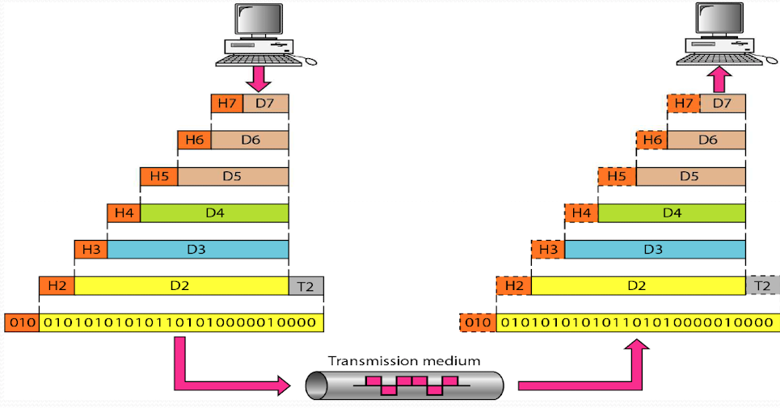

# Network Programming
## Introduction
### Process commmunication
#### A process is a program in execution
In your computer, processes may talk with each other by **inter-process communication (IPC)**. IPC methods include

- File locking
- Pipes
- FIFO
- Message queues
- Semaphores
- Shared  memory

Processes may be also executed on different systems. From the viewpoint of each process, this is till IPC.

> Image credit to Professor Wang's slides

### Layering architecture
In the 7-layer model, each layer is responsible for different tasks.

| Layer        | Task                                                                                |
|--------------|-------------------------------------------------------------------------------------|
| Application  | To allow access to network resources                                                |
| Presentation | To translate, encrypt, and compress data                                            |
| Session      | To establish, manage, and terminate sessions                                        |
| Transport    | To provide reliable process-to-process message delivery and error recovery          |
| Network      | To move packets from source to destination; to provide internetworking              |
| Data link    | To organize bits into frames; to provide hop-to-hop delivery                        |
| Physical     | To transmit bits over a medium; to provide mechanical and electrical specifications |

#### Data encapsulation
The data portion of a packet at level $k-1$ carries the whole packet from level $k$ (while the header portion is for level $k-1$ itself)

> Image credit to Professor Wang's slides

### P2P vs. client-server
Network communications can be classified into two types:
#### Peer-to-peer (P2P)
Data may be distributed over all computer. A common example is torrenting in which data is segmented into small parts and distributed all over the user end systems. However, we still need a server to coordinate between endpoints, otherwise, we cannot find at which IP addresses the data exist.

#### Client-server architecture
Data may be concentrated on few sites, i.e., servers. And other computers, i.e., clients, may obtain their desired dat aby querying these sites.
