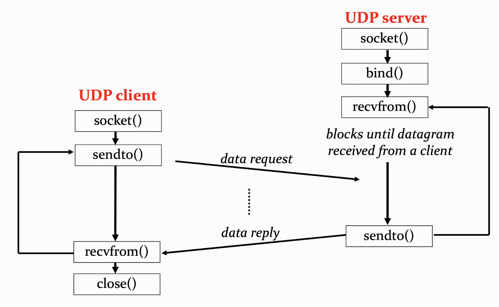

# UNIX Socket Programming
## Preliminary
Server and client exchange messages over network through a common [socket API](./chapter-2.md#internet-socket)

### Transportation-layer protocols
#### UDP

- Single socket to receive messages
- No guarantee of delivery
- Not necessarily in-order delivery
- **Datagram**
    - Independent packets
- Must address each packet
- Examples
    - Multimedia
    - VoIP

#### TCP

- Connection-oriented, dedicated socket for each connection
- Reliable, ensuring delivery
- Byte **stream**, in-order delivery
- Setup connection before data transfer
- Examples
    - Web
    - email
    - ssh

### Port
A host can have up to 2<sup>16</sup> ports and they're used by different processes on the host. The port numbers are used to identify entities (processes) on a host. Port numbers can be

1. Well-known (ports 0 ~ 1023)
1. Registered (ports 1024 ~ 49151)
    - can be used by ordinary users
1. Dynamic, private, or ephemeral (ports 49152 ~ 65535)

- **Servers** and **daemons** (medium between applications and the kernel) usually use well-known ports
    - https: 443
    - ssh: 22
- Client usually use dynamic ports
    - Assigned by the kernel at run time

### IP address
Each attachment point on the Internet is assigned with a unique **address**. However, it hard for human to memorize the numeric addresses. Instead, we prefer to deal with names, hence the domain name server (DNS) provides the mapping of host names to their IP address.

#### IPv4 Internet addressing
```c
#include <netinet/in.h>

/* Internet address structure */
struct in_addr {
    in_addr_t s_addr;                   /* 32-bit IPv4 address */
};

/* Socket address */
struct sockaddr_in {
    u_char          sin_len;            /* length (16, optional) */
    u_short         sin_family;         /* address family (AF_INET) <- v4 */
    u_short         sin_port;           /* UDP or TCP port */

    struct in_addr  sin_addr;           /* IP address */
    char            sin_zero[8];        /* unused (padding) */
}
```
#### IPv6 Internet addressing
```c
#include <netinet/in.h>

/* Internet address structure */
struct in6_addr {
    uint8_t s6_addr[16];                /* 128-bit IPv6 address */
};

#define SIN6_LEN                       /* required for compile-time tests */

/* Socket address */
struct sockaddr_in6 {
    sa_family_t     sin6_family;        /* AF_INET6 <- v4 */
    in_port_t       sin6_port;          /* transport layer port num */
    uint32_t        sin6_flowinfo;      /* IPv6 flow information */
    struct in6_addr sin6_addr;          /* IPv6 address */
    /* set of interfaces for a scope */
    uint32_t        sin6_scope_id;
}
```
#### Byte ordering
The endianess (big/little) may be different between hosts, so we should use a byte-ordering translation procedure to maintain the compatibility.
```c
#include <netinet/in.h>
uint32_t htonl(uint32_t hostlong);
uint16_t htons(uint16_t hostshort);
uint32_t ntohl(uint32_t netlong);
uint16_t ntohs(uint16_t netshort);
```

- **h**: host byte order
- **n**: network (remote) byte order
- **l**: long (4 bytes), used to convert IP addresses
- **s**: short (2 bytes), used to convert port numbers

#### UNIX data types

<table>
    <tr>
        <th>Datatype</th>
        <th>Description</th>
        <th>Header</th>
    </tr>
    <tr>
        <td>int8_t</td>
        <td>Unsigned 8-bit integer</td>
        <td rowspan=6>&lt;sys/types.h&gt;</td>
    </tr>
    <tr>
        <td>uint8_t</td>
        <td>Signed 16-bit integer</td>
    </tr>
    <tr>
        <td>int16_t</td>
        <td>Signed 16-bit integer</td>
    </tr>
    <tr>
        <td>uint16_t</td>
        <td>Unsigned 16-bit integer</td>
    </tr>
    <tr>
        <td>int32_t</td>
        <td>Signed 32-bit integer</td>
    </tr>
    <tr>
        <td>uint32_t</td>
        <td>Unsigned 32-bit integer</td>
    </tr>
    <tr>
        <td>sa_family_t</td>
        <td>Address family of socket address structure</td>
        <td rowspan=2>&lt;sys/socket.h&gt;</td>
    </tr>
    <tr>
        <td>socklen_t</td>
        <td>Length of socket address structure, normally uint32_t</td>
    </tr>
    <tr>
        <td>in_addr_t</td>
        <td>IPv4 address, normally uint32_t</td>
        <td rowspan=2>&lt;netinet/in.h&gt;</td>
    </tr>
    <tr>
        <td>in_port_t</td>
        <td>TCP or UDP port, normally uint16_t</td>
    </tr>
</table>

## Basic Socket I/O
Socket is a **file descriptor** which allows an application to read/write data from/to the network.
::: tip File Descriptor
In Unix, all of the I/O are treated as files stream, where `stdin`, `stdout` and `stderr` are mapped to `0`, `1` and `2` in the file descriptor table respectively.
:::
### TCP server
TCP establishes connection before each host can transmit data.
We require a serial of procedures to build up a TCP server

1. [socket()](#socket-procedure): Get the **file descriptor**. 
1. [bind()](#bind-procedure): Connect the file descriptor with **IP** and **port**. 
1. [listen()](#listen-procedure): **Wait** for request from clients. 
1. [accept()](#accept-procedure): **Accept** request. 
1. [read()](#read-procedure): Read data from the socket. 

#### socket procedure
```c
#include <sys/socket.h>

int socket(int family, int type, int protocol);
```

- `socket()` returns the file descriptor
    - A negative value indicates an error
- `family`
    - `AF_INET` for IPv4
    - `AF_INET6` for IPv6
- `type`
    - `SOCK_STREAM`, typically TCP
    - `SOCK_DGRAMm` typically UDP
- `protocol`, if not compatible with `type`, then default to TCP or UDP based on `type`
    - `IPPROTO_TCP`
    - `IPPROTO_UDP`
    - ...

#### bind procedure
```c
int fd;
struct sockaddr_in srv;

/* 1) create the socket by socket() */

srv.sin_family      = AF_INET;              /* IPv4*/
srv.sin_port        = htons(80);            /* listen on port 80 */
srv.sin_addr.s_addr = htonl(INADDR_ANY);    /* listen on all of the network interface */

if (bind(fd, (struct sockaddr*) &srv, sizeof(srv)) < 0) {
    perror("bind");
    exit(1);
}
```

#### listen procedure
When a socket is created by `socket()`, it default to a **active** socket. Then `listen()` procedure converts it to a **passive** socket, so kernel can accept incoming connection directed to this socket.
```c
#define BACKLOG = 5     /* This specifies the max #connections that kernel should queue for this socket */
int fd;
struct sockaddr_in srv;

/* 1) create the socket by socket() */
/* 2) bind the socket to a port by bind() */

if (listen(fd, BACKLOG) < 0) {
    perror("listen");
    exit(1);
}
```
Here the connection is not established yet! We just store the requests in a queue. The size of the queue depends on `BACKLOG`
::: danger Backlog of Zero
If you do not want any client to connect to your socket, just **close** the socket. The backlog is a **pseudo** size. A backlog of zero do not set the number of queued connections to zero.
:::

#### accept procedure
`accept()` blocks waiting for a connection, and if there's request, a connection is established. It returns a **new socket** (newfd, dedicated socket for the connection).
```c
int fd;                     /* used by socket() */
struct sockaddr_in srv;     /* used by bind() */

struct sockaddr_in cli;     /* used by accept() */
int newfd;
int cli_len = sizeof(cli);

/* 1) create the socket by socket() */
/* 2) bind the socket to a port by bind() */
/* 3) listen on the socket */

newfd = accept(fd, (struct sockaddr*) &cli, &cli_len);
/* The client may be IPv4 or IPv6, pass the references of client variables */
if (newfd < 0) {
    perror("accept");
    exit(1);
}
```
- Get the information of the client
    - `cli.sin_addr.s_addr` contains client's IP address
    - `cli.sin_port` contains client's port number
    - Use [this](#numerical-address-to-string) to extract the content.
- Then, the server can exchange data with the client by using `read()` and `write()` on the file descriptor `newfd`

#### read procedure
- `read()` can be used to get data from a socket
    - `read()` blocks waiting for data from the client
    - It does **not** guarantee that a `sizeof(buf)` amount of data will be read
    - It returns #bytes transmitted
```c
#define BUFSIZE 512
inf newfd;             /* dedicated fd */
char buf[BUFSIZE];
int nbytes;

/* 1) create the socket by socket() */
/* 2) bind the socket to a port by bind() */
/* 3) listen on the socket */
/* 4) accept the incoming connection */

if ((nbytes = read(newfd, buf, sizeof(buf))) < 0) {
    perror("read");
    exit(1);
}
```

### TCP client
#### Deal with IP address
TCP client needs to know the IP address of the server. However, we use IP addresses as **strings** (with dot, right?) Meanwhile, The computers only recognize them as numbers. So we need a **conversion procedure** again.

##### String to numerical address
```c
struct sockaddr_in srv;

srv.sin_addr.s_addr = inet_addr("140.117.11.87");

if (srv.sin_addr.s_addr == (in_addr_t) -1) {
    fprintf(stderr, "inet_addr failed!\n");
    exit(1);
}
```
##### Numerical address to string
```c
struct sockaddr_in srv;

char *t = inet_ntoa(srv.sin_addr);

if (t == 0) {
    fprintf(stderr, "inet_ntoa failed!\n");
    exit(1);
}
```
#### connect procedure
`connect()` allows a client to connect with the server.
```c
int fd;
struct sockaddr_in srv;

/* 1) create the socket by socket() */

srv.sin_family      = AF_INET;
srv.sin_port        = htons(80);
srv.sin_addr.s_addr = inet_addr("140.117.11.87"); /* specify the server IP */

if (connect(fd, (struct sockaddr*) &srv, sizeof(srv)) < 0) {
    perror("connect");
    exit(1);
}
```
#### write procedure
`write()` can be used to write data to a socket
```c
#define BUFSIZE 512
int fd;
struct sockaddr_in srv;
char buf[BUFSIZE];
int nbytes;

/* 1) create the socket by socket() */
/* 2) connect() to the server */

if ((nbytes = write(fd, buf, sizeof(buf))) < 0) {
    perror("write");
    exit(1);
}
```
#### TCP client-server interaction


> Image credit to Professor Wang's slides

### UDP server
UDP uses a single socket for all the transmission
We require a three procedures to build up a UDP server

1. [socket()](#socket-procedure-2): Get the **file descriptor**. 
1. [bind()](#bind-procedure-2): Connect the file descriptor with **IP** and **port**. 
1. [recvfrom()](#recvfrom-procedure): Receive data from the socket

#### socket procedure
UDP server must create a **datagram** socket
```c
int fd;

if ((fd = socket(AF_INET, SOCK_DGRAM, 0)) < 0) {
    /* we didn't specify the protocol, becuase SOCK_DGRAM default it to UDP */
    perror("socket");
    eixt(1);
}
```
#### bind procedure
A socket can be bound to a port
```c
int fd;
struct sockaddr_in srv;

/* 1) create the socket by socket() */

srv.sin_family      = AF_INET;
srv.sin_port        = htons(123);
srv.sin_addr.s_addr = htonl(INADDR_ANY);

if (bind(fd, (struct sockaddr*) &srv, sizeof(srv)) < 0) {
    perror("bind");
    exit(1);
}
```
#### recvfrom procedure
`read` does not provide client's addres to UDP server, but in UDP, every transmission need to specify the IP.
```c
int fd;
struct sockaddr_in srv;
struct sockaddr_in cli;
char buf[512];
int cli_len = sizeof(cli);
int nbytes;

/* 1) create the socket by socket() */
/* 2) bind to the socket by bind() */

nbyts = recvfrom(fd, buf, sizeof(buf), 0, (struct sockaddr*) &cli, &cli_len);

if (nbytes < 0) {
    perror("recvfrom");
    exit(1);
}
```
Actoins performed by recvfrom() procedure

1. Return the #bytes read, i.e., `nbytes`.
1. Copy a `nbytes` amount of data into `buf`.
1. Modified the address of the client, i.e., `cli`.
1. Modified the length of the client, i.e., `cli_len`.

### UDP client

1. socket(): Get the **file descriptor**. 
1. sendto(): Send data to the socket

#### sendto procedure
UDP client does not bind a port number. A port number is dynamically assigned when the first `sendto()` procedure is invoked.
```c
int fd;
struct sockaddr_in srv;

srv.sin_family      = AF_INET;
srv.sin_port        = htons(123);
srv.sin_addr.s_addr = inet_addr("140.117.11.87");

nbytes = sendto(fd, buf, sizeof(buf), 0, (struct sockaddr*) &srv, sizeof(srv));

if (nbytes < 0) {
    perror("sendto");
    exit(1);
}
```
#### UDP client-server interaction



> Image credit to Professor Wang's slides

## Advanced Socket I/O
### Simultaneous UDP server
#### A naive solution
What's wrong with the following code
```c
int s1, s2;

/* create socket for s1, s2 and bind to ports */

while (1) {
    recvfrom(s1, buf1, sizeof(buf), ...);
    recvfrom(s2, buf2, sizeof(buf2), ...);
}
```

::: tip Answer
If client `s1` never send data, the server would blocking wait for `s1` and would never have chance to receive data from `s2`.
:::

#### select procedure
```c
int select(
    int maxfds, 
    fdset *readfds, 
    fd_set *writefds, 
    fd_set *exceptfds, 
    struct timeval *timeout
);

FD_CLR  (int fd, fd_set *fds);  /* clear the bit for fd in fds */ 
FD_ISSET(int fd, fd_set *fds);  /* is the bit for fd in fds? */ 
FD_SET  (int fd, fd_set *fds);  /* turn on the bit for fd in fds */ 
FD_ZERO (fd_set *fds);          /* clear all bits in fds */ 
```

- `maxfds`: Number of descriptors to be tested
    - fd (0, 1, ..., `maxfds-1`) will be tested.
- `readfds`: Return a set of fds that are ready to read
- `writefds`: Return a set of fds that are ready to write
- `exceptfds`: Return a set of fds with exception conditions
- `timeout`:
    - If it's NULL, then wait forever and return only when one of the fd is ready for I/O
    - Otherwise, wait up to `timeout`
    - Or we can just specify it to 0 in a **while loop**

```c
int s1, s2;
fd_set readfds;

while (1) {
    FD_ZERO(&readfds)       /* initialize the fd set */
    FD_SET(s1, &readfds);   /* add s1 to the fd set */
    FD_SET(s2, &readfds);   /* add s2 to the fd set */

    /* use select() for synchronous I/O multiplexing */
    if (select(s2+1, &readfds, 0, 0, 0) < 0) {
        /* notice for s2 + 1 */
        /* set one of the fd in (0, 1, ... s2) */
        perror("select");
        exit(1);
    }

    if (FD_ISSET(s1, &readfds)) {
        recvfrom(s1, buf, sizeof(buf));
    }
    if (FD_ISSET(s2, &readfds)) {
        recvfrom(s2, buf, sizeof(buf));
    }
}
```

